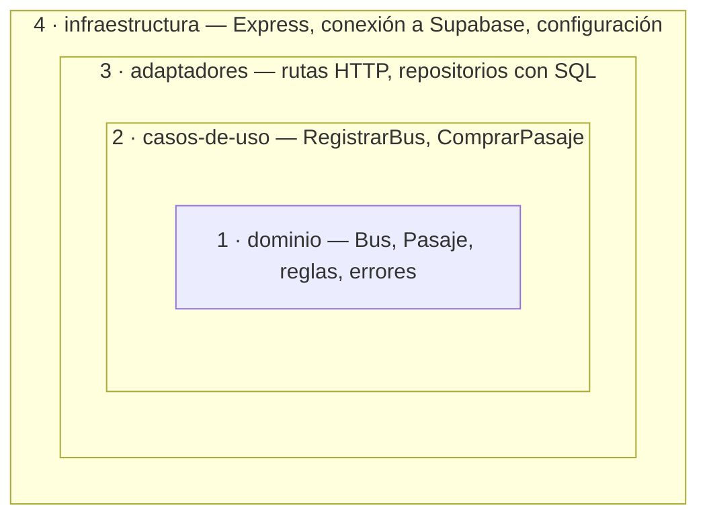
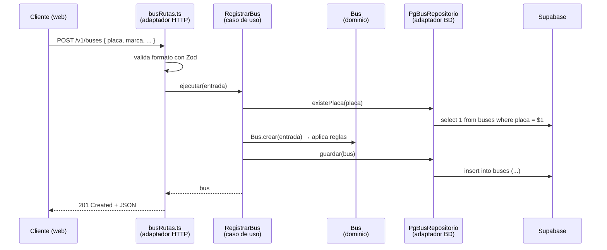

# Guía de Clean Architecture — Proyecto Panamericana

> **Versión:** 0.1 · **Público:** todo el equipo · **Objetivo:** entender la arquitectura y saber **dónde va cada línea de código**.
> Los ejemplos son **ilustrativos** (módulo `buses`) y usan los nombres del borrador de base de datos v0.1.

---

## 1. La idea en una frase

> **El negocio en el centro; las herramientas en el borde.**

Las reglas de Panamericana, como "un bus tiene 1 o 2 pisos" o "un asiento no se vende dos veces", no deben depender de si usamos Express, Supabase, Next.js u otra herramienta. Si mañana cambiamos alguna, **las reglas no se tocan**.

Imagina una cebolla de 4 capas:



---

## 2. Las 4 capas

| Capa | Pregunta que responde | Ejemplos en Panamericana | Puede importar |
|---|---|---|---|
| **1. dominio** | ¿Cuáles son las reglas del negocio? | `Bus`, `BusRepositorio` (interfaz), `PlacaInvalidaError` | **Nada** externo |
| **2. casos-de-uso** | ¿Qué quiere hacer el usuario y en qué pasos? | `RegistrarBus`, `ComprarPasaje`, `EntregarEncomienda` | dominio |
| **3. adaptadores** | ¿Cómo entra la petición y cómo se guardan los datos? | `busRutas.ts` (HTTP), `PgBusRepositorio.ts` (SQL) | casos-de-uso, dominio, librerías (`express`, `pg`, `zod`) |
| **4. infraestructura** | ¿Cómo arranca y se conecta todo? | `servidor.ts`, `baseDeDatos.ts`, `config.ts` | Todo |

---

## 3. La Regla de Oro

> **Las flechas de `import` solo apuntan hacia adentro.**

```
infraestructura  →  adaptadores  →  casos-de-uso  →  dominio
```

| ✅ Permitido | ❌ Prohibido |
|---|---|
| `RegistrarBus.ts` importa `Bus` del dominio | `Bus.ts` importa `pg` o `express` |
| `PgBusRepositorio.ts` importa `BusRepositorio` (interfaz) | `RegistrarBus.ts` recibe `req` o `res` de Express |
| `busRutas.ts` importa `RegistrarBus` | `RegistrarBus.ts` escribe SQL |
| Un módulo usa la **interfaz de dominio** de otro módulo | Un módulo importa los **adaptadores** de otro módulo |

### ¿Y cómo guarda datos el caso de uso si no puede tocar la BD?

Con una **interfaz** (un "enchufe"):

1. El **dominio** define *qué* necesita: `BusRepositorio` con `guardar(bus)`.
2. Los **adaptadores** definen *cómo* se hace: `PgBusRepositorio` con SQL.
3. El archivo **`contenedor.ts`** conecta uno con otro.

Así, el caso de uso funciona con Supabase en producción y con un repositorio **en memoria** en las pruebas.

---

## 4. Estructura del Repositorio

```
panamericana/
├── backend/            # API REST (Node.js + TypeScript + Express)
├── web/                # Next.js: portal público + backoffice
├── mobile/             # Expo React Native: app de compra
├── supabase/
│   ├── migrations/     # archivos .sql (minúsculas, nombres del modelo aprobado)
│   └── seed.sql        # datos de prueba
└── docs/
    ├── api/
    │   └── openapi.yaml   # contrato de la API (se escribe ANTES del código)
    └── adr/               # decisiones de arquitectura
```

---

## 5. Estructura del Backend

Organizamos **primero por módulo** (lo que hace el negocio) y **después por capa**. Al abrir `modulos/` se ve de qué trata el sistema.

```
backend/
├── src/
│   ├── modulos/
│   │   ├── buses/
│   │   │   ├── dominio/
│   │   │   │   ├── Bus.ts                    # entidad + reglas
│   │   │   │   ├── BusRepositorio.ts         # interfaz (el "enchufe")
│   │   │   │   └── errores.ts                # PlacaInvalidaError, PlacaDuplicadaError
│   │   │   ├── casos-de-uso/
│   │   │   │   ├── RegistrarBus.ts
│   │   │   │   ├── RegistrarBus.test.ts
│   │   │   │   └── ListarBuses.ts
│   │   │   └── adaptadores/
│   │   │       ├── busRutas.ts               # HTTP: recibe petición, responde JSON
│   │   │       └── PgBusRepositorio.ts       # SQL contra Supabase
│   │   ├── usuarios/
│   │   ├── clientes/
│   │   ├── terminales/
│   │   ├── rutas/
│   │   ├── viajes/
│   │   ├── pasajes/
│   │   ├── pagos/
│   │   ├── encomiendas/
│   │   └── reportes/
│   │
│   ├── compartido/
│   │   ├── dominio/
│   │   │   └── ErrorDeDominio.ts             # clase base de errores de negocio
│   │   └── adaptadores/http/
│   │       ├── manejadorErrores.ts           # error de dominio → código HTTP
│   │       └── autenticacion.ts              # valida el JWT de Supabase Auth
│   │
│   ├── infraestructura/
│   │   ├── config.ts                         # lee y valida variables de entorno
│   │   ├── baseDeDatos.ts                    # crea el Pool de conexión a Supabase
│   │   └── servidor.ts                       # crea la app Express
│   │
│   ├── contenedor.ts                         # conecta todas las piezas (new X(new Y))
│   └── main.ts                               # punto de entrada
├── .env.example
├── package.json
└── tsconfig.json
```

---

## 6. Recorrido Completo: "Registrar un bus"

### 6.1 El viaje de una petición



### 6.2 Capa 1 — Dominio

```ts
// modulos/buses/dominio/Bus.ts
import { NumeroPisosInvalidoError, PlacaInvalidaError } from './errores';

export type EstadoBus = 'activo' | 'mantenimiento' | 'inactivo';

export class Bus {
  private constructor(
    readonly id: string,
    readonly placa: string,
    readonly marca: string,
    readonly modelo: string,
    readonly anio_fabricacion: number | null,
    readonly numero_pisos: number,
    readonly estado: EstadoBus,
  ) {}

  static crear(datos: {
    placa: string; marca: string; modelo: string;
    anio_fabricacion?: number | null; numero_pisos: number;
  }): Bus {
    const placa = datos.placa.trim().toUpperCase();
    if (placa.length < 6) throw new PlacaInvalidaError(datos.placa);
    if (datos.numero_pisos !== 1 && datos.numero_pisos !== 2) throw new NumeroPisosInvalidoError();

    return new Bus(crypto.randomUUID(), placa, datos.marca, datos.modelo,
      datos.anio_fabricacion ?? null, datos.numero_pisos, 'activo');
  }
}
```

```ts
// modulos/buses/dominio/BusRepositorio.ts
import type { Bus } from './Bus';

export interface BusRepositorio {
  existePlaca(placa: string): Promise<boolean>;
  guardar(bus: Bus): Promise<void>;
}
```

> 👀 Observa que **no hay ningún `import` de librerías externas**: solo TypeScript y reglas.
> Los campos se llaman igual que en la BD (`numero_pisos`), según la regla R2.

### 6.3 Capa 2 — Caso de uso

```ts
// modulos/buses/casos-de-uso/RegistrarBus.ts
import { Bus } from '../dominio/Bus';
import type { BusRepositorio } from '../dominio/BusRepositorio';
import { PlacaDuplicadaError } from '../dominio/errores';

export type RegistrarBusEntrada = {
  placa: string; marca: string; modelo: string;
  anio_fabricacion?: number | null; numero_pisos: number;
};

export class RegistrarBus {
  constructor(private readonly buses: BusRepositorio) {}

  async ejecutar(entrada: RegistrarBusEntrada): Promise<Bus> {
    const bus = Bus.crear(entrada);                       // 1. reglas del dominio
    if (await this.buses.existePlaca(bus.placa)) {        // 2. regla que necesita datos
      throw new PlacaDuplicadaError(bus.placa);
    }
    await this.buses.guardar(bus);                        // 3. persistir
    return bus;
  }
}
```

> 👀 El caso de uso **no sabe** si los datos van a Supabase, a memoria o a un archivo. Solo conoce la interfaz.

### 6.4 Capa 3 — Adaptadores

```ts
// modulos/buses/adaptadores/PgBusRepositorio.ts
import type { Pool } from 'pg';
import type { Bus } from '../dominio/Bus';
import type { BusRepositorio } from '../dominio/BusRepositorio';

export class PgBusRepositorio implements BusRepositorio {
  constructor(private readonly db: Pool) {}

  async existePlaca(placa: string): Promise<boolean> {
    const resultado = await this.db.query('select 1 from buses where placa = $1', [placa]);
    return (resultado.rowCount ?? 0) > 0;
  }

  async guardar(bus: Bus): Promise<void> {
    await this.db.query(
      `insert into buses (id, placa, marca, modelo, anio_fabricacion, numero_pisos, estado)
       values ($1, $2, $3, $4, $5, $6, $7)`,
      [bus.id, bus.placa, bus.marca, bus.modelo, bus.anio_fabricacion, bus.numero_pisos, bus.estado],
    );
  }
}
```

```ts
// modulos/buses/adaptadores/busRutas.ts
import { Router } from 'express';
import { z } from 'zod';
import type { RegistrarBus } from '../casos-de-uso/RegistrarBus';

const esquemaRegistro = z.object({
  placa: z.string(),
  marca: z.string(),
  modelo: z.string(),
  anio_fabricacion: z.number().int().nullable().optional(),
  numero_pisos: z.number().int(),
});

export function busRutas(registrarBus: RegistrarBus): Router {
  const router = Router();

  router.post('/v1/buses', async (req, res) => {
    const entrada = esquemaRegistro.parse(req.body);   // ¿el JSON tiene la forma correcta?
    const bus = await registrarBus.ejecutar(entrada);  // ¿cumple las reglas del negocio?
    res.status(201).json(bus);
  });

  return router;
}
```

> 👀 **Zod** valida la *forma* (¿`numero_pisos` es número?). El **dominio** valida el *negocio* (¿es 1 o 2?).
> Los errores no se capturan aquí: los traduce `manejadorErrores.ts` (`PlacaDuplicadaError` → 409, `ZodError` → 400).

### 6.5 Capa 4 — Infraestructura y contenedor

```ts
// contenedor.ts — el ÚNICO lugar donde se usa "new" para conectar piezas
import { config } from './infraestructura/config';
import { crearPool } from './infraestructura/baseDeDatos';
import { PgBusRepositorio } from './modulos/buses/adaptadores/PgBusRepositorio';
import { RegistrarBus } from './modulos/buses/casos-de-uso/RegistrarBus';

const pool = crearPool(config.DATABASE_URL);

const busRepositorio = new PgBusRepositorio(pool);
export const registrarBus = new RegistrarBus(busRepositorio);
```

```ts
// main.ts
import { crearServidor } from './infraestructura/servidor';
import { busRutas } from './modulos/buses/adaptadores/busRutas';
import { registrarBus } from './contenedor';

const app = crearServidor();
app.use(busRutas(registrarBus));
app.listen(3000);
```

### 6.6 La recompensa: probar sin base de datos

```ts
// modulos/buses/casos-de-uso/RegistrarBus.test.ts
import { describe, expect, it } from 'vitest';
import type { Bus } from '../dominio/Bus';
import type { BusRepositorio } from '../dominio/BusRepositorio';
import { PlacaDuplicadaError } from '../dominio/errores';
import { RegistrarBus } from './RegistrarBus';

class BusRepositorioEnMemoria implements BusRepositorio {
  buses: Bus[] = [];
  async existePlaca(placa: string) { return this.buses.some((b) => b.placa === placa); }
  async guardar(bus: Bus) { this.buses.push(bus); }
}

describe('RegistrarBus', () => {
  it('no permite dos buses con la misma placa', async () => {
    const registrarBus = new RegistrarBus(new BusRepositorioEnMemoria());
    await registrarBus.ejecutar({ placa: 'ABC-123', marca: 'Volvo', modelo: 'B450R', numero_pisos: 2 });

    await expect(
      registrarBus.ejecutar({ placa: 'abc-123', marca: 'Scania', modelo: 'K410', numero_pisos: 1 }),
    ).rejects.toThrow(PlacaDuplicadaError);
  });
});
```

> 👀 La prueba se ejecuta en milisegundos, sin internet y sin Supabase. **Por esto separamos capas.**

---

## 7. Estructura del Frontend (Web y Móvil)

El frontend aplica la misma idea con **3 capas sencillas**:

| Capa | Carpeta | Responsabilidad | Prohibido |
|---|---|---|---|
| **UI** | `componentes/`, `pantallas/` | Mostrar datos y capturar eventos | Llamar a `fetch` |
| **Lógica** | `hooks/` | Decidir cuándo pedir datos; manejar carga y error | Dibujar HTML |
| **Acceso a API** | `api/` | Hablar con el backend | Conocer componentes |

```
componentes  →  hooks  →  api  →  backend
```

### 7.1 Web (Next.js)

```
web/src/
├── app/                                  # SOLO rutas y páginas delgadas
│   ├── (publico)/                        # Karime
│   │   ├── page.tsx                      # buscador de viajes
│   │   └── viajes/[id]/page.tsx          # croquis y compra
│   └── (backoffice)/                     # Brisa (layout) + Grisel (encomiendas, clientes, reportes)
│       ├── layout.tsx
│       └── admin/
│           ├── buses/page.tsx
│           └── encomiendas/page.tsx
├── modulos/
│   ├── buses/
│   │   ├── componentes/                  # TablaBuses.tsx, FormularioBus.tsx
│   │   ├── hooks/                        # useBuses.ts, useRegistrarBus.ts
│   │   ├── api/                          # busesApi.ts
│   │   └── tipos.ts                      # tipos iguales al contrato (snake_case)
│   ├── pasajes/
│   └── encomiendas/
└── compartido/
    ├── componentes/                      # Boton, Modal, Tabla
    └── api/clienteHttp.ts                # fetch base + token de Supabase Auth
```

### 7.2 Móvil (Expo)

```
mobile/src/
├── app/                                  # rutas (Expo Router)
├── modulos/
│   └── pasajes/
│       ├── pantallas/
│       ├── componentes/
│       ├── hooks/
│       └── api/
└── compartido/
```

> Karime usa **la misma organización** en web y móvil. Si un hook se repite idéntico 3 veces, se extrae a un paquete compartido (sección 12).

### 7.3 Ejemplo de las 3 capas

```ts
// modulos/buses/api/busesApi.ts
import { clienteHttp } from '@/compartido/api/clienteHttp';
import type { Bus, RegistrarBusEntrada } from '../tipos';

export const busesApi = {
  listar: () => clienteHttp.get<Bus[]>('/v1/buses'),
  registrar: (datos: RegistrarBusEntrada) => clienteHttp.post<Bus>('/v1/buses', datos),
};
```

```ts
// modulos/buses/hooks/useRegistrarBus.ts
import { useMutation, useQueryClient } from '@tanstack/react-query';
import { busesApi } from '../api/busesApi';

export function useRegistrarBus() {
  const queryClient = useQueryClient();
  return useMutation({
    mutationFn: busesApi.registrar,
    onSuccess: () => queryClient.invalidateQueries({ queryKey: ['buses'] }),
  });
}
```

```tsx
// modulos/buses/componentes/FormularioBus.tsx  (fragmento)
const registrar = useRegistrarBus();
// ...
<button disabled={registrar.isPending}>Registrar</button>
{registrar.error && <p role="alert">{registrar.error.message}</p>}
```

---

## 8. Checklist: ¿Dónde pongo este código?

| Si el código… | Va en |
|---|---|
| Valida una regla del negocio ("un bus tiene 1 o 2 pisos") | `dominio/` (entidad) |
| Define un error del negocio (`AsientoNoDisponibleError`) | `dominio/errores.ts` |
| Define qué datos necesita guardar o leer (interfaz) | `dominio/XRepositorio.ts` |
| Coordina pasos ("verifica, crea, guarda") | `casos-de-uso/` |
| Lee `req.body`, responde `res.json`, define la URL | `adaptadores/xRutas.ts` |
| Valida la forma del JSON (Zod) | `adaptadores/xRutas.ts` |
| Escribe SQL | `adaptadores/PgXRepositorio.ts` |
| Convierte un error de dominio a código HTTP | `compartido/adaptadores/http/manejadorErrores.ts` |
| Lee variables de entorno o crea la conexión | `infraestructura/` |
| Usa `new` para unir piezas | `contenedor.ts` |
| Dibuja algo en pantalla | frontend `componentes/` o `pantallas/` |
| Decide cuándo pedir datos o maneja "cargando" | frontend `hooks/` |
| Hace una petición HTTP | frontend `api/` |

---

## 9. Errores Comunes (y cómo corregirlos)

| ❌ Error | Por qué está mal | ✅ Corrección |
|---|---|---|
| SQL dentro de `busRutas.ts` | Mezcla HTTP con base de datos | Mover el SQL a `PgBusRepositorio` |
| El caso de uso recibe `req` | Lo ata a Express y no se puede probar | Recibir un objeto simple (`RegistrarBusEntrada`) |
| `import { Pool } from 'pg'` en `dominio/` | El negocio queda atado a la BD | Usar la interfaz `BusRepositorio` |
| Validar "1 o 2 pisos" solo con Zod | La regla se pierde si el caso de uso se llama desde otro lugar | Zod valida la forma; `Bus.crear` valida la regla |
| `fetch` dentro de un componente React | Imposible reutilizar o probar | Usar `api/` + `hooks/` |
| Renombrar `numero_pisos` a `numeroPisos` | Rompe la regla R2 y confunde entre capas | Mismo nombre en BD, entidad y JSON |
| `new PgBusRepositorio()` dentro del caso de uso | El caso de uso vuelve a depender de la BD | Crear las instancias solo en `contenedor.ts` |
| Crear una tabla desde el panel de Supabase | Staging y prod quedan distintos | Crear siempre una migración en `supabase/migrations/` |

---

## 10. Receta: Crear un Módulo Nuevo

Sigue este orden. Cada paso puede ser un commit.

| Paso | Qué hacer | Archivo(s) |
|---|---|---|
| 1 | Confirmar que las tablas y campos existen en el **modelo aprobado** | `PROPUESTA_BD.md` (v1.0) |
| 2 | Escribir el endpoint en el **contrato** y abrir un PR `contract:` | `docs/api/openapi.yaml` |
| 3 | **Dominio:** entidad, errores e interfaz del repositorio | `dominio/` |
| 4 | **Caso de uso** + prueba con repositorio en memoria | `casos-de-uso/` |
| 5 | **Adaptador BD:** SQL en minúsculas con los nombres exactos | `adaptadores/PgXRepositorio.ts` |
| 6 | **Adaptador HTTP:** ruta + validación Zod | `adaptadores/xRutas.ts` |
| 7 | Conectar en el **contenedor** y registrar la ruta | `contenedor.ts`, `main.ts` |
| 8 | **Frontend:** `tipos` → `api` → `hook` → `componente` → `página` | `web/src/modulos/x/` |

---

## 11. Convenciones de Nombres

| Elemento | Convención | Ejemplo |
|---|---|---|
| Carpetas | kebab-case, en español | `casos-de-uso/`, `modulos/` |
| Entidades y casos de uso | PascalCase; verbo en infinitivo para casos de uso | `Bus`, `RegistrarBus`, `ComprarPasaje` |
| Interfaces de repositorio | `<Entidad>Repositorio` | `BusRepositorio` |
| Implementaciones de repositorio | `Pg<Entidad>Repositorio` | `PgBusRepositorio` |
| Errores | `<Descripción>Error` | `PlacaDuplicadaError` |
| Archivos de clase | Igual que la clase | `RegistrarBus.ts` |
| Otros archivos | camelCase | `busRutas.ts`, `clienteHttp.ts` |
| Funciones y variables | camelCase | `registrarBus`, `crearPool` |
| **Campos de datos** (BD, entidad, DTO, JSON) | **snake_case idéntico a la BD** | `numero_pisos`, `fecha_salida` |
| Endpoints | `/v1/<recurso-en-plural>` | `/v1/buses`, `/v1/viajes/:id/asientos` |
| Componentes React | PascalCase | `FormularioBus.tsx` |
| Hooks | `use` + PascalCase | `useRegistrarBus` |

---

## 12. Lo que Dejamos Fuera a Propósito (por ahora)

Lo simple primero. Cada herramienta entra **solo cuando resuelve un dolor real**.

| Herramienta / práctica | Por qué no ahora | Cuándo entra |
|---|---|---|
| NestJS | Esconde la inyección de dependencias y agrega decoradores que aprender | Si el contenedor manual se vuelve difícil de mantener |
| ORM o query builder (Prisma, Kysely) | Queremos aprender y controlar el SQL (R1, R4) | Probablemente nunca |
| Paquetes compartidos (monorepo) | Agregan configuración | Cuando el mismo código se repita 3 veces entre web y móvil |
| Generación automática de tipos desde OpenAPI | Un paso más que aprender | Cuando el contrato supere unos 20 endpoints |
| Validación automática de capas (`eslint-plugin-boundaries`) | Primero hay que entender la regla | E10 (endurecimiento) |
| Pruebas E2E (Playwright, Maestro) | Primero dominamos las pruebas unitarias | E10 |
| Supabase Realtime para el croquis | Rompe "datos solo por la API"; con consultas periódicas basta | Si la experiencia de compra lo exige (se decide con un ADR) |
