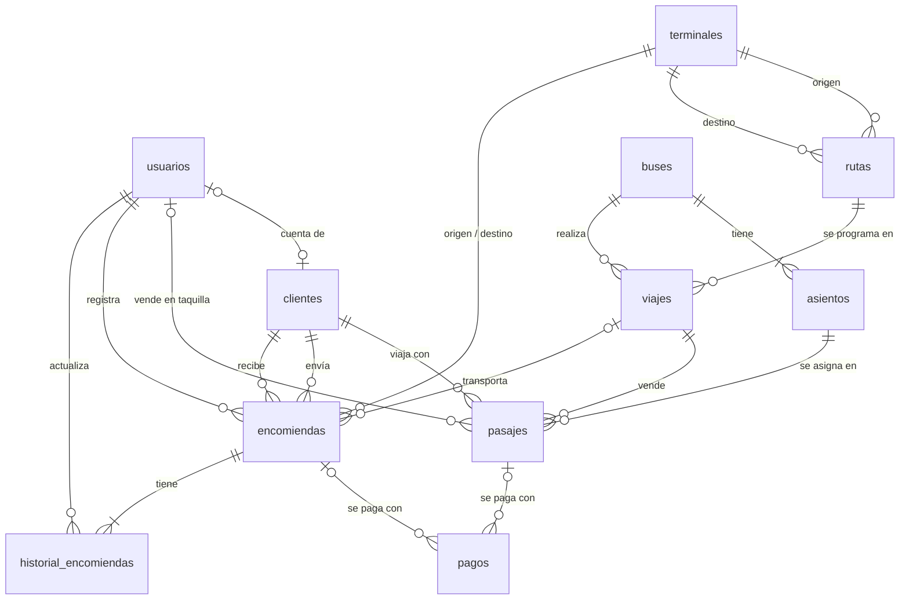

# Propuesta de Base de Datos — Panamericana

> **Versión:** Borrador v0.1 · **Estado:** 🟡 Abierto a comentarios
> **Fecha límite para comentarios:** ____ / ____ / 2026
> **Objetivo:** tener un primer modelo de datos que **todo el equipo** revise, cuestione y mejore antes de crearlo en la base de datos.

---

## 1. Cómo Revisar este Documento

1. Mira el **diagrama general** (sección 3) para entender las relaciones.
2. Revisa las **tablas** de tu área de interés (sección 4).
3. Responde las **preguntas abiertas** (sección 6); ahí es donde más necesitamos opiniones.
4. Deja tus comentarios en el **formato** de la sección 7.

> ⚠️ **Importante:** cuando aprobemos la versión 1.0, **los nombres de tablas y campos se congelan** y ya no se podrán cambiar. **Ahora** es el momento de proponer cambios de nombres, campos que faltan o sobran, o relaciones distintas.

---

## 2. Convenciones Propuestas

| Convención | Regla | Ejemplo |
|---|---|---|
| Nombres | Minúsculas, `snake_case`, en español, **sin tildes ni ñ** | `numero_pisos`, `anio_fabricacion` |
| Tablas | En plural | `buses`, `pasajes` |
| Clave primaria | `id` de tipo `uuid` | `id` |
| Clave foránea | `<entidad_en_singular>_id` | `bus_id`, `viaje_id` |
| Fechas de auditoría | `creado_en`, `actualizado_en` (`timestamptz`) | — |
| Fechas del negocio | `fecha_<evento>` (`timestamptz`) | `fecha_salida` |
| Montos | `numeric(10,2)` | `precio`, `costo` |
| Estados | Texto con lista de valores permitidos | `'activo'`, `'mantenimiento'` |
| Palabras SQL | Siempre en minúsculas | `create table`, `not null` |

---

## 3. Diagrama General



**Resumen: 11 tablas en 4 áreas**

| Área | Tablas |
|---|---|
| 🔐 Acceso y personas | `usuarios`, `clientes` |
| 🚌 Flota y rutas | `terminales`, `buses`, `asientos`, `rutas`, `viajes` |
| 🎫 Ventas | `pasajes`, `pagos` |
| 📦 Encomiendas | `encomiendas`, `historial_encomiendas` |

---

## 4. Diccionario de Tablas

### 🔐 4.1 `usuarios`
Personas que inician sesión en el sistema: personal de la empresa y clientes con cuenta.
*Las contraseñas **no** se guardan aquí; las gestiona el servicio de autenticación.*

| Campo | Tipo | Obligatorio | Descripción |
|---|---|---|---|
| `id` | uuid | Sí | Identificador (el mismo del servicio de autenticación) |
| `nombres` | text | Sí | |
| `apellidos` | text | Sí | |
| `correo` | text | Sí | Único |
| `rol` | text | Sí | `'administrador'`, `'vendedor'`, `'encomiendas'`, `'cliente'` |
| `activo` | boolean | Sí | Por defecto `true` |
| `creado_en` | timestamptz | Sí | Por defecto, fecha actual |
| `actualizado_en` | timestamptz | Sí | Por defecto, fecha actual |

### 🔐 4.2 `clientes`
Pasajeros, remitentes y destinatarios. **No necesitan cuenta** en el sistema.

| Campo | Tipo | Obligatorio | Descripción |
|---|---|---|---|
| `id` | uuid | Sí | |
| `usuario_id` | uuid | No | → `usuarios.id`. Solo si el cliente tiene cuenta. Único |
| `tipo_documento` | text | Sí | `'dni'`, `'ce'`, `'pasaporte'` |
| `numero_documento` | text | Sí | |
| `nombres` | text | Sí | |
| `apellidos` | text | Sí | |
| `telefono` | text | No | |
| `correo` | text | No | |
| `fecha_nacimiento` | date | No | Útil para identificar menores de edad |
| `creado_en` | timestamptz | Sí | |
| `actualizado_en` | timestamptz | Sí | |

**Reglas:** no puede repetirse la combinación `tipo_documento` + `numero_documento`.

### 🚌 4.3 `terminales`
Lugares de salida y llegada de los viajes y de las encomiendas.

| Campo | Tipo | Obligatorio | Descripción |
|---|---|---|---|
| `id` | uuid | Sí | |
| `nombre` | text | Sí | Único |
| `ciudad` | text | Sí | |
| `direccion` | text | Sí | |
| `activo` | boolean | Sí | Por defecto `true` |
| `creado_en` | timestamptz | Sí | |
| `actualizado_en` | timestamptz | Sí | |

### 🚌 4.4 `buses`

| Campo | Tipo | Obligatorio | Descripción |
|---|---|---|---|
| `id` | uuid | Sí | |
| `placa` | text | Sí | Única |
| `marca` | text | Sí | |
| `modelo` | text | Sí | |
| `anio_fabricacion` | integer | No | |
| `numero_pisos` | smallint | Sí | `1` o `2` |
| `estado` | text | Sí | `'activo'`, `'mantenimiento'`, `'inactivo'` · Por defecto `'activo'` |
| `creado_en` | timestamptz | Sí | |
| `actualizado_en` | timestamptz | Sí | |

### 🚌 4.5 `asientos`
Cada asiento físico de un bus. `fila` y `columna` permiten **dibujar el croquis** en pantalla.

| Campo | Tipo | Obligatorio | Descripción |
|---|---|---|---|
| `id` | uuid | Sí | |
| `bus_id` | uuid | Sí | → `buses.id` |
| `numero` | smallint | Sí | Número visible en el asiento |
| `piso` | smallint | Sí | `1` o `2` |
| `fila` | smallint | Sí | Posición en el croquis |
| `columna` | smallint | Sí | Posición en el croquis |
| `tipo` | text | Sí | `'normal'`, `'semicama'`, `'cama'` |

**Reglas:** no se repite el `numero` dentro del mismo bus ni la posición (`piso`, `fila`, `columna`) dentro del mismo bus.

### 🚌 4.6 `rutas`

| Campo | Tipo | Obligatorio | Descripción |
|---|---|---|---|
| `id` | uuid | Sí | |
| `terminal_origen_id` | uuid | Sí | → `terminales.id` |
| `terminal_destino_id` | uuid | Sí | → `terminales.id` |
| `distancia_km` | numeric(7,2) | No | |
| `duracion_estimada_min` | integer | Sí | Duración aproximada en minutos |
| `activo` | boolean | Sí | Por defecto `true` |
| `creado_en` | timestamptz | Sí | |
| `actualizado_en` | timestamptz | Sí | |

**Reglas:** el origen debe ser distinto del destino, y no se repite la misma pareja origen–destino.

### 🚌 4.7 `viajes`
Un bus que recorre una ruta en una fecha y hora específicas.

| Campo | Tipo | Obligatorio | Descripción |
|---|---|---|---|
| `id` | uuid | Sí | |
| `ruta_id` | uuid | Sí | → `rutas.id` |
| `bus_id` | uuid | Sí | → `buses.id` |
| `fecha_salida` | timestamptz | Sí | |
| `fecha_llegada_estimada` | timestamptz | Sí | Posterior a `fecha_salida` |
| `precio_base` | numeric(10,2) | Sí | Mayor que 0 |
| `estado` | text | Sí | `'programado'`, `'en_ruta'`, `'finalizado'`, `'cancelado'` |
| `creado_en` | timestamptz | Sí | |
| `actualizado_en` | timestamptz | Sí | |

**Reglas:** un bus no puede tener dos viajes con horarios cruzados (lo valida el sistema).

### 🎫 4.8 `pasajes`

| Campo | Tipo | Obligatorio | Descripción |
|---|---|---|---|
| `id` | uuid | Sí | |
| `codigo` | text | Sí | Código impreso en el boleto. Único |
| `viaje_id` | uuid | Sí | → `viajes.id` |
| `asiento_id` | uuid | Sí | → `asientos.id` (debe pertenecer al bus del viaje) |
| `cliente_id` | uuid | Sí | → `clientes.id` (el pasajero) |
| `usuario_id` | uuid | No | → `usuarios.id` (quien vendió en taquilla; vacío si fue por web o app) |
| `canal` | text | Sí | `'web'`, `'movil'`, `'taquilla'` |
| `precio` | numeric(10,2) | Sí | Precio final cobrado |
| `estado` | text | Sí | `'reservado'`, `'pagado'`, `'anulado'`, `'expirado'` |
| `reservado_hasta` | timestamptz | No | Hasta cuándo se retiene el asiento mientras se paga |
| `creado_en` | timestamptz | Sí | |
| `actualizado_en` | timestamptz | Sí | |

**Reglas:** en un mismo viaje, un asiento solo puede tener **un** pasaje en estado `'reservado'` o `'pagado'` (ver sección 5).

### 🎫 4.9 `pagos`
Sirve tanto para pasajes como para encomiendas.

| Campo | Tipo | Obligatorio | Descripción |
|---|---|---|---|
| `id` | uuid | Sí | |
| `pasaje_id` | uuid | No | → `pasajes.id` |
| `encomienda_id` | uuid | No | → `encomiendas.id` |
| `monto` | numeric(10,2) | Sí | Mayor que 0 |
| `metodo` | text | Sí | `'efectivo'`, `'tarjeta'`, `'transferencia'`, `'billetera_digital'` |
| `estado` | text | Sí | `'pendiente'`, `'aprobado'`, `'rechazado'`, `'reembolsado'` |
| `referencia_externa` | text | No | Código de la operación en la pasarela de pago |
| `usuario_id` | uuid | No | → `usuarios.id` (quien cobró en taquilla) |
| `creado_en` | timestamptz | Sí | |

**Reglas:** cada pago corresponde a **un pasaje o a una encomienda**, nunca a ambos ni a ninguno.

### 📦 4.10 `encomiendas`

| Campo | Tipo | Obligatorio | Descripción |
|---|---|---|---|
| `id` | uuid | Sí | |
| `codigo_seguimiento` | text | Sí | Código para rastrear el envío. Único |
| `remitente_id` | uuid | Sí | → `clientes.id` |
| `destinatario_id` | uuid | Sí | → `clientes.id` |
| `terminal_origen_id` | uuid | Sí | → `terminales.id` |
| `terminal_destino_id` | uuid | Sí | → `terminales.id` |
| `viaje_id` | uuid | No | → `viajes.id` (se asigna cuando se despacha) |
| `descripcion` | text | Sí | Contenido declarado |
| `peso_kg` | numeric(6,2) | Sí | Mayor que 0 |
| `costo` | numeric(10,2) | Sí | |
| `estado` | text | Sí | `'registrada'`, `'en_transito'`, `'en_destino'`, `'entregada'`, `'cancelada'` |
| `usuario_id` | uuid | Sí | → `usuarios.id` (quien la registró) |
| `fecha_entrega` | timestamptz | No | Cuándo se entregó al destinatario |
| `creado_en` | timestamptz | Sí | |
| `actualizado_en` | timestamptz | Sí | |

### 📦 4.11 `historial_encomiendas`
Cada cambio de estado de una encomienda, para mostrar su seguimiento.

| Campo | Tipo | Obligatorio | Descripción |
|---|---|---|---|
| `id` | uuid | Sí | |
| `encomienda_id` | uuid | Sí | → `encomiendas.id` |
| `estado` | text | Sí | Estado al que cambió |
| `observacion` | text | No | |
| `usuario_id` | uuid | Sí | → `usuarios.id` (quien hizo el cambio) |
| `creado_en` | timestamptz | Sí | |

---

## 5. ¿Cómo Evitamos Vender el Mismo Asiento Dos Veces?

Es el punto más delicado del sistema. La propuesta usa **tres protecciones**:

| # | Protección | En palabras simples |
|---|---|---|
| 1 | **Reserva temporal** | Cuando alguien elige un asiento, se crea un pasaje `'reservado'` con `reservado_hasta`. Si no paga a tiempo, pasa a `'expirado'` y el asiento se libera. |
| 2 | **Turno en la base de datos** | Si dos personas confirman al mismo tiempo, la base de datos las atiende **de una en una**. |
| 3 | **Candado final** | La base de datos **rechaza** un segundo pasaje activo para el mismo asiento y viaje, aunque todo lo demás falle. |

---

## 6. Preguntas Abiertas para el Equipo

Estas decisiones cambian el modelo. **Tu opinión es importante.**

| # | Pregunta | Qué cambiaría en el modelo |
|---|---|---|
| **P1** | ¿Los viajes tienen **paradas intermedias**? ¿Se venden pasajes para un **tramo** del recorrido? | Nuevas tablas de paradas y tramos; cambia la regla de asiento ocupado |
| **P2** | ¿Registramos **conductores** o tripulación en cada viaje? | Nueva tabla `conductores` y relación con `viajes` |
| **P3** | ¿El **precio** cambia según el tipo de asiento (`cama`, `semicama`) o el piso? | Tabla de tarifas por tipo de asiento, o campo adicional |
| **P4** | ¿Se pueden comprar **varios pasajes en una sola operación** con un solo pago? | Nueva tabla `ventas` que agrupe pasajes |
| **P5** | ¿El cliente debe **tener cuenta** para comprar por web o app, o puede comprar como invitado? | Obligatoriedad de `clientes.usuario_id` |
| **P6** | ¿Cuántos **minutos** se retiene un asiento mientras se paga? (propuesta: 10) | Valor de `reservado_hasta` |
| **P7** | ¿Las encomiendas se pagan en **origen**, en **destino** o en ambos? | Reglas de `pagos` para encomiendas |
| **P8** | ¿Qué **métodos de pago** acepta realmente la empresa? | Valores de `pagos.metodo` |
| **P9** | ¿Qué **roles internos** existen? (¿supervisor?, ¿contador?) | Valores de `usuarios.rol` |
| **P10** | ¿Se pueden **anular** pasajes? ¿Hay devolución de dinero? ¿Con cuánta anticipación? | Estados de pasajes y pagos |
| **P11** | ¿Guardamos el **historial de cambios** de los pasajes, como en las encomiendas? | Nueva tabla `historial_pasajes` |
| **P12** | ¿Qué **documentos de identidad** se aceptan? | Valores de `clientes.tipo_documento` |
| **P13** | ¿Algún **nombre** de tabla o campo no es claro o cambiarías alguno? | Nombres (antes de congelarlos) |
| **P14** | ¿Falta alguna **información** que la empresa necesite registrar? | Nuevos campos o tablas |

---

## 7. Formato para Enviar Comentarios

Copia esta tabla y agrega una fila por comentario:

| # | Tabla / campo | Tipo | Comentario | Propuesta |
|---|---|---|---|---|
| 1 | `buses.anio_fabricacion` | Cambio | *Ejemplo: debería ser obligatorio para el SOAT* | *Hacerlo obligatorio* |
| 2 | P4 | Respuesta | *Ejemplo: sí, las familias compran juntas* | *Agregar tabla `ventas`* |
| 3 | | | | |

**Tipos de comentario:** `Duda` · `Cambio` · `Falta` · `Sobra` · `Respuesta` (a una pregunta P#)

---

## 8. Próximos Pasos

```
Borrador v0.1  →  Comentarios del equipo  →  Versión v1.0  →  Aprobación en reunión  →  Nombres congelados  →  Creación de la base de datos
```

| Paso | Resultado |
|---|---|
| 1. Recolectar comentarios hasta la fecha límite | Lista consolidada de cambios |
| 2. Resolver preguntas P1–P14 en reunión | Decisiones registradas |
| 3. Publicar v1.0 con los cambios | Modelo definitivo |
| 4. Aprobación del equipo | Nombres congelados |
| 5. Crear la base de datos (entorno de pruebas y luego producción) | Base de datos lista para desarrollar |
