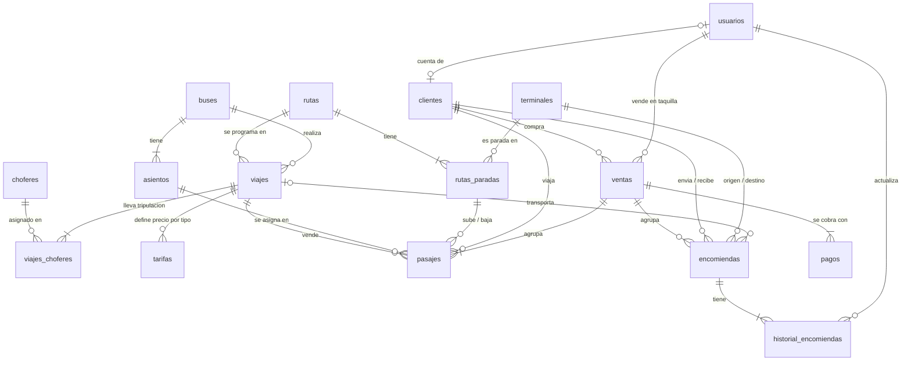

# Propuesta de Base de Datos — Panamericana

> **Versión:** 1.0 · **Estado:** ✅ Creada en Supabase · nombres congelados
> **Fecha:** 2026-09-12
> Incorpora las observaciones de la revisión del modelo v0.1.

## 0. Estado actual

| Dato | Valor |
|---|---|
| Proyecto Supabase | `panamericana` (ref `tvyhpwpyxmbdfxogopnl`) |
| Tablas creadas | **16**, todas con RLS activado y sin políticas públicas |
| Datos de prueba | `supabase/seed.sql`: 2 buses, 4 asientos, 3 terminales, 1 ruta La Paz → Oruro → Cochabamba, 1 viaje, 1 venta y 1 pasaje |
| Migraciones | `supabase/migrations/` (6 archivos, aplicados) |
| Contexto | **Bolivia (La Paz):** documentos `ci`, `ce` y `pasaporte`; placas `1234ABC`; montos en bolivianos (Bs); fechas en hora de La Paz (UTC−4) |

**Protección de asientos verificada en la base real:**

| Prueba | Resultado |
|---|---|
| Vender el asiento 1 del tramo 1→3 cuando ya está vendido el 1→2 | ❌ Rechazado (`23P01`, restricción `pasajes_asiento_sin_traslape`) |
| Vender el asiento 1 del tramo 2→3 con el 1→2 ya vendido | ✅ Aceptado |

> ⚠️ **Los nombres de tablas y campos están congelados** (reglas R2 y R3). Cualquier cambio a partir de aquí se hace con una migración nueva, nunca editando las existentes. Las preguntas de la sección 6 que sigan abiertas se resuelven así.

---

## 1. Qué cambió respecto a la v0.1

| # | Observación | Cambio aplicado |
|---|---|---|
| 1 | Falta la gestión de la tripulación (P2) | Nuevas tablas **`choferes`** y **`viajes_choferes`** (conductor y ayudante por viaje) |
| 2 | El modelo asumía viajes directos, sin paradas intermedias (P1) | Nueva tabla **`rutas_paradas`**. Los pasajes ahora se venden **por tramo** |
| 3 | `precio_base` no alcanza si hay asientos `cama` y `semicama` (P3) | Nueva tabla **`tarifas`** (precio por viaje y tipo de asiento) |
| 4 | `pagos` atado a un solo pasaje impide comprar varios juntos (P4) | Nueva tabla **`ventas`** que agrupa pasajes y encomiendas; **`pagos`** ahora se enlaza a la venta |
| 5 | La estrategia de concurrencia es correcta | Se conserva, **ampliada a tramos** (ver sección 5) |

**Preguntas ya respondidas:** P1 (sí hay tramos), P2 (sí hay tripulación), P3 (sí, precio por tipo de asiento), P4 (sí, compra múltiple).

---

## 2. Convenciones

| Convención | Regla | Ejemplo |
|---|---|---|
| Nombres | Minúsculas, `snake_case`, español, **sin tildes ni ñ** | `numero_pisos`, `anio_fabricacion` |
| Tablas | En plural | `buses`, `pasajes` |
| Clave primaria | `id` de tipo `uuid` | `id` |
| Clave foránea | `<entidad_en_singular>_id` | `bus_id`, `viaje_id` |
| Fechas de auditoría | `creado_en`, `actualizado_en` (`timestamptz`) | — |
| Fechas del negocio | `fecha_<evento>` | `fecha_salida` |
| Montos | `numeric(10,2)` | `precio`, `total` |
| Estados | Texto con lista de valores permitidos | `'activo'` |
| Palabras SQL | Siempre en minúsculas | `create table`, `not null` |
| Moneda | Bolivianos (Bs) | `precio_base` 80.00 = Bs 80 |
| Documentos de identidad | `ci` (carnet de identidad), `ce` (cédula de extranjero), `pasaporte` | `ci` `4827351` o `4827351-1A` |
| Placas | 3 o 4 dígitos y 3 letras, sin guion | `2045KLP` |

---

## 3. Diagrama General



**16 tablas en 5 áreas**

| Área | Tablas |
|---|---|
| 🔐 Acceso y personas | `usuarios`, `clientes` |
| 🚌 Flota y tripulación | `buses`, `asientos`, `choferes` |
| 🗺️ Rutas y viajes | `terminales`, `rutas`, `rutas_paradas`, `viajes`, `viajes_choferes`, `tarifas` |
| 🎫 Ventas | `ventas`, `pasajes`, `pagos` |
| 📦 Encomiendas | `encomiendas`, `historial_encomiendas` |

---

## 4. Diccionario de Tablas

### 🔐 4.1 `usuarios`
Personas que inician sesión. *Las contraseñas no se guardan aquí; las gestiona el servicio de autenticación.*

| Campo | Tipo | Obligatorio | Descripción |
|---|---|---|---|
| `id` | uuid | Sí | Mismo identificador del servicio de autenticación |
| `nombres` | text | Sí | |
| `apellidos` | text | Sí | |
| `correo` | text | Sí | Único |
| `rol` | text | Sí | `'administrador'`, `'vendedor'`, `'encomiendas'`, `'cliente'` |
| `activo` | boolean | Sí | Por defecto `true` |
| `creado_en` · `actualizado_en` | timestamptz | Sí | |

### 🔐 4.2 `clientes`
Pasajeros, remitentes y destinatarios. No necesitan cuenta.

| Campo | Tipo | Obligatorio | Descripción |
|---|---|---|---|
| `id` | uuid | Sí | |
| `usuario_id` | uuid | No | → `usuarios.id`. Único. Solo si tiene cuenta |
| `tipo_documento` | text | Sí | `'ci'` (carnet de identidad), `'ce'` (cédula de extranjero), `'pasaporte'` |
| `numero_documento` | text | Sí | |
| `nombres` · `apellidos` | text | Sí | |
| `telefono` · `correo` | text | No | |
| `fecha_nacimiento` | date | No | Para identificar menores de edad |
| `creado_en` · `actualizado_en` | timestamptz | Sí | |

**Reglas:** no se repite `tipo_documento` + `numero_documento`.

### 🚌 4.3 `buses`

| Campo | Tipo | Obligatorio | Descripción |
|---|---|---|---|
| `id` | uuid | Sí | |
| `placa` | text | Sí | Única |
| `marca` · `modelo` | text | Sí | |
| `anio_fabricacion` | integer | No | |
| `numero_pisos` | smallint | Sí | `1` o `2` |
| `estado` | text | Sí | `'activo'`, `'mantenimiento'`, `'inactivo'` |
| `creado_en` · `actualizado_en` | timestamptz | Sí | |

### 🚌 4.4 `asientos`
`fila` y `columna` permiten dibujar el croquis en pantalla.

| Campo | Tipo | Obligatorio | Descripción |
|---|---|---|---|
| `id` | uuid | Sí | |
| `bus_id` | uuid | Sí | → `buses.id` |
| `numero` | smallint | Sí | Número visible en el asiento |
| `piso` | smallint | Sí | `1` o `2` |
| `fila` · `columna` | smallint | Sí | Posición en el croquis |
| `tipo` | text | Sí | `'normal'`, `'semicama'`, `'cama'` |

**Reglas:** no se repite `numero` en el mismo bus, ni la posición (`piso`, `fila`, `columna`).

### 🚌 4.5 `choferes` *(nueva)*

| Campo | Tipo | Obligatorio | Descripción |
|---|---|---|---|
| `id` | uuid | Sí | |
| `tipo_documento` · `numero_documento` | text | Sí | `'ci'`, `'ce'` o `'pasaporte'`; únicos en conjunto |
| `nombres` · `apellidos` | text | Sí | |
| `numero_licencia` | text | Sí | Único |
| `categoria_licencia` | text | Sí | Categoría habilitante |
| `fecha_vencimiento_licencia` | date | Sí | Permite alertar licencias vencidas |
| `telefono` | text | No | |
| `activo` | boolean | Sí | Por defecto `true` |
| `creado_en` · `actualizado_en` | timestamptz | Sí | |

### 🗺️ 4.6 `terminales`

| Campo | Tipo | Obligatorio | Descripción |
|---|---|---|---|
| `id` | uuid | Sí | |
| `nombre` | text | Sí | Único |
| `ciudad` · `direccion` | text | Sí | |
| `activo` | boolean | Sí | Por defecto `true` |
| `creado_en` · `actualizado_en` | timestamptz | Sí | |

### 🗺️ 4.7 `rutas` *(modificada)*
Ya no guarda origen y destino: ahora son la primera y la última parada.

| Campo | Tipo | Obligatorio | Descripción |
|---|---|---|---|
| `id` | uuid | Sí | |
| `nombre` | text | Sí | Ej.: "La Paz – Cochabamba" |
| `distancia_km` | numeric(7,2) | No | |
| `duracion_estimada_min` | integer | Sí | Total del recorrido |
| `activo` | boolean | Sí | Por defecto `true` |
| `creado_en` · `actualizado_en` | timestamptz | Sí | |

### 🗺️ 4.8 `rutas_paradas` *(nueva)*
El orden de terminales por los que pasa una ruta. **Es lo que permite vender tramos.**

| Campo | Tipo | Obligatorio | Descripción |
|---|---|---|---|
| `id` | uuid | Sí | |
| `ruta_id` | uuid | Sí | → `rutas.id` |
| `terminal_id` | uuid | Sí | → `terminales.id` |
| `orden` | smallint | Sí | `1` = origen; el mayor = destino final |
| `minutos_desde_origen` | integer | Sí | Para calcular la hora de paso |

**Reglas:** no se repite `orden` ni `terminal_id` dentro de la misma ruta; toda ruta tiene al menos 2 paradas.

### 🗺️ 4.9 `viajes`

| Campo | Tipo | Obligatorio | Descripción |
|---|---|---|---|
| `id` | uuid | Sí | |
| `ruta_id` | uuid | Sí | → `rutas.id` |
| `bus_id` | uuid | Sí | → `buses.id` |
| `fecha_salida` | timestamptz | Sí | |
| `fecha_llegada_estimada` | timestamptz | Sí | Posterior a `fecha_salida` |
| `precio_base` | numeric(10,2) | Sí | Precio del recorrido completo en asiento `normal` |
| `estado` | text | Sí | `'programado'`, `'en_ruta'`, `'finalizado'`, `'cancelado'` |
| `creado_en` · `actualizado_en` | timestamptz | Sí | |

**Reglas:** un bus no puede tener dos viajes con horarios cruzados (lo valida el sistema).

### 🗺️ 4.10 `viajes_choferes` *(nueva)*

| Campo | Tipo | Obligatorio | Descripción |
|---|---|---|---|
| `id` | uuid | Sí | |
| `viaje_id` | uuid | Sí | → `viajes.id` |
| `chofer_id` | uuid | Sí | → `choferes.id` |
| `rol` | text | Sí | `'conductor'`, `'ayudante'` |

**Reglas:** un chofer no se repite en el mismo viaje; cada viaje necesita al menos un `'conductor'`; un chofer no puede estar en dos viajes que se cruzan en horario (lo valida el sistema).

### 🗺️ 4.11 `tarifas` *(nueva)*
Precio por tipo de asiento. Si no hay fila para un tipo, se usa `viajes.precio_base`.

| Campo | Tipo | Obligatorio | Descripción |
|---|---|---|---|
| `id` | uuid | Sí | |
| `viaje_id` | uuid | Sí | → `viajes.id` |
| `tipo_asiento` | text | Sí | `'normal'`, `'semicama'`, `'cama'` |
| `precio` | numeric(10,2) | Sí | Precio del recorrido completo en ese tipo |
| `creado_en` · `actualizado_en` | timestamptz | Sí | |

**Reglas:** un solo precio por `viaje_id` + `tipo_asiento`; `precio` mayor que 0.

### 🎫 4.12 `ventas` *(nueva)*
Una operación de compra. Agrupa varios pasajes (una familia) y/o encomiendas, y se cobra con **un solo pago**.

| Campo | Tipo | Obligatorio | Descripción |
|---|---|---|---|
| `id` | uuid | Sí | |
| `codigo` | text | Sí | Código visible de la operación. Único |
| `cliente_id` | uuid | No | → `clientes.id` (quien compra) |
| `usuario_id` | uuid | No | → `usuarios.id` (vendedor; vacío si fue web o app) |
| `canal` | text | Sí | `'web'`, `'movil'`, `'taquilla'` |
| `total` | numeric(10,2) | Sí | Suma de lo que agrupa |
| `estado` | text | Sí | `'pendiente'`, `'pagada'`, `'anulada'`, `'expirada'` |
| `creado_en` · `actualizado_en` | timestamptz | Sí | |

### 🎫 4.13 `pasajes` *(modificada)*

| Campo | Tipo | Obligatorio | Descripción |
|---|---|---|---|
| `id` | uuid | Sí | |
| `codigo` | text | Sí | Código impreso en el boleto. Único |
| `venta_id` | uuid | Sí | → `ventas.id` |
| `viaje_id` | uuid | Sí | → `viajes.id` |
| `asiento_id` | uuid | Sí | → `asientos.id` (del bus del viaje) |
| `cliente_id` | uuid | Sí | → `clientes.id` (el pasajero) |
| `parada_origen_id` | uuid | Sí | → `rutas_paradas.id` (dónde sube) |
| `parada_destino_id` | uuid | Sí | → `rutas_paradas.id` (dónde baja) |
| `orden_origen` | smallint | Sí | Copia del `orden` de la parada de subida |
| `orden_destino` | smallint | Sí | Copia del `orden` de la parada de bajada |
| `precio` | numeric(10,2) | Sí | Precio final cobrado |
| `estado` | text | Sí | `'reservado'`, `'pagado'`, `'anulado'`, `'expirado'` |
| `reservado_hasta` | timestamptz | No | Hasta cuándo se retiene el asiento |
| `creado_en` · `actualizado_en` | timestamptz | Sí | |

> **¿Por qué se copian `orden_origen` y `orden_destino`?** Porque la protección contra la doble venta (sección 5) se aplica en la propia base de datos y necesita esos números en la misma fila, sin consultar otra tabla.

### 🎫 4.14 `pagos` *(modificada)*
Ahora se enlaza a la **venta**, no a un pasaje suelto.

| Campo | Tipo | Obligatorio | Descripción |
|---|---|---|---|
| `id` | uuid | Sí | |
| `venta_id` | uuid | Sí | → `ventas.id` |
| `monto` | numeric(10,2) | Sí | Mayor que 0 |
| `metodo` | text | Sí | `'efectivo'`, `'tarjeta'`, `'transferencia'`, `'billetera_digital'` |
| `estado` | text | Sí | `'pendiente'`, `'aprobado'`, `'rechazado'`, `'reembolsado'` |
| `referencia_externa` | text | No | Código de la operación en la pasarela de pago |
| `creado_en` | timestamptz | Sí | |

### 📦 4.15 `encomiendas`

| Campo | Tipo | Obligatorio | Descripción |
|---|---|---|---|
| `id` | uuid | Sí | |
| `codigo_seguimiento` | text | Sí | Único |
| `venta_id` | uuid | No | → `ventas.id` (se asigna al cobrar) |
| `remitente_id` · `destinatario_id` | uuid | Sí | → `clientes.id` |
| `terminal_origen_id` · `terminal_destino_id` | uuid | Sí | → `terminales.id` |
| `viaje_id` | uuid | No | → `viajes.id` (al despachar) |
| `descripcion` | text | Sí | Contenido declarado |
| `peso_kg` | numeric(6,2) | Sí | Mayor que 0 |
| `costo` | numeric(10,2) | Sí | |
| `estado` | text | Sí | `'registrada'`, `'en_transito'`, `'en_destino'`, `'entregada'`, `'cancelada'` |
| `usuario_id` | uuid | Sí | → `usuarios.id` (quien registró) |
| `fecha_entrega` | timestamptz | No | |
| `creado_en` · `actualizado_en` | timestamptz | Sí | |

### 📦 4.16 `historial_encomiendas`

| Campo | Tipo | Obligatorio | Descripción |
|---|---|---|---|
| `id` | uuid | Sí | |
| `encomienda_id` | uuid | Sí | → `encomiendas.id` |
| `estado` | text | Sí | Estado al que cambió |
| `observacion` | text | No | |
| `usuario_id` | uuid | Sí | → `usuarios.id` |
| `creado_en` | timestamptz | Sí | |

---

## 5. Cómo evitamos vender dos veces el mismo asiento

Con tramos, el problema se vuelve más fino: el asiento 12 puede ir ocupado de la parada 1 a la 3 y estar **libre** de la 3 a la 5.

| # | Protección | En palabras simples |
|---|---|---|
| 1 | **Reserva temporal** | Al elegir el asiento se crea el pasaje como `'reservado'` con `reservado_hasta`. Si no se paga a tiempo, pasa a `'expirado'` y el asiento se libera |
| 2 | **Turno en la base de datos** | Si dos personas confirman a la vez, la base las atiende de una en una |
| 3 | **Candado por tramo** | La base **rechaza** un segundo pasaje activo del mismo asiento, en el mismo viaje, cuyo tramo **se cruce** con uno ya vendido |

La tercera protección es una restricción de PostgreSQL que compara los tramos como rangos:

```sql
create extension if not exists btree_gist;

alter table pasajes
  add constraint pasajes_asiento_sin_traslape
  exclude using gist (
    viaje_id with =,
    asiento_id with =,
    int4range(orden_origen, orden_destino) with &&
  )
  where (estado in ('reservado', 'pagado'));
```

Traducido: *"para el mismo viaje y el mismo asiento, no pueden existir dos pasajes activos cuyos tramos se solapen"*. Vender de la parada 1 a la 3 y de la 3 a la 5 sí se permite; de la 1 a la 3 y de la 2 a la 4, no.

---

## 6. Preguntas que siguen abiertas

| # | Pregunta | Qué cambiaría |
|---|---|---|
| **P5** | ¿El cliente necesita cuenta para comprar por web, o puede comprar como invitado? | Obligatoriedad de `ventas.cliente_id` y `clientes.usuario_id` |
| **P6** | ¿Cuántos minutos se retiene un asiento mientras se paga? (propuesta: 10) | Valor de `reservado_hasta` |
| **P7** | ¿Las encomiendas se pagan en origen, en destino o en ambos? | Momento en que se crea la `venta` de una encomienda |
| **P8** | ¿Qué métodos de pago acepta la empresa? | Valores de `pagos.metodo` |
| **P9** | ¿Qué roles internos existen? (¿supervisor?, ¿contador?) | Valores de `usuarios.rol` |
| **P10** | ¿Se pueden anular pasajes? ¿Hay devolución y con cuánta anticipación? | Estados de `pasajes` y `pagos` |
| **P11** | ¿Guardamos historial de cambios de los pasajes, como en encomiendas? | Nueva tabla `historial_pasajes` |
| ~~P12~~ | ✅ **Resuelta (15/09):** Bolivia → `ci`, `ce` y `pasaporte` | Migración `documentos_bolivia` |
| **P15** | ¿Las tarifas se definen viaje por viaje, o conviene una plantilla por ruta que se copie al programar? | Tabla `tarifas` por viaje o por ruta |
| **P16** | ¿La tripulación rota a mitad del recorrido en viajes largos? | `viajes_choferes` necesitaría tramo asignado |
| **P17** | ¿El precio de un tramo se calcula por proporción de la distancia, o se define manualmente? | Posible tabla `tarifas_tramos` |
| **P18** | ¿Algún nombre de tabla o campo no es claro? | Nombres (última oportunidad antes de congelarlos) |

---

## 7. Formato para enviar comentarios

| # | Tabla / campo | Tipo | Comentario | Propuesta |
|---|---|---|---|---|
| 1 | `choferes.categoria_licencia` | Duda | *Ejemplo: ¿validamos la categoría al asignar?* | *Agregar validación* |
| 2 | P15 | Respuesta | | |
| 3 | | | | |

**Tipos:** `Duda` · `Cambio` · `Falta` · `Sobra` · `Respuesta` (a una pregunta P#)

---

## 8. Próximos pasos

| Paso | Estado |
|---|---|
| 1. Incorporar la revisión (tripulación, tramos, tarifas, ventas) | ✅ Hecho |
| 2. Escribir las migraciones `.sql` | ✅ 5 migraciones |
| 3. Crear la base en Supabase | ✅ 16 tablas |
| 4. Cargar datos de prueba y verificar la protección de asientos | ✅ Verificado |
| 5. Congelar nombres | ✅ Reglas R2 y R3 activas |
| 6. Responder P5–P18 | ⏳ Cada respuesta será una migración nueva |
| 7. Crear el proyecto de producción antes de la entrega | ⏳ Pendiente |

### Migraciones aplicadas

| Archivo | Contenido |
|---|---|
| `20260912051634_buses.sql` | `buses` |
| `20260912051645_funciones_y_personas.sql` | función de auditoría, `usuarios`, `clientes` |
| `20260912051709_flota_y_rutas.sql` | `asientos`, `choferes`, `terminales`, `rutas`, `rutas_paradas`, `viajes`, `viajes_choferes`, `tarifas` |
| `20260912051726_ventas_pasajes_pagos.sql` | `ventas`, `pasajes` (con la restricción por tramos), `pagos` |
| `20260912051740_encomiendas.sql` | `encomiendas`, `historial_encomiendas` |
| `20260915052138_documentos_bolivia.sql` | `clientes` y `choferes` aceptan `ci`, `ce` y `pasaporte` (antes `dni`) |

Todas las tablas tienen `creado_en` y `actualizado_en`; un *trigger* mantiene `actualizado_en` al día automáticamente.
