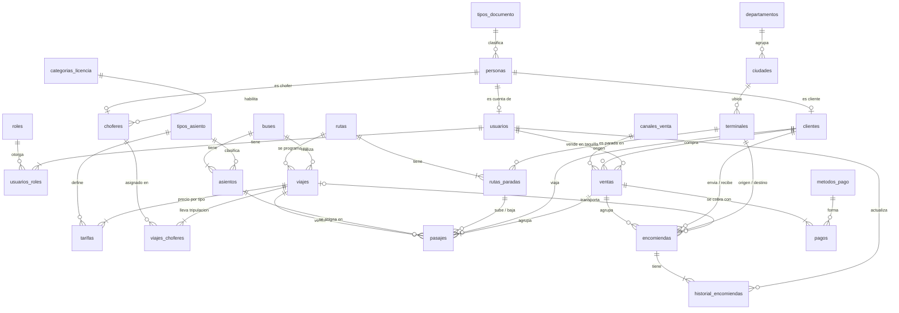

# Propuesta de Base de Datos — Panamericana

> **Versión:** 2.0 · **Estado:** ✅ Aplicada en Supabase · nombres congelados otra vez
> **Fecha:** 2026-09-22 · reemplaza a la v1.0 del 12/09
> Incorpora la revisión de normalización de `docs/bd/ANALISIS_NORMALIZACION.md` (modelo verificado hasta 5FN).

## 0. Estado actual

| Dato | Valor |
|---|---|
| Proyecto Supabase | `panamericana` (ref `tvyhpwpyxmbdfxogopnl`) |
| Tablas creadas | **26**, todas con RLS activado y sin políticas públicas |
| Vistas | **4** (`rutas_resumen`, `viajes_horarios`, `ventas_totales`, `encomiendas_estado_actual`), con `security_invoker` y sin acceso para `anon` |
| Datos de prueba | `supabase/seed.sql`: 5 personas, 2 usuarios con rol, 2 clientes, 1 chofer, 3 terminales, 2 buses con croquis completo (`2045KLP`: 4 cama + 32 semicama en 2 pisos; `3187HTR`: 40 semicama), 1 ruta con 3 paradas, 1 viaje, 3 tarifas, 1 venta con pasaje y pago |
| Datos de demostración | `supabase/demo.sql` (`npm run db:demo`): viajes de hoy a 6 días con tarifas; idempotente y sin cruces de horario |
| Cuentas de acceso | Supabase Auth: Ana (administradora) y Luis (vendedor), con el **mismo id** que en `usuarios`. La contraseña no se versiona |
| Migraciones | `supabase/migrations/` (11 archivos, aplicados) |
| Contexto | **Bolivia (La Paz):** documentos `ci`, `ce` y `pasaporte`; placas `1234ABC`; montos en bolivianos (Bs); fechas en hora de La Paz (UTC−4) |

**Pruebas ejecutadas contra la base real (22/09):**

| Prueba | Resultado |
|---|---|
| Vender el asiento 1 del tramo 1→3 cuando ya está vendido el 1→2 | ❌ Rechazado (`23P01`, `pasajes_asiento_sin_traslape`) |
| Vender el asiento 1 del tramo 2→3 con el 1→2 ya vendido | ✅ Aceptado |
| Pasaje con un bus distinto al del viaje | ❌ Rechazado (`23503`, `pasajes_viaje_bus`) |
| Pasaje con una parada que no existe en la ruta | ❌ Rechazado (`23503`, `pasajes_parada_destino`) |
| Asiento con un tipo fuera del catálogo | ❌ Rechazado (`23503`, `asientos_tipo_fk`) |
| Segundo rol para el mismo usuario | ✅ Aceptado |
| `seed.sql` ejecutado dos veces seguidas | ✅ Sin duplicados |

> ⚠️ **Los nombres de tablas y campos vuelven a estar congelados** (reglas R2 y R3). El descongelamiento del 22/09 fue **único y autorizado**, antes de escribir el código del Sprint 2. Cualquier cambio a partir de aquí se hace con una migración nueva.

---

## 1. Qué cambió respecto a la v1.0

| # | Problema del modelo v1.0 | Cambio aplicado |
|---|---|---|
| 1 | Los datos de una misma persona se guardaban hasta 3 veces (`usuarios`, `clientes`, `choferes`) | Tabla **`personas`**; las otras tres pasan a ser **roles** con `persona_id` |
| 2 | Un usuario no podía tener dos roles | Catálogo **`roles`** + tabla puente **`usuarios_roles`** |
| 3 | Dos caminos entre usuario y cliente | Se eliminó `clientes.usuario_id`: el vínculo va por `personas` |
| 4 | 7 columnas se podían calcular (se desincronizaban) | Se eliminaron y se calculan con **4 vistas** |
| 5 | Las mismas listas de valores repetidas en varios `check` | **8 catálogos** con el código legible como clave primaria |
| 6 | `terminales.ciudad` texto libre; ciudad → departamento | Catálogos **`departamentos`** y **`ciudades`** |
| 7 | La base no garantizaba que parada, ruta, asiento y bus correspondieran al viaje | **Claves foráneas compuestas** en `pasajes` |
| 8 | `parada_origen_id` y `orden_origen` eran el mismo dato | El tramo se identifica por `(ruta_id, orden)`; se eliminaron las dos columnas `parada_*_id` |
| 9 | Tablas puente con `id` decorativo | **Claves primarias naturales** en `rutas_paradas`, `viajes_choferes` y `tarifas` |

**Efecto en el contrato de la API:** los catálogos usan el código como clave (`'ci'`, `'cama'`, `'taquilla'`), así que **los campos y los valores del JSON no cambian**. Lo que cambia es de dónde salen: algunos se leen con un `join` o desde una vista.

---

## 2. Convenciones

| Convención | Regla | Ejemplo |
|---|---|---|
| Nombres | Minúsculas, `snake_case`, español, **sin tildes ni ñ** | `numero_pisos`, `anio_fabricacion` |
| Tablas | En plural | `buses`, `pasajes` |
| Clave primaria | `id` de tipo `uuid` en las entidades; **clave natural** en catálogos y tablas puente | `id` · `codigo` · `(viaje_id, tipo_asiento)` |
| Catálogos | Clave primaria `codigo` legible, con `nombre` y `activo` | `tipos_asiento.codigo = 'cama'` |
| Clave foránea | `<entidad_en_singular>_id` | `bus_id`, `persona_id` |
| Fechas de auditoría | `creado_en`, `actualizado_en` (`timestamptz`) | — |
| Fechas del negocio | `fecha_<evento>` | `fecha_salida` |
| Montos | `numeric(10,2)` | `precio`, `monto` |
| Estados | Texto con lista de valores permitidos (`check`) | `'activo'` |
| Palabras SQL | Siempre en minúsculas | `create table`, `not null` |
| Moneda | Bolivianos (Bs) | `precio` 80.00 = Bs 80 |
| Documentos de identidad | `ci`, `ce`, `pasaporte` (catálogo `tipos_documento`) | `ci` `4827351` o `4827351-1A` |
| Placas | 3 o 4 dígitos y 3 letras, sin guion | `2045KLP` |
| **Datos calculados** | **No se guardan**: se leen de una vista | `ventas_totales.total` |

---

## 3. Diagrama general



**26 tablas en 6 áreas**

| Área | Tablas |
|---|---|
| 📚 Catálogos | `departamentos`, `ciudades`, `tipos_documento`, `tipos_asiento`, `categorias_licencia`, `canales_venta`, `metodos_pago`, `roles` |
| 🔐 Personas y acceso | `personas`, `usuarios`, `usuarios_roles`, `clientes` |
| 🚌 Flota y tripulación | `buses`, `asientos`, `choferes` |
| 🗺️ Rutas y viajes | `terminales`, `rutas`, `rutas_paradas`, `viajes`, `viajes_choferes`, `tarifas` |
| 🎫 Ventas | `ventas`, `pasajes`, `pagos` |
| 📦 Encomiendas | `encomiendas`, `historial_encomiendas` |

---

## 4. Diccionario de tablas

*(`*` = obligatorio)*

### 📚 4.1 Catálogos

Todos tienen `codigo` (clave primaria), `nombre*`, `activo*` y `creado_en*`.

| Tabla | Valores iniciales | Extras |
|---|---|---|
| `departamentos` | `lp`, `cb`, `sc`, `or`, `pt`, `ch`, `tj`, `be`, `pd` | Sin `activo` |
| `ciudades` | La Paz, Oruro, Cochabamba | Clave `id` uuid · `departamento*` → `departamentos` · única por `(departamento, nombre)` |
| `tipos_documento` | `ci`, `ce`, `pasaporte` | |
| `tipos_asiento` | `normal`, `semicama`, `cama` | `orden*` para mostrarlos |
| `categorias_licencia` | `a`, `b`, `c`, `m`, `p`, `t` | `descripcion` |
| `canales_venta` | `web`, `movil`, `taquilla` | |
| `metodos_pago` | `efectivo`, `tarjeta`, `transferencia`, `billetera_digital` | |
| `roles` | `administrador`, `vendedor`, `encomiendas`, `cliente` | `descripcion` |

> Agregar un rol, un método de pago o una ciudad es **insertar una fila**, no una migración.

### 🔐 4.2 `personas`
El dato de una persona vive **solo aquí**, sin importar si es pasajero, chofer o empleado.

| Campo | Tipo | Descripción |
|---|---|---|
| `id`* | uuid | |
| `tipo_documento`* | text | → `tipos_documento` |
| `numero_documento`* | text | |
| `nombres`* · `apellidos`* | text | |
| `telefono` · `correo` | text | Contacto |
| `fecha_nacimiento` | date | Para identificar menores de edad |
| `creado_en`* · `actualizado_en`* | timestamptz | |

**Reglas:** no se repite `tipo_documento` + `numero_documento` (única para todo el sistema).

### 🔐 4.3 `usuarios`
Cuentas que inician sesión. *Las contraseñas las gestiona el servicio de autenticación.*

| Campo | Tipo | Descripción |
|---|---|---|
| `id`* | uuid | Mismo identificador del servicio de autenticación |
| `persona_id`* | uuid | → `personas.id`. Único |
| `correo`* | text | Correo **de la cuenta** (login). Único |
| `activo`* | boolean | Por defecto `true` |
| `creado_en`* · `actualizado_en`* | timestamptz | |

### 🔐 4.4 `usuarios_roles`
Un usuario puede tener varios roles.

| Campo | Tipo | Descripción |
|---|---|---|
| `usuario_id`* + `rol`* | uuid + text | **Clave primaria**. `rol` → `roles.codigo` |
| `creado_en`* | timestamptz | |

### 🔐 4.5 `clientes`
Pasajeros, remitentes y destinatarios. No necesitan cuenta.

| Campo | Tipo | Descripción |
|---|---|---|
| `id`* | uuid | |
| `persona_id`* | uuid | → `personas.id`. Único |
| `creado_en`* · `actualizado_en`* | timestamptz | |

### 🚌 4.6 `buses`

| Campo | Tipo | Descripción |
|---|---|---|
| `id`* | uuid | |
| `placa`* | text | Única · `1234ABC` |
| `marca`* · `modelo`* | text | |
| `anio_fabricacion` | integer | |
| `numero_pisos`* | smallint | `1` o `2` |
| `estado`* | text | `'activo'`, `'mantenimiento'`, `'inactivo'` |
| `creado_en`* · `actualizado_en`* | timestamptz | |

### 🚌 4.7 `asientos`
`fila` y `columna` permiten dibujar el croquis.

| Campo | Tipo | Descripción |
|---|---|---|
| `id`* | uuid | |
| `bus_id`* | uuid | → `buses.id` |
| `numero`* | smallint | Número visible |
| `piso`* | smallint | `1` o `2` |
| `fila`* · `columna`* | smallint | Posición en el croquis |
| `tipo`* | text | → `tipos_asiento.codigo` |

**Reglas:** no se repite `numero` ni la posición (`piso`, `fila`, `columna`) en el mismo bus. Además `(id, bus_id)` es único, para que `pasajes` pueda exigir que el asiento sea del bus del viaje.

### 🚌 4.8 `choferes`

| Campo | Tipo | Descripción |
|---|---|---|
| `id`* | uuid | |
| `persona_id`* | uuid | → `personas.id`. Único |
| `numero_licencia`* | text | Único |
| `categoria_licencia`* | text | → `categorias_licencia.codigo` |
| `fecha_vencimiento_licencia`* | date | Permite alertar licencias vencidas |
| `activo`* | boolean | Por defecto `true` |
| `creado_en`* · `actualizado_en`* | timestamptz | |

### 🗺️ 4.9 `terminales`

| Campo | Tipo | Descripción |
|---|---|---|
| `id`* | uuid | |
| `nombre`* | text | Único |
| `ciudad_id`* | uuid | → `ciudades.id` |
| `direccion`* | text | |
| `activo`* | boolean | Por defecto `true` |
| `creado_en`* · `actualizado_en`* | timestamptz | |

### 🗺️ 4.10 `rutas`
El origen y el destino son la primera y la última parada. **La duración y la distancia se leen de `rutas_resumen`.**

| Campo | Tipo | Descripción |
|---|---|---|
| `id`* | uuid | |
| `nombre`* | text | Ej.: "La Paz - Cochabamba" |
| `activo`* | boolean | Por defecto `true` |
| `creado_en`* · `actualizado_en`* | timestamptz | |

### 🗺️ 4.11 `rutas_paradas`
El orden de terminales por los que pasa una ruta. **Es lo que permite vender tramos.**

| Campo | Tipo | Descripción |
|---|---|---|
| `ruta_id`* + `orden`* | uuid + smallint | **Clave primaria**. `orden` `1` = origen |
| `terminal_id`* | uuid | → `terminales.id` |
| `minutos_desde_origen`* | integer | Para calcular la hora de paso |
| `km_desde_origen` | numeric(7,2) | Para la distancia de la ruta |
| `creado_en`* · `actualizado_en`* | timestamptz | |

**Reglas:** no se repite `terminal_id` dentro de la misma ruta; toda ruta tiene al menos 2 paradas (lo valida el sistema).

### 🗺️ 4.12 `viajes`
**La llegada estimada se lee de `viajes_horarios`; el precio, de `tarifas`.**

| Campo | Tipo | Descripción |
|---|---|---|
| `id`* | uuid | |
| `ruta_id`* | uuid | → `rutas.id` |
| `bus_id`* | uuid | → `buses.id` |
| `fecha_salida`* | timestamptz | |
| `estado`* | text | `'programado'`, `'en_ruta'`, `'finalizado'`, `'cancelado'` |
| `creado_en`* · `actualizado_en`* | timestamptz | |

**Reglas:** un bus no puede tener dos viajes con horarios cruzados (lo valida el sistema). `(id, ruta_id)` y `(id, bus_id)` son únicos, para las claves foráneas compuestas de `pasajes`.

### 🗺️ 4.13 `viajes_choferes`

| Campo | Tipo | Descripción |
|---|---|---|
| `viaje_id`* + `chofer_id`* | uuid | **Clave primaria** |
| `rol`* | text | `'conductor'`, `'ayudante'` |
| `creado_en`* | timestamptz | |

**Reglas:** cada viaje necesita al menos un `'conductor'`; un chofer no puede estar en dos viajes cruzados (lo valida el sistema).

### 🗺️ 4.14 `tarifas`
Precio del recorrido completo por tipo de asiento. El precio de un tramo se calcula proporcional al tiempo (decisión P17).

| Campo | Tipo | Descripción |
|---|---|---|
| `viaje_id`* + `tipo_asiento`* | uuid + text | **Clave primaria**. `tipo_asiento` → `tipos_asiento.codigo` |
| `precio`* | numeric(10,2) | Mayor que 0 |
| `creado_en`* · `actualizado_en`* | timestamptz | |

**Reglas:** un viaje debe tener tarifa para **cada tipo de asiento que tenga su bus** (lo valida el sistema).

### 🎫 4.15 `ventas`
Una operación de compra: agrupa pasajes y/o encomiendas y se cobra junta. **El total se lee de `ventas_totales`.**

| Campo | Tipo | Descripción |
|---|---|---|
| `id`* | uuid | |
| `codigo`* | text | Código visible. Único |
| `cliente_id` | uuid | → `clientes.id` (quien compra) |
| `usuario_id` | uuid | → `usuarios.id` (vendedor; vacío si fue web o app) |
| `canal`* | text | → `canales_venta.codigo` |
| `estado`* | text | `'pendiente'`, `'pagada'`, `'anulada'`, `'expirada'` |
| `creado_en`* · `actualizado_en`* | timestamptz | |

### 🎫 4.16 `pasajes`

| Campo | Tipo | Descripción |
|---|---|---|
| `id`* | uuid | |
| `codigo`* | text | Código impreso en el boleto. Único |
| `venta_id`* | uuid | → `ventas.id` |
| `viaje_id`* | uuid | → `viajes.id` |
| `ruta_id`* · `bus_id`* | uuid | Copias verificadas por la base (sección 5.2) |
| `asiento_id`* | uuid | → `asientos.id`, del bus del viaje |
| `cliente_id`* | uuid | → `clientes.id` (el pasajero) |
| `orden_origen`* · `orden_destino`* | smallint | Paradas donde sube y baja, dentro de `ruta_id` |
| `precio`* | numeric(10,2) | Precio cobrado (histórico: no se recalcula) |
| `estado`* | text | `'reservado'`, `'pagado'`, `'anulado'`, `'expirado'` |
| `reservado_hasta` | timestamptz | Hasta cuándo se retiene el asiento |
| `creado_en`* · `actualizado_en`* | timestamptz | |

### 🎫 4.17 `pagos`

| Campo | Tipo | Descripción |
|---|---|---|
| `id`* | uuid | |
| `venta_id`* | uuid | → `ventas.id` |
| `monto`* | numeric(10,2) | Mayor que 0 |
| `metodo`* | text | → `metodos_pago.codigo` |
| `estado`* | text | `'pendiente'`, `'aprobado'`, `'rechazado'`, `'reembolsado'` |
| `referencia_externa` | text | Código de la pasarela |
| `creado_en`* | timestamptz | |

### 📦 4.18 `encomiendas`
**El estado y la fecha de entrega se leen de `encomiendas_estado_actual`.**

| Campo | Tipo | Descripción |
|---|---|---|
| `id`* | uuid | |
| `codigo_seguimiento`* | text | Único |
| `venta_id` | uuid | → `ventas.id` (se asigna al cobrar) |
| `remitente_id`* · `destinatario_id`* | uuid | → `clientes.id` |
| `terminal_origen_id`* · `terminal_destino_id`* | uuid | → `terminales.id`, distintas |
| `viaje_id` | uuid | → `viajes.id` (al despachar) |
| `descripcion`* | text | Contenido declarado |
| `peso_kg`* | numeric(6,2) | Mayor que 0 |
| `costo`* | numeric(10,2) | Precio cobrado (histórico) |
| `usuario_id`* | uuid | → `usuarios.id` (quien registró) |
| `creado_en`* · `actualizado_en`* | timestamptz | |

### 📦 4.19 `historial_encomiendas`
Cada cambio de estado. **Es la fuente del estado actual.**

| Campo | Tipo | Descripción |
|---|---|---|
| `id`* | uuid | |
| `encomienda_id`* | uuid | → `encomiendas.id` |
| `estado`* | text | `'registrada'`, `'en_transito'`, `'en_destino'`, `'entregada'`, `'cancelada'` |
| `observacion` | text | |
| `usuario_id`* | uuid | → `usuarios.id` |
| `creado_en`* | timestamptz | |

### 👁️ 4.20 Vistas

| Vista | Devuelve | Reemplaza a |
|---|---|---|
| `rutas_resumen` | `ruta_id`, `total_paradas`, `duracion_estimada_min`, `distancia_km` | `rutas.duracion_estimada_min`, `rutas.distancia_km` |
| `viajes_horarios` | `viaje_id`, `orden`, `terminal_id`, `fecha_paso_estimada` | `viajes.fecha_llegada_estimada` |
| `ventas_totales` | `venta_id`, `total` | `ventas.total` |
| `encomiendas_estado_actual` | `encomienda_id`, `estado`, `fecha_estado`, `observacion` | `encomiendas.estado`, `encomiendas.fecha_entrega` |

---

## 5. Cómo evitamos vender dos veces el mismo asiento

El asiento 12 puede ir ocupado de la parada 1 a la 3 y estar **libre** de la 3 a la 5.

| # | Protección | En palabras simples |
|---|---|---|
| 1 | **Reserva temporal** | Al elegir el asiento se crea el pasaje como `'reservado'` con `reservado_hasta`. Si no se paga a tiempo pasa a `'expirado'` y el asiento se libera |
| 2 | **Turno en la base de datos** | Si dos personas confirman a la vez, la base las atiende de una en una |
| 3 | **Candado por tramo** | La base **rechaza** un segundo pasaje activo del mismo asiento, en el mismo viaje, cuyo tramo **se cruce** con uno ya vendido |

### 5.1 La restricción

```sql
create extension if not exists btree_gist;

alter table pasajes
  add constraint pasajes_asiento_sin_traslape
  exclude using gist (
    viaje_id with =,
    asiento_id with =,
    int4range(orden_origen, orden_destino) with &&
  )
  where (estado in ('reservado', 'pagado'));
```

Vender de la parada 1 a la 3 y de la 3 a la 5 sí se permite; de la 1 a la 3 y de la 2 a la 4, no.

### 5.2 Por qué `pasajes` guarda `ruta_id`, `bus_id` y los órdenes

La restricción se evalúa **dentro de la fila**: necesita los órdenes ahí mismo, sin consultar otra tabla. Esas copias podrían mentir, así que la base las verifica con **claves foráneas compuestas**:

```sql
alter table pasajes
  add constraint pasajes_viaje_ruta foreign key (viaje_id, ruta_id) references viajes (id, ruta_id),
  add constraint pasajes_viaje_bus foreign key (viaje_id, bus_id) references viajes (id, bus_id),
  add constraint pasajes_asiento_del_bus foreign key (asiento_id, bus_id) references asientos (id, bus_id),
  add constraint pasajes_parada_origen foreign key (ruta_id, orden_origen) references rutas_paradas (ruta_id, orden),
  add constraint pasajes_parada_destino foreign key (ruta_id, orden_destino) references rutas_paradas (ruta_id, orden);
```

Traducido: *no existe ningún `insert` ni `update` que pueda dejar un pasaje con una parada de otra ruta o un asiento de otro bus*. Es una redundancia **sin anomalía posible**, y es el único lugar del modelo donde se acepta.

---

## 6. Preguntas abiertas

Las decisiones marcadas ✅ están en `PRODUCT_BACKLOG.md` §2 y **no requieren migración**.

| # | Pregunta | Qué cambiaría |
|---|---|---|
| ~~P7~~ | ✅ **Resuelta (23/09, ajuste A6):** se pagan **en origen**, en efectivo, al registrarlas (venta de canal `taquilla`) | Sin cambios |
| ~~P9~~ | ✅ **Resuelta (22/09):** los roles son **datos** del catálogo `roles`; agregar uno es un `insert` | Sin cambios |
| **P11** | ¿Guardamos historial de cambios de los pasajes, como en encomiendas? | Nueva tabla `historial_pasajes` |
| **P16** | ¿La tripulación rota a mitad del recorrido en viajes largos? | `viajes_choferes` necesitaría el tramo asignado |
| ~~P5, P6, P8, P10, P12, P15, P17, P18~~ | ✅ Resueltas en la v1.0 (ver `PRODUCT_BACKLOG.md` §2) | Sin cambios |

---

## 7. Cómo cambiar el modelo desde ahora

1. Escribir una **migración nueva** (nunca editar una aplicada): SQL en minúsculas, sin renombrar campos, con RLS en tablas nuevas.
2. Aplicarla en Supabase y guardar el archivo como `supabase/migrations/<version>_<nombre>.sql`, con la versión que registró la base.
3. Actualizar este documento: diccionario, sección 0 y tabla de migraciones.
4. Si afecta al repositorio del equipo, registrarla en `docs/repo2/CORRECCIONES_NN.md` (la base es compartida: no se vuelve a aplicar, solo se copian los archivos).

**Antes de agregar una columna, preguntarse:** ¿este dato se puede calcular con otros que ya existen? Si la respuesta es sí, va en una vista.

---

## 8. Migraciones aplicadas

| Archivo | Contenido |
|---|---|
| `20260912051634_buses.sql` | `buses` |
| `20260912051645_funciones_y_personas.sql` | función de auditoría, `usuarios`, `clientes` |
| `20260912051709_flota_y_rutas.sql` | `asientos`, `choferes`, `terminales`, `rutas`, `rutas_paradas`, `viajes`, `viajes_choferes`, `tarifas` |
| `20260912051726_ventas_pasajes_pagos.sql` | `ventas`, `pasajes` (restricción por tramos), `pagos` |
| `20260912051740_encomiendas.sql` | `encomiendas`, `historial_encomiendas` |
| `20260915052138_documentos_bolivia.sql` | `ci`, `ce` y `pasaporte` (antes `dni`) |
| `20260922143655_catalogos.sql` | los 8 catálogos con sus valores iniciales |
| `20260922143733_personas.sql` | `personas`, `usuarios_roles` y los tres roles enlazados |
| `20260922143814_derivados_y_vistas.sql` | quita las 7 columnas calculadas y crea las 4 vistas |
| `20260922143903_integridad_y_claves.sql` | claves naturales, catálogos como FK y la integridad del tramo |
| `20260924022028_rutas_nombre_unico.sql` | índice único `lower(nombre)` en `rutas`: dos registros simultáneos con el mismo nombre no pasan (Sprint 2, PAN-13) |

Todas las tablas (salvo las puente y las de historial) tienen `creado_en` y `actualizado_en`; un *trigger* mantiene `actualizado_en` al día.
