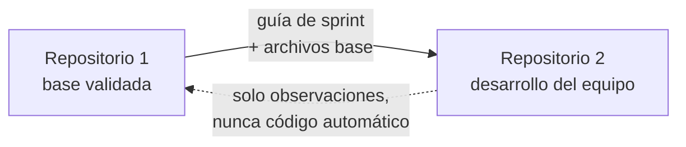

# Replicación al Repositorio 2 (repositorio del equipo)

> **Versión:** 0.1 · **Fecha:** 2026-09-11
> **Documento interno del Repositorio 1.** No se copia al Repositorio 2.

---

## 1. Los dos repositorios

| | **Repositorio 1** | **Repositorio 2** |
|---|---|---|
| Nombre sugerido | `panamericana-base` | `panamericana` |
| Dueño | Z&P (John + Ángel) | Ángel |
| Acceso | John, Ángel | Los 5 integrantes |
| Visibilidad | Privado | Privado |
| Propósito | Construir y validar la base técnica | Desarrollo del equipo completo |
| Herramientas de IA | Sí | No |
| Ruta local | `F:\Universidad\6to\Proyecto III\project_bus` | **Otra carpeta**, fuera de esa ruta |



**Nunca hay conexión automática entre ambos**: ni remotos cruzados, ni `git push`, ni submódulos. La transferencia es manual y consciente.

---

## 2. Reglas de aislamiento

| # | Regla | Por qué |
|---|---|---|
| **A1** | El Repositorio 2 vive en **otra carpeta** del disco, fuera de `project_bus` | Evita que una herramienta que trabaja en el Repositorio 1 lo alcance |
| **A2** | El Repositorio 2 **nunca** se abre como directorio de trabajo de Claude Code ni de otro asistente | Es el requisito principal |
| **A3** | El Repositorio 1 **no** tiene al Repositorio 2 como remoto (`git remote -v` solo muestra su propio `origin`) | Evita un `push` accidental |
| **A4** | El Repositorio 2 **no** copia: `.claude/`, `CLAUDE.md`, `.mcp.json`, `REPLICACION_REPO2.md`, `PLANIFICACION.md` (interno), `.git/` | Evita filtrar configuración y contexto del Repositorio 1 |
| **A5** | Cada repositorio tiene su **propio proyecto de Supabase** y sus propias claves. Los archivos `.env` nunca se copian | Una clave filtrada afecta a los dos |
| **A6** | La transferencia es por **copia de archivos**, nunca por historial de Git | El Repositorio 2 tiene su propio historial, hecho por el equipo |
| **A7** | Antes de copiar cualquier archivo, se revisa que no contenga claves, rutas locales ni referencias al Repositorio 1 | Ver checklist de la sección 6 |

---

## 3. Crear el Repositorio 2 (lo hace Ángel)

### 3.1 Carpeta local

```bash
mkdir "F:\Universidad\6to\Proyecto III\panamericana"
cd "F:\Universidad\6to\Proyecto III\panamericana"
git init -b main
```

> ⚠️ La carpeta debe estar **fuera** de `project_bus`, nunca dentro.

### 3.2 Crear el repositorio remoto

En GitHub: **New repository** → nombre `panamericana` → **Private** → sin README, sin .gitignore (los traemos nosotros) → Create.

```bash
git remote add origin https://github.com/<usuario-de-angel>/panamericana.git
```

### 3.3 Invitar al equipo

**Settings → Collaborators → Add people:** John, Grisel, Brisa y Karime, con permiso **Write**.

### 3.4 Proteger la rama `main`

**Settings → Branches → Add branch protection rule** para `main`:

- [x] Require a pull request before merging → **1 aprobación**
- [x] Require status checks to pass (cuando la CI esté funcionando)
- [x] Require conversation resolution before merging
- [ ] *(No activar "Include administrators" al inicio, para no bloquear al equipo)*

---

## 4. Qué se copia y qué no

| Archivo o carpeta | ¿Se copia? | Nota |
|---|---|---|
| `ARQUITECTURA_CLEAN.md` | ✅ Sí | Es la guía que todos deben seguir |
| `PROPUESTA_BD.md` (v1.0 aprobada) | ✅ Sí | Modelo de datos del equipo |
| `README.md` | ✅ Sí | **Editado**: quitar la nota de "Repositorio 1" y el enlace a este documento |
| `.gitignore`, `.editorconfig`, `.prettierrc`, `.nvmrc` | ✅ Sí | Igual |
| `backend/package.json`, `tsconfig.json`, `eslint.config.js` | ✅ Sí | Igual |
| `backend/.env.example` | ✅ Sí | Solo el ejemplo, **nunca** el `.env` |
| `backend/src/` (estructura de carpetas con `.gitkeep`) | ✅ Sí | El esqueleto, sin el código ya resuelto |
| `web/README.md`, `mobile/README.md` | ✅ Sí | Instrucciones para generar los proyectos |
| `supabase/migrations/`, `supabase/seed.sql` | ✅ Sí | Las migraciones aprobadas |
| `docs/api/openapi.yaml` | ✅ Sí | Contrato |
| `docs/adr/` | ✅ Sí | Decisiones |
| `docs/guias-sprint/GUIA_SPRINT_N.md` | ✅ Sí | Una por sprint, cuando se autorice avanzar |
| `.github/workflows/ci.yml`, `.github/pull_request_template.md` | ✅ Sí | Igual |
| `PLANIFICACION.md` | ⚠️ Versión adaptada | Quitar lo interno; dejar roles, sprints, DoR/DoD y reglas |
| `REPLICACION_REPO2.md` | ❌ No | Documento interno |
| `.env`, `.env.local` | ❌ Nunca | Claves |
| `.git/`, `node_modules/`, `dist/`, `.next/`, `.expo/` | ❌ No | Se regeneran |
| `.claude/`, `CLAUDE.md`, `.mcp.json` | ❌ Nunca | Configuración de herramientas del Repositorio 1 |
| `docs/guias-sprint/PLANTILLA_GUIA_SPRINT.md` | ❌ No | Uso interno |

### 4.1 Comando de copia (PowerShell)

Desde el Repositorio 1, copia la base al Repositorio 2 excluyendo lo que no debe salir:

```powershell
robocopy "F:\Universidad\6to\Proyecto III\project_bus" "F:\Universidad\6to\Proyecto III\panamericana" /E /XD ".git" "node_modules" "dist" ".next" ".expo" ".claude" "guias-sprint" /XF ".env" ".env.local" "REPLICACION_REPO2.md" "PLANIFICACION.md" "CLAUDE.md" ".mcp.json"
```

Después de copiar:

1. Editar el `README.md` del Repositorio 2 (quitar la nota de acceso y el enlace a este documento).
2. Agregar la versión adaptada de `PLANIFICACION.md`.
3. Copiar a mano la guía del sprint correspondiente dentro de `docs/guias-sprint/`.
4. Revisar con el checklist de la sección 6.

### 4.2 Primer commit del Repositorio 2

```bash
git add .
git commit -m "chore: estructura base del proyecto"
git push -u origin main
```

---

## 5. Configuración de entorno del Repositorio 2

Cada integrante, en su computadora:

| Paso | Comando o acción |
|---|---|
| 1. Clonar | `git clone https://github.com/<usuario-de-angel>/panamericana.git` |
| 2. Node 24 | Verificar con `node -v` |
| 3. Backend | `cd backend && npm install && cp .env.example .env` |
| 4. Completar `.env` | Con los datos del **proyecto Supabase del equipo** |
| 5. Web | Seguir `web/README.md` |
| 6. Móvil | Seguir `mobile/README.md` |
| 7. Migraciones | `supabase link --project-ref <ref-del-equipo>` y `supabase db push` |

**Supabase del equipo:** Ángel crea dos proyectos nuevos (`panamericana-equipo-staging` y `panamericana-equipo-prod`), distintos de los del Repositorio 1. Las claves se comparten por un canal privado, **nunca** dentro del repositorio ni por chat grupal.

---

## 6. Checklist antes de publicar cualquier copia

- [ ] No hay archivos `.env` (solo `.env.example` con valores vacíos)
- [ ] No hay claves, contraseñas ni cadenas de conexión reales en ningún archivo
- [ ] No existe la carpeta `.claude/` ni archivos `CLAUDE.md` o `.mcp.json`
- [ ] No se copió `REPLICACION_REPO2.md`
- [ ] El `README.md` no menciona el Repositorio 1
- [ ] No hay carpeta `.git` copiada del Repositorio 1 (`git log` del Repositorio 2 muestra solo sus propios commits)
- [ ] `git remote -v` en el Repositorio 1 no incluye al Repositorio 2, y viceversa

---

## 7. Ciclo de sincronización por sprint

```
Repo 1: se construye y valida el sprint N
        ↓
Se escribe docs/guias-sprint/GUIA_SPRINT_N.md
        ↓
Se autoriza avanzar  →  Ángel copia la guía y los archivos base al Repo 2
        ↓
El equipo (5) desarrolla el sprint N en el Repo 2, con sus propias ramas y PRs
        ↓
Diferencias encontradas  →  se anotan en docs/guias-sprint/DIFERENCIAS.md (Repo 1)
        ↓
Se ajusta la guía del sprint N+1
```

### 7.1 Qué contiene cada guía de sprint

Se usa `docs/guias-sprint/PLANTILLA_GUIA_SPRINT.md`. Incluye funcionalidades, migraciones, endpoints del contrato, archivos por módulo en orden, pantallas y checklist de cierre.

**La guía explica *qué* construir y *en qué orden*, no entrega el código resuelto.** Así cada integrante escribe su parte y el resultado sigue siendo uniforme, porque todos parten de la misma arquitectura, el mismo contrato y los mismos nombres de datos.

### 7.2 Por qué el código puede quedar distinto y aun así funcionar

Lo que mantiene la uniformidad entre los dos repositorios no es el código idéntico, sino los **cuatro acuerdos**:

| Acuerdo | Documento |
|---|---|
| Misma estructura de carpetas y capas | `ARQUITECTURA_CLEAN.md` |
| Mismo contrato de API | `docs/api/openapi.yaml` |
| Mismos nombres de datos | `PROPUESTA_BD.md` (v1.0) |
| Mismas reglas de calidad | Checklist del PR y DoD |

Si esos cuatro se respetan, dos implementaciones distintas siguen siendo compatibles e intercambiables.

---

## 8. Errores a evitar

| ❌ Error | Consecuencia | ✅ En su lugar |
|---|---|---|
| `git remote add repo2 ...` en el Repositorio 1 | Un `push` accidental mezcla los repositorios | Copiar archivos manualmente |
| Copiar la carpeta `.git` | El Repositorio 2 hereda todo el historial del Repositorio 1 | `robocopy` con `/XD ".git"` |
| Copiar `.env` | Se filtran claves de la base de datos | Copiar solo `.env.example` |
| Usar el mismo proyecto de Supabase en los dos repositorios | Un error en uno daña los datos del otro | Proyectos separados |
| Abrir el Repositorio 2 en una sesión de Claude Code | Rompe el aislamiento acordado | Trabajar el Repositorio 2 solo con editor normal |
| Entregar el código resuelto en vez de la guía | El equipo no aprende y las diferencias se vuelven ingobernables | Entregar la guía del sprint |
| Cambiar nombres de campos en el Repositorio 2 | Los dos modelos dejan de ser compatibles | Respetar R2 y R3 |
