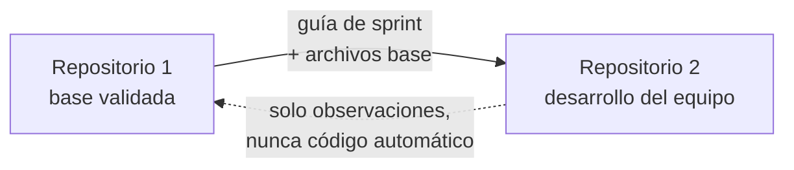

# Replicación al Repositorio 2 (repositorio del equipo)

> **Versión:** 0.2 · **Fecha:** 2026-09-12
> **Documento interno del Repositorio 1.** No se copia al Repositorio 2.
> Actualizado con la estructura real: workspaces (`shared`, `backend`, `web`), módulo de ejemplo `buses` y ramas por integrante.

---

## 1. Los dos repositorios

| | **Repositorio 1** | **Repositorio 2** |
|---|---|---|
| Nombre | `panamericana-base` | `panamericana` |
| Dueño | Z&P (John + Ángel) | Ángel |
| Acceso | John, Ángel | Los 5 integrantes |
| Visibilidad | Privado | Privado |
| Propósito | Construir y validar la base técnica | Desarrollo del equipo completo |
| Herramientas de IA | Sí | No |
| Ruta local | `F:\Universidad\6to\Proyecto III\project_bus` | **Otra carpeta**, fuera de esa ruta |



**Nunca hay conexión automática entre ambos:** ni remotos cruzados, ni `git push`, ni submódulos. La transferencia es manual y consciente.

---

## 2. Reglas de aislamiento

| # | Regla | Por qué |
|---|---|---|
| **A1** | El Repositorio 2 vive en **otra carpeta** del disco, fuera de `project_bus` | Evita que una herramienta que trabaja en el Repositorio 1 lo alcance |
| **A2** | El Repositorio 2 **nunca** se abre como directorio de trabajo de Claude Code ni de otro asistente | Es el requisito principal |
| **A3** | El Repositorio 1 **no** tiene al Repositorio 2 como remoto (`git remote -v` solo muestra su propio `origin`) | Evita un `push` accidental |
| **A4** | El Repositorio 2 **no** copia: `.claude/`, `CLAUDE.md`, `AGENTS.md`, `.mcp.json`, `REPLICACION_REPO2.md`, `.git/` | Evita filtrar configuración y contexto del Repositorio 1 |
| **A5** | Los dos repositorios comparten el proyecto de Supabase `panamericana`, pero **los archivos `.env` nunca se copian**: cada persona pone sus credenciales a mano | Compartir datos es intencional; compartir archivos con claves, no |
| **A6** | La transferencia es por **copia de archivos**, nunca por historial de Git | El Repositorio 2 tiene su propio historial, hecho por el equipo |
| **A7** | Antes de copiar, se revisa que ningún archivo tenga claves ni rutas locales | Ver checklist de la sección 6 |

---

## 3. Crear el Repositorio 2 (lo hace Ángel)

### 3.1 Carpeta local

```bash
mkdir "F:\Universidad\6to\Proyecto III\panamericana"
```

```bash
cd "F:\Universidad\6to\Proyecto III\panamericana" && git init -b main
```

> ⚠️ La carpeta debe estar **fuera** de `project_bus`, nunca dentro.

### 3.2 Repositorio remoto

En GitHub: **New repository** → nombre `panamericana` → **Private** → sin README ni .gitignore → Create.

```bash
git remote add origin https://github.com/<usuario-de-angel>/panamericana.git
```

### 3.3 Invitar al equipo

**Settings → Collaborators → Add people:** John, Grisel, Brisa y Karime con permiso **Write**.

### 3.4 Proteger `main`

**Settings → Branches → Add branch protection rule** para `main`:

- [x] Require a pull request before merging → **1 aprobación**
- [x] Require status checks to pass (una vez que la CI corra)
- [x] Require conversation resolution before merging

---

## 4. Qué se copia y qué no

| Archivo o carpeta | ¿Se copia? | Nota |
|---|---|---|
| `package.json` (raíz) | ✅ Sí | Define los workspaces y los comandos |
| `package-lock.json` | ✅ Sí | Asegura las mismas versiones |
| `shared/` | ✅ Sí | Contrato: endpoints y tipos |
| `backend/` (sin `node_modules` ni `dist`) | ✅ Sí | Incluye el módulo de ejemplo `buses` |
| `web/` (sin `node_modules` ni `.next`) | ✅ Sí | Incluye el panel y el módulo `buses` |
| `supabase/migrations/`, `supabase/seed.sql` | ✅ Sí | Migraciones aprobadas |
| `docs/api/openapi.yaml`, `docs/adr/` | ✅ Sí | Contrato y decisiones |
| `docs/guias-sprint/GUIA_SPRINT_N.md` | ✅ Sí | Solo la del sprint autorizado |
| `ARQUITECTURA_CLEAN.md` | ✅ Sí | Es la guía que todos siguen |
| `PROPUESTA_BD.md` (v1.0 aprobada) | ✅ Sí | Modelo de datos |
| `README.md` | ✅ **Editado** | Quitar la nota de "Repositorio 1" y el enlace a este documento |
| `.gitignore`, `.gitattributes`, `.editorconfig`, `.prettierrc`, `.nvmrc` | ✅ Sí | Igual |
| `.github/workflows/ci.yml`, `.github/pull_request_template.md` | ✅ Sí | Igual |
| `PLANIFICACION.md` | ⚠️ Versión adaptada | Dejar roles, sprints, DoR/DoD y reglas; quitar lo interno |
| `REPLICACION_REPO2.md` | ❌ No | Documento interno |
| `docs/guias-sprint/PLANTILLA_GUIA_SPRINT.md` | ❌ No | Uso interno |
| `.env`, `.env.local` | ❌ Nunca | Claves |
| `node_modules/`, `dist/`, `.next/`, `.git/` | ❌ No | Se regeneran |
| `.claude/`, `CLAUDE.md`, `AGENTS.md`, `.mcp.json` | ❌ Nunca | Configuración de herramientas del Repositorio 1 |

### 4.1 Comando de copia (PowerShell)

```powershell
robocopy "F:\Universidad\6to\Proyecto III\project_bus" "F:\Universidad\6to\Proyecto III\panamericana" /E /XD ".git" "node_modules" "dist" ".next" ".expo" ".claude" "guias-sprint" /XF ".env" ".env.local" "REPLICACION_REPO2.md" "PLANIFICACION.md" "CLAUDE.md" "AGENTS.md" ".mcp.json"
```

Después de copiar:

1. Editar el `README.md` (quitar la nota de acceso y el enlace a este documento).
2. Agregar la versión adaptada de `PLANIFICACION.md`.
3. Crear `docs/guias-sprint/` y copiar solo la guía del sprint autorizado.
4. Revisar el checklist de la sección 6.

### 4.2 Verificar que la base funciona antes del primer commit

```bash
npm install
```

```bash
npm run build
```

```bash
npm test
```

Si los tres pasan, la base está sana.

### 4.3 Primer commit

```bash
git add .
```

```bash
git commit -m "chore: estructura base del proyecto"
```

```bash
git push -u origin main
```

---

## 5. Configuración de entorno del Repositorio 2

### 5.1 Supabase compartido

Los dos repositorios usan **el mismo proyecto**, así que el equipo de 5 y nosotros vemos los mismos datos.

| Dato | Valor |
|---|---|
| Proyecto | `panamericana` |
| Referencia | `tvyhpwpyxmbdfxogopnl` |
| URL | `https://tvyhpwpyxmbdfxogopnl.supabase.co` |
| Región | `us-east-1` |
| Estado | 16 tablas creadas, con datos de prueba |

**Lo que NO se comparte por el repositorio:** la contraseña de la base de datos y la cadena de conexión. Cada integrante las copia del panel de Supabase:

| Dato | Dónde está |
|---|---|
| Cadena de conexión | Supabase → **Connect** → *Session pooler* (o *Direct connection*) |
| Contraseña de la base | Supabase → Project Settings → Database → *Database password* (se puede resetear) |
| Claves de la API | Supabase → Project Settings → API |

> ⚠️ Como es una base compartida, el Repositorio 1 **no hace cargas masivas de datos**. El espacio es del equipo de 5 para sus pruebas de CRUD.

### 5.2 Pasos para cada integrante

| # | Paso | Comando |
|---|---|---|
| 1 | Clonar | `git clone https://github.com/<usuario-de-angel>/panamericana.git` |
| 2 | Verificar Node 24 | `node -v` |
| 3 | Instalar (en la raíz) | `npm install` |
| 4 | Variables del backend | `cp backend/.env.example backend/.env` |
| 5 | Variables de la web | `cp web/.env.local.example web/.env.local` |
| 6 | Completar `backend/.env` | `DATABASE_URL` del panel de Supabase (sección 5.1) |
| 7 | Levantar | `npm run dev:backend` y `npm run dev:web` |
| 8 | Verificar la base | `npm run db:verificar` |
| 9 | Verificar en el navegador | http://localhost:4000/salud y http://localhost:3000/admin/buses |

### 5.3 Migraciones

```bash
npx supabase link --project-ref tvyhpwpyxmbdfxogopnl
```

```bash
npx supabase db push
```

---

## 6. Checklist antes de publicar cualquier copia

- [ ] No hay archivos `.env` ni `.env.local` (solo los `.example`)
- [ ] No hay claves, contraseñas ni cadenas de conexión reales
- [ ] No existen `.claude/`, `CLAUDE.md`, `AGENTS.md` ni `.mcp.json`
- [ ] No se copió `REPLICACION_REPO2.md`
- [ ] El `README.md` no menciona el Repositorio 1
- [ ] `git log` del Repositorio 2 muestra solo sus propios commits
- [ ] `git remote -v` no cruza los dos repositorios
- [ ] `npm install`, `npm run build` y `npm test` funcionan en una carpeta recién clonada

---

## 7. Ramas del Repositorio 2

Una rama por integrante para avanzar sus tareas, y `main` siempre estable.

```
main ────●──────────●──────────●────  (protegida, solo por PR)
          \        /  \       /
 dev/john  ●──●───●    ●──●──●
 dev/brisa ●────●─●
```

| Rama | Dueño |
|---|---|
| `main` | Protegida. Solo se actualiza con PR aprobado |
| `dev/angel` | Ángel |
| `dev/john` | John |
| `dev/grisel` | Grisel |
| `dev/brisa` | Brisa |
| `dev/karime` | Karime |

**Crear la rama propia:**

```bash
git checkout -b dev/john main
```

```bash
git push -u origin dev/john
```

**Rutina diaria de cada integrante:**

```bash
git checkout dev/john && git pull origin main
```

Al terminar una tarjeta: subir la rama, abrir un **Pull Request hacia `main`**, pedir revisión al compañero que corresponda y, una vez fusionado, el resto actualiza su rama con `git pull origin main`.

**Reglas:**

1. Nadie trabaja directamente en `main`.
2. Cada quien toca **solo sus módulos** (`backend/src/modulos/<suyo>`, `web/src/modulos/<suyo>`). Así casi no hay conflictos.
3. Los archivos compartidos (`shared/src/endpoints.ts`, `backend/src/rutas.ts`, `backend/src/contenedor.ts`, `web/src/app/(backoffice)/layout.tsx`) se tocan en cambios pequeños y se fusionan rápido, para que no se peleen dos ramas por la misma línea.
4. Traer `main` a la rama propia **todos los días**: cuanto más vieja la rama, peor el conflicto.

---

## 8. Ciclo de sincronización por sprint

```
Repo 1: se construye y valida el sprint N
        ↓
Se escribe docs/guias-sprint/GUIA_SPRINT_N.md
        ↓
Se autoriza avanzar  →  Ángel copia la guía y los archivos base al Repo 2
        ↓
El equipo (5) desarrolla el sprint N en sus ramas
        ↓
Diferencias encontradas  →  se anotan en docs/guias-sprint/DIFERENCIAS.md (Repo 1)
        ↓
Se ajusta la guía del sprint N+1
```

### 8.1 Qué contiene cada guía de sprint

Se usa `docs/guias-sprint/PLANTILLA_GUIA_SPRINT.md`: funcionalidades, migraciones, endpoints, archivos por módulo en orden, pantallas y checklist de cierre.

**La guía explica *qué* construir y *en qué orden*, no entrega el código resuelto.** Cada integrante escribe su parte y el resultado sigue siendo uniforme porque todos parten de la misma arquitectura, el mismo contrato y los mismos nombres de datos.

### 8.2 Por qué el código puede quedar distinto y aun así funcionar

| Acuerdo | Documento |
|---|---|
| Misma estructura de carpetas y capas | `ARQUITECTURA_CLEAN.md` |
| Mismas direcciones y tipos de la API | `shared/src/` y `docs/api/openapi.yaml` |
| Mismos nombres de datos | `PROPUESTA_BD.md` (v1.0) |
| Mismas reglas de calidad | Checklist del PR y DoD |

---

## 9. Errores a evitar

| ❌ Error | Consecuencia | ✅ En su lugar |
|---|---|---|
| `git remote add repo2 ...` en el Repositorio 1 | Un `push` accidental mezcla los repositorios | Copiar archivos manualmente |
| Copiar la carpeta `.git` | El Repositorio 2 hereda todo el historial | `robocopy` con `/XD ".git"` |
| Copiar `.env` | Se filtran claves de la base de datos | Copiar solo `.env.example` |
| Copiar `node_modules` | Copia lentísima y rota | Excluirla y ejecutar `npm install` |
| Usar el mismo Supabase en los dos repositorios | Un error en uno daña los datos del otro | Proyectos separados |
| Abrir el Repositorio 2 en una sesión de Claude Code | Rompe el aislamiento acordado | Editor normal |
| Entregar el código resuelto en vez de la guía | El equipo no aprende y las diferencias se descontrolan | Entregar la guía del sprint |
| Cambiar nombres de campos en el Repositorio 2 | Los modelos dejan de ser compatibles | Respetar R2 y R3 |
| `npm install` dentro de `backend/` o `web/` | Rompe la instalación por workspaces | `npm install` en la raíz |
