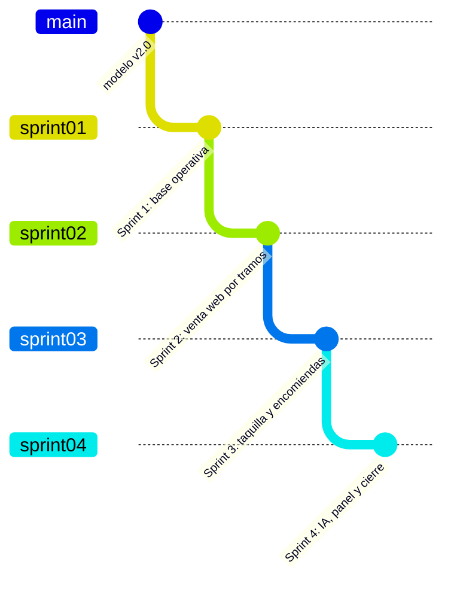

# Revisión de factibilidad y plan de ramas del MVP

> **Fecha:** 23/09/2026 · **Revisión:** arquitectura, planificación, base de datos y código del Sprint 1
> **Repositorio:** `ZPSoftwareFastSolutions/panamericana-base` (el repositorio de referencia; el del equipo es `panamericana`)
> **Veredicto:** ✅ **El MVP es factible** con 4 incrementos. Se encontraron 7 ajustes necesarios; ninguno rompe la arquitectura ni exige cambiar el modelo de datos.

---

## 1. Qué se revisó

| Área | Resultado |
|---|---|
| **Arquitectura** (`ARQUITECTURA_CLEAN.md`, código del Sprint 1) | ✅ Capas respetadas: el dominio no importa librerías, el SQL vive solo en los repositorios, `contenedor.ts` es el único con `new`, el contrato está en `shared/`. El núcleo `compartido/` evita duplicar reglas |
| **Base de datos** (26 tablas, 4 vistas, 10 migraciones) | ✅ Normalizada hasta 5FN; la restricción `pasajes_asiento_sin_traslape` y las claves foráneas compuestas cubren el requisito crítico. No hace falta cambiar el modelo. Durante el Sprint 2 se agregó **un índice** (`rutas_nombre_unico`) para que la regla del nombre único de la ruta resista registros simultáneos |
| **Planificación** (`PRODUCT_BACKLOG.md`, `PLANIFICACION.md`, ADR-001/002/003) | ⚠️ 3 tarjetas quedaron desalineadas con el modelo v2.0 (ver §2) |
| **Autenticación** (ADR-003, HU-005) | ✅ Verificado hoy: Supabase entrega tokens **ES256** con `kid 4190b38b…`, audiencia `authenticated`, y `sub` igual al `id` de `usuarios` |
| **Entorno** | ⚠️ No hay Python en la computadora de trabajo; la CI solo corre en `main` |

---

## 2. Ajustes necesarios (todos incorporados al plan)

| # | Hallazgo | Riesgo si no se corrige | Decisión |
|---|---|---|---|
| **A1** | El modelo v2.0 eliminó `viajes.precio_base`: el precio vive **solo** en `tarifas` | Un viaje programado en el Sprint 2 no tendría precio y no se podría vender | La programación del viaje (**PAN-15**) crea sus tarifas por tipo de asiento. **PAN-35** pasa a ser *editar tarifas* y **PAN-36** se absorbe en el croquis y el checkout del Sprint 2 |
| **A2** | No existían cuentas en Supabase Auth | El login (PAN-10/11) no se puede probar | Se crearon las cuentas de **Ana** (administradora) y **Luis** (vendedor) con el **mismo id** que en `usuarios`. La contraseña se comparte por canal privado, igual que la de la base |
| **A3** | El bus de prueba tiene 4 asientos | La demo de compra por tramos no es creíble | **PAN-12** genera el croquis estándar; los datos de demostración usan un bus completo |
| **A4** | La predicción de demanda estaba planeada en un notebook de Python, y aquí no hay Python | El componente de *machine learning* no se podría verificar | El entrenamiento (regresión lineal múltiple por mínimos cuadrados, con partición entrenamiento/prueba y MAE, RMSE y R²) se hace en **TypeScript** con `npm run ml:entrenar`. Un solo lenguaje para todo el equipo; los coeficientes se exportan a JSON como estaba previsto |
| **A5** | El calendario del docente tiene 3 sprints más una fase final, y el Sprint 3 suma 47 puntos | Un solo incremento demasiado grande, difícil de revisar | El trabajo se divide en **4 ramas** (§3). La rama `sprint04` es el cierre del MVP y encaja en la fase final si el docente no amplía el calendario |
| **A6** | P7 (¿las encomiendas se pagan en origen o en destino?) seguía abierta | Bloquea el registro de encomiendas | **Pago en origen**, en efectivo, al registrarla: se crea una venta de canal `taquilla` con su pago |
| **A7** | La CI solo corre en `main` | Las ramas de sprint no se verifican solas | La CI se extiende a las ramas `sprint*` |

**Fuera del MVP (sin cambios):** choferes y tripulación (HU-013, *Could*: es el ejemplo de la guía del equipo), cuenta de cliente (HU-008), pasarela real (HU-032), app nativa (HU-027) y el despliegue en la nube (PAN-09, PAN-24), que necesita la cuenta de Vercel de Ángel y sigue en la fase final.

---

## 3. Ramas del repositorio

Cada rama es la **foto validada** de un incremento. Se crea a partir de la anterior, se prueba y se sube; después `main` avanza hasta ella. Así `main` siempre tiene la última versión estable y cada sprint se puede revisar por separado.

| Rama | Incremento | Tarjetas | Guía para Ángel |
|---|---|---|---|
| `sprint01` | **Base operativa:** catálogos, terminales, usuarios, clientes, menú y portal | PAN-01 a PAN-08, PAN-41, PAN-42 | `docs/repo2/REPLICACION_SPRINT_01.md` |
| `sprint02` | **MVP 1 — Venta web por tramos:** login y roles, croquis, rutas con paradas, viajes con tarifas, búsqueda, disponibilidad por tramo, reserva con control de concurrencia y compra con pago simulado | PAN-10 a PAN-23 | `REPLICACION_SPRINT_02.md` |
| `sprint03` | **MVP 2 — Operación multicanal:** taquilla sobre el mismo inventario, anulación, encomiendas con seguimiento, boleto con QR, tarifas y editor de croquis | PAN-30 a PAN-38 | `REPLICACION_SPRINT_03.md` |
| `sprint04` | **Cierre del MVP:** predicción de demanda (ML), panel de indicadores, PWA, prueba automatizada de compras simultáneas, pruebas de humo y checklist de seguridad | PAN-25 a PAN-29, PAN-39, PAN-40 | `REPLICACION_SPRINT_04.md` |

---

## 4. Cómo se valida cada sprint antes de subir su rama

1. `npm run lint`, `npm test` y `npm run build` sin errores.
2. **Pruebas de aceptación contra la base real** con un script que crea sus datos, verifica cada criterio de las tarjetas y **borra todo lo que creó**.
3. **Revisión en el navegador** de cada pantalla nueva, en computadora y en celular (375 px).
4. **Revisión de código** del incremento (correctitud y arquitectura) y, cuando hay autenticación o dinero de por medio, **revisión de seguridad**.
5. Búsqueda de rastros internos en el stack (§3.3 de `CLAUDE.md`).
6. Recién entonces: commit, rama, `push` y la guía `REPLICACION_SPRINT_NN.md`.

---

## 5. Qué muestra el MVP al presentar

| Operación | Canal | Garantía |
|---|---|---|
| Buscar viajes por ciudad y fecha, incluidos los tramos intermedios | Portal (celular o computadora) | Solo viajes programados y con salida futura |
| Elegir asiento **para un tramo** y reservarlo 10 minutos | Portal | Nadie más puede tomarlo mientras dure la reserva |
| Pagar (simulado) y recibir el boleto con QR | Portal | Venta, pagos y pasajes se confirman en **una sola transacción** |
| Vender en taquilla sobre el **mismo inventario** | Backoffice (vendedor) | La web y la taquilla nunca venden el mismo asiento en tramos que se cruzan |
| Anular un pasaje hasta 2 h antes | Backoffice (vendedor) | El asiento se libera y el reembolso queda registrado |
| Registrar, despachar y entregar encomiendas; seguimiento público | Backoffice y portal | Cada cambio de estado queda en el historial |
| Ver ventas, ingresos, ocupación y la **demanda estimada** de los próximos 7 días | Panel (administrador) | Modelo de regresión con sus métricas publicadas |
