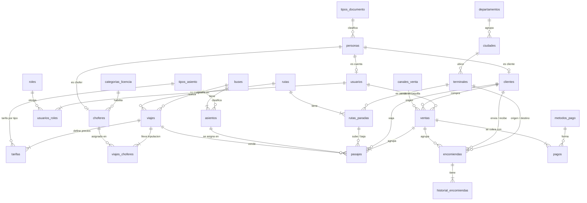

# Análisis de normalización y propuesta de modelo v2.0

> **Fecha:** 2026-09-22 · **Estado:** ✅ **Aplicada el 22/09/2026** (opción A, modelo v2.0 completo) — ver la sección 11
> **Alcance:** las 16 tablas del modelo v1.0 (`PROPUESTA_BD.md`), verificadas contra la base real de Supabase.
> **Objetivo pedido:** que el modelo esté normalizado **hasta 5FN** y quede bien estructurado para que el equipo trabaje cómodo.

---

## 0. Resumen ejecutivo

**Verificación hecha hoy sobre la base real:** 16 tablas, las 6 migraciones aplicadas, RLS activo en todas, y **solo datos de prueba** (2 usuarios, 2 clientes, 3 terminales, 2 buses, 4 asientos, 1 chofer, 1 ruta con 3 paradas, 1 viaje, 2 tarifas, 1 venta, 1 pasaje, 0 pagos, 0 encomiendas). **No hay datos reales que migrar**: el costo de reestructurar hoy es el más bajo que va a tener el proyecto.

**Veredicto del modelo v1.0:** está en **1FN y 2FN** sin objeciones, pero **no llega a 3FN/BCNF** por tres motivos, y el problema más serio no es de forma normal sino de **estructura**:

| | Hallazgo | Gravedad |
|---|---|---|
| **H1** | Los datos de una misma persona se guardan hasta **3 veces** (`usuarios`, `clientes`, `choferes`) | 🔴 Alta |
| **H2** | **7 columnas derivadas** (se pueden calcular a partir de otras filas): rompen 3FN y se desincronizan | 🔴 Alta |
| **H3** | `usuarios.rol` es una sola columna: un usuario no puede tener dos roles sin duplicar la fila | 🟠 Media |
| **H4** | Dos caminos distintos entre `usuarios` y `clientes` (redundancia de asociación) | 🟠 Media |
| **H5** | `terminales.ciudad` como texto libre; sin departamento (dependencia ciudad → departamento) | 🟠 Media |
| **H6** | `tipo_asiento` vive en dos tablas sin catálogo que garantice que coincidan | 🟠 Media |
| **H7** | La base **no garantiza** que la parada de un pasaje pertenezca a la ruta del viaje, ni que el asiento sea del bus del viaje | 🟠 Media |
| **H8** | Claves naturales no declaradas en las tablas puente (`viajes_choferes`, `tarifas`) | 🟡 Baja |

**Recomendación:** aplicar el **modelo v2.0** (26 tablas + 4 vistas) **hoy, antes de que el equipo escriba el código del Sprint 2**. Hoy es el Planning: PAN-13 a PAN-23 tocan justamente `rutas`, `viajes`, `ventas` y `pasajes`. Si se aplica después, el cambio deja de costar 4 migraciones y pasa a costar 4 migraciones **más** reescribir código ya revisado.

**Lo que había que decidir (sección 9):** esto exigía **descongelar los nombres una sola vez** (reglas R2/R3) y avisar al equipo con una corrección (`docs/repo2/CORRECCIONES_02.md`). ✅ Autorizado y aplicado el 22/09 (opción A); los nombres quedaron congelados otra vez.

---

## 1. Cómo se verificó

Para cada tabla se revisó, en este orden:

| Forma normal | Qué se buscó |
|---|---|
| **1FN** | Columnas con más de un valor, listas separadas por comas o grupos repetidos (`telefono1`, `telefono2`) |
| **2FN** | Atributos que dependan solo de una parte de la clave (solo aplica a claves compuestas) |
| **3FN** | Atributos que dependan de otro atributo no clave, y **columnas calculables** a partir de otras filas |
| **BCNF** | Tablas con dos claves candidatas donde un determinante no sea clave |
| **4FN** | Dos hechos multivaluados independientes metidos en la misma tabla |
| **5FN** | Relaciones de 3 o más entidades que se puedan descomponer sin perder información |

**Criterio usado para los catálogos** (para no inflar el modelo con tablas de dos filas): una tabla de catálogo se justifica cuando **elimina una dependencia funcional real** (ciudad → departamento) o cuando **el mismo dominio se usa en dos o más tablas** (`tipo_documento`, `tipo_asiento`). La higiene de texto por sí sola no alcanza.

---

## 2. Veredicto tabla por tabla (modelo v1.0)

| Tabla | 1FN | 2FN | 3FN / BCNF | 4FN | 5FN | Observación |
|---|:--:|:--:|:--:|:--:|:--:|---|
| `usuarios` | ✅ | ✅ | ⚠️ | ⚠️ | ✅ | Datos de persona duplicados (H1); `rol` único (H3) |
| `clientes` | ✅ | ✅ | ⚠️ | ✅ | ✅ | Datos de persona duplicados (H1); `usuario_id` redundante (H4) |
| `choferes` | ✅ | ✅ | ⚠️ | ✅ | ✅ | Datos de persona duplicados (H1) |
| `buses` | ✅ | ✅ | ✅ | ✅ | ✅ | Sin objeciones |
| `asientos` | ✅ | ✅ | ✅ | ✅ | ✅ | `tipo` sin catálogo compartido (H6) |
| `terminales` | ✅ | ✅ | ⚠️ | ✅ | ✅ | `ciudad` texto libre (H5) |
| `rutas` | ✅ | ✅ | ❌ | ✅ | ✅ | `duracion_estimada_min` y `distancia_km` son calculables (H2) |
| `rutas_paradas` | ✅ | ✅ | ✅ | ✅ | ✅ | Dos claves candidatas, ambas superclave → BCNF correcto |
| `viajes` | ✅ | ✅ | ❌ | ✅ | ✅ | `fecha_llegada_estimada` y `precio_base` calculables/duplicados (H2) |
| `viajes_choferes` | ✅ | ✅ | ✅ | ✅ | ✅ | Clave natural no declarada (H8) |
| `tarifas` | ✅ | ✅ | ✅ | ✅ | ✅ | Hecho ternario genuino; clave natural no declarada (H8) |
| `ventas` | ✅ | ✅ | ❌ | ✅ | ✅ | `total` es la suma de sus líneas (H2) |
| `pasajes` | ✅ | ✅ | ⚠️ | ✅ | ✅ | `orden_origen`/`orden_destino` copiados a propósito (sección 5) |
| `pagos` | ✅ | ✅ | ✅ | ✅ | ✅ | Sin objeciones |
| `encomiendas` | ✅ | ✅ | ❌ | ✅ | ✅ | `estado` y `fecha_entrega` se deducen del historial (H2) |
| `historial_encomiendas` | ✅ | ✅ | ✅ | ✅ | ✅ | Sin objeciones |

✅ cumple · ⚠️ cumple formalmente pero arrastra redundancia entre tablas · ❌ no cumple

---

## 3. Hallazgos en detalle

### 🔴 H1 · La misma persona guardada hasta tres veces

`usuarios`, `clientes` y `choferes` repiten el mismo bloque: `nombres`, `apellidos`, `tipo_documento`, `numero_documento`, `telefono`, `correo`.

**Qué se rompe en la práctica:**
- Un chofer que compra un pasaje entra **dos veces**, con dos `id` distintos. Si se casa y cambia de apellido, hay que corregirlo en dos lugares (**anomalía de actualización**).
- La regla "no se repite el documento" solo vale **dentro de cada tabla**: el CI `4827351` puede existir como cliente y como chofer con los nombres escritos distinto.
- Un dato de contacto nuevo (por ejemplo, celular de emergencia) habría que agregarlo en tres tablas.

**Corrección:** una tabla **`personas`** con el documento y los datos personales, y `usuarios`, `clientes` y `choferes` como **roles** que apuntan a ella (`persona_id`). Es la especialización clásica: la persona es única, sus roles son varios.

```
personas (documento, nombres, apellidos, telefono, correo, fecha_nacimiento)
   ▲              ▲                ▲
   │              │                │
usuarios       clientes         choferes
(cuenta)       (compra/viaja)   (maneja)
```

**Ventaja para el equipo:** buscar por documento se hace **en un solo lugar** y sirve para taquilla, encomiendas y tripulación a la vez (HU-009 se vuelve más simple, no más compleja).

### 🔴 H2 · Columnas calculables (rompen 3FN)

Una columna que se puede calcular a partir de otras filas es un dato repetido: tarde o temprano queda desactualizado y nadie sabe cuál de los dos valores es el bueno.

| Columna | Se calcula como | Qué pasa hoy si se desincroniza |
|---|---|---|
| `rutas.duracion_estimada_min` | `max(rutas_paradas.minutos_desde_origen)` | La hora de llegada que ve el cliente no coincide con las paradas |
| `rutas.distancia_km` | suma de los tramos | Reportes de kilometraje inconsistentes |
| `viajes.fecha_llegada_estimada` | `fecha_salida` + duración de la ruta | Se agrega una parada y el viaje sigue mostrando la llegada vieja |
| `viajes.precio_base` | es la **tarifa del tipo `normal`** | Dos precios para lo mismo: `tarifas` dice 95 y `precio_base` dice 80 |
| `ventas.total` | `Σ pasajes.precio + Σ encomiendas.costo` | Se anula un pasaje y el total de la venta miente |
| `encomiendas.estado` | último `historial_encomiendas.estado` | La encomienda dice `en_transito` y el historial dice `entregada` |
| `encomiendas.fecha_entrega` | fila del historial con estado `entregada` | Igual que el anterior |

**Corrección:** se eliminan las columnas y se calculan con **vistas** (sección 4.4). La API sigue devolviendo los mismos campos en el JSON, así que el frontend **no se entera del cambio**.

> **Excepción justificada:** `pasajes.precio` y `encomiendas.costo` **se quedan**. No son datos derivados: son el **precio pactado en el momento de la venta**. Si mañana sube la tarifa, el boleto vendido ayer debe seguir diciendo lo que costó. Eso es un hecho propio de la fila, no una copia.

### 🟠 H3 · `usuarios.rol` como columna única

Hoy un usuario tiene exactamente un rol. El día que Luis sea `vendedor` **y** `encomiendas` hay que duplicar el usuario o inventar el valor `'vendedor_encomiendas'` (y ahí sí se rompe 1FN: dos hechos en un solo valor).

**Corrección:** catálogo **`roles`** + tabla puente **`usuarios_roles`**. Es la forma normal del hecho "este usuario tiene este rol".

### 🟠 H4 · Dos caminos entre usuario y cliente

Existe `clientes.usuario_id` **y** (con H1) existiría `usuarios.persona_id` + `clientes.persona_id`. Dos caminos para responder la misma pregunta = dos versiones posibles de la verdad.

**Corrección:** el vínculo queda **solo por `personas`**; se elimina `clientes.usuario_id`.

### 🟠 H5 · `terminales.ciudad` como texto libre

`ciudad` determina `departamento` (La Paz → La Paz, Oruro → Oruro, Cochabamba → Cochabamba). Es una dependencia funcional entre atributos no clave: si mañana se agrega `departamento` a `terminales`, es una **violación de 3FN de manual**. Además hoy nada impide `'La Paz'`, `'la paz'` y `'LA PAZ'` como tres ciudades distintas.

**Corrección:** catálogos **`departamentos`** (los 9 de Bolivia) y **`ciudades`**; `terminales.ciudad_id` apunta a la ciudad. Bonus: los reportes por departamento salen gratis.

### 🟠 H6 · `tipo_asiento` en dos tablas sin catálogo

`asientos.tipo` y `tarifas.tipo_asiento` usan la misma lista de valores, pero cada una con su propio `check`. Si mañana se agrega `'ejecutivo'`, hay que acordarse de las **dos** migraciones; si alguien cambia solo una, existirán asientos sin tarifa posible.

**Corrección:** catálogo **`tipos_asiento`** (clave `codigo`), referenciado por las dos tablas. Mismo criterio para `tipos_documento`, `metodos_pago`, `canales_venta`, `roles` y `categorias_licencia`.

### 🟠 H7 · Integridad de tramo no garantizada por la base

Hoy la base acepta un pasaje cuyo `parada_origen_id` pertenece a **otra ruta**, o cuyo `asiento_id` es de **otro bus**. Solo el código lo evita; un `insert` manual o un error lo rompe y **el candado contra la doble venta deja de servir** (compara tramos de rutas distintas).

**Corrección:** claves foráneas compuestas encadenadas (sección 5.2): la base garantiza que parada, ruta, asiento, bus y viaje son coherentes, sin un solo `if` en el código.

### 🟡 H8 · Claves naturales no declaradas

`viajes_choferes` y `tarifas` son tablas puente: su identidad **es** el par (`viaje_id`, `chofer_id`) y (`viaje_id`, `tipo_asiento`). El `id` uuid es decorativo y obliga a un `unique` extra.

**Corrección:** clave primaria compuesta natural. Menos columnas, menos índices, misma garantía.

---

## 4. Modelo v2.0

### 4.1 De 16 a 26 tablas (+4 vistas)

| Área | Tablas |
|---|---|
| 📚 **Catálogos** *(nuevos)* | `departamentos`, `ciudades`, `tipos_documento`, `tipos_asiento`, `categorias_licencia`, `canales_venta`, `metodos_pago`, `roles` |
| 🔐 Personas y acceso | **`personas`** *(nueva)*, `usuarios`, **`usuarios_roles`** *(nueva)*, `clientes`, `choferes` |
| 🚌 Flota | `buses`, `asientos` |
| 🗺️ Rutas y viajes | `terminales`, `rutas`, `rutas_paradas`, `viajes`, `viajes_choferes`, `tarifas` |
| 🎫 Ventas | `ventas`, `pasajes`, `pagos` |
| 📦 Encomiendas | `encomiendas`, `historial_encomiendas` |
| 👁️ **Vistas** | `rutas_resumen`, `viajes_horarios`, `ventas_totales`, `encomiendas_estado_actual` |

### 4.2 Diagrama



### 4.3 Cambios campo por campo

Los catálogos usan el **código legible como clave primaria** (`'ci'`, `'cama'`, `'taquilla'`). Consecuencia importante: **las columnas y los valores del JSON de la API no cambian** — `tipo_documento` sigue siendo `'ci'`, solo que ahora es una clave foránea en vez de un `check`.

| Tabla | Cambio |
|---|---|
| `personas` *(nueva)* | `id`, `tipo_documento` → `tipos_documento`, `numero_documento`, `nombres`, `apellidos`, `telefono`, `correo`, `fecha_nacimiento`, auditoría. `unique (tipo_documento, numero_documento)` |
| `usuarios` | **quita** `nombres`, `apellidos`, `rol`; **agrega** `persona_id` (único). **Mantiene** `correo` (es el correo de la **cuenta**, no el de la persona) y `activo` |
| `usuarios_roles` *(nueva)* | `usuario_id` + `rol` → `roles.codigo`, clave primaria compuesta |
| `clientes` | **quita** `tipo_documento`, `numero_documento`, `nombres`, `apellidos`, `telefono`, `correo`, `fecha_nacimiento`, `usuario_id`; **agrega** `persona_id` (único) |
| `choferes` | **quita** los mismos datos personales; **agrega** `persona_id` (único). `categoria_licencia` → `categorias_licencia` |
| `terminales` | `ciudad` (texto) → **`ciudad_id`** → `ciudades` |
| `asientos` | `tipo` → clave foránea a `tipos_asiento` |
| `rutas` | **quita** `duracion_estimada_min` y `distancia_km` (vista `rutas_resumen`) |
| `rutas_paradas` | **agrega** `km_desde_origen`; clave primaria natural `(ruta_id, orden)`, se elimina el `id` uuid; `unique (ruta_id, terminal_id)` |
| `viajes` | **quita** `fecha_llegada_estimada` (vista `viajes_horarios`) y `precio_base` (pasa a `tarifas`); **agrega** las claves únicas que usan las FK compuestas |
| `viajes_choferes` | clave primaria natural `(viaje_id, chofer_id)`. `rol` se queda como `check`: solo lo usa esta tabla (criterio de la sección 1) |
| `tarifas` | clave primaria natural `(viaje_id, tipo_asiento)`; **obligatoria** para cada tipo de asiento del bus |
| `ventas` | **quita** `total` (vista `ventas_totales`); `canal` → `canales_venta` |
| `pasajes` | **agrega** `ruta_id` y `bus_id` como columnas de integridad (sección 5.2) y **elimina** `parada_origen_id` y `parada_destino_id`: con la parada identificada por `(ruta_id, orden)` eran el mismo dato dos veces. La restricción de exclusión no cambia |
| `pagos` | `metodo` → `metodos_pago` |
| `encomiendas` | **quita** `estado` y `fecha_entrega` (vista `encomiendas_estado_actual`) |
| `historial_encomiendas` | sin cambios |

### 4.4 Vistas que reemplazan a los datos calculados

```sql
-- duracion y distancia de cada ruta, a partir de sus paradas
create view rutas_resumen as
select r.id as ruta_id,
       max(p.minutos_desde_origen) as duracion_estimada_min,
       max(p.km_desde_origen) as distancia_km,
       count(*) as total_paradas
  from rutas r
  join rutas_paradas p on p.ruta_id = r.id
 group by r.id;

-- hora de paso por cada parada y llegada estimada del viaje
create view viajes_horarios as
select v.id as viaje_id, p.orden, p.terminal_id,
       v.fecha_salida + make_interval(mins => p.minutos_desde_origen) as hora_estimada
  from viajes v
  join rutas_paradas p on p.ruta_id = v.ruta_id;

-- total cobrado por venta
create view ventas_totales as
select v.id as venta_id,
       coalesce((select sum(precio) from pasajes where venta_id = v.id and estado <> 'anulado'), 0)
     + coalesce((select sum(costo) from encomiendas where venta_id = v.id), 0) as total
  from ventas v;

-- estado actual de cada encomienda, segun su ultimo movimiento
create view encomiendas_estado_actual as
select distinct on (h.encomienda_id)
       h.encomienda_id, h.estado, h.creado_en as fecha_estado
  from historial_encomiendas h
 order by h.encomienda_id, h.creado_en desc;
```

---

## 5. Lo que **no** se cambia (y por qué)

Normalizar de más también es un error. Estas cuatro decisiones son deliberadas y hay que poder defenderlas:

### 5.1 Los estados siguen siendo `check`, no tablas

`estado`, con su lista de valores (`'reservado'`, `'pagado'`, …), **no viola ninguna forma normal**: el valor es atómico y la lista es una *restricción de dominio*, no una dependencia funcional. Convertirla en tabla no evita tocar código (la máquina de estados vive en el dominio) y obliga a un `join` en cada consulta. Se queda como está.

> Los catálogos que **sí** se crean son los que cumplen el criterio de la sección 1: eliminan una dependencia (ciudad → departamento) o se comparten entre tablas (`tipo_documento`, `tipo_asiento`).

### 5.2 `pasajes` conserva copias — protegidas por la base

`pasajes` guarda `orden_origen`, `orden_destino` y ahora también `ruta_id` y `bus_id`. **Son copias, y es intencional:**

| Por qué | Cómo se evita la anomalía |
|---|---|
| La restricción `pasajes_asiento_sin_traslape` (requisito crítico del proyecto) se evalúa **dentro de la fila**: necesita los órdenes ahí mismo | Claves foráneas **compuestas**: la base rechaza cualquier fila cuya copia no coincida con el original |

```sql
-- el padre declara la combinacion como unica...
alter table rutas_paradas add constraint rutas_paradas_id_ruta_orden unique (id, ruta_id, orden);
alter table viajes       add constraint viajes_id_ruta unique (id, ruta_id);
alter table viajes       add constraint viajes_id_bus  unique (id, bus_id);
alter table asientos     add constraint asientos_id_bus unique (id, bus_id);

-- ...y el hijo la referencia completa
alter table pasajes
  add constraint pasajes_viaje_ruta foreign key (viaje_id, ruta_id) references viajes (id, ruta_id),
  add constraint pasajes_viaje_bus  foreign key (viaje_id, bus_id)  references viajes (id, bus_id),
  add constraint pasajes_asiento_del_bus foreign key (asiento_id, bus_id) references asientos (id, bus_id),
  add constraint pasajes_parada_origen  foreign key (parada_origen_id, ruta_id, orden_origen)
      references rutas_paradas (id, ruta_id, orden),
  add constraint pasajes_parada_destino foreign key (parada_destino_id, ruta_id, orden_destino)
      references rutas_paradas (id, ruta_id, orden);
```

Resultado: **no existe ningún `update` que pueda dejar esas copias mentirosas** — la base lo impide. La redundancia sin anomalía posible es el precio aceptado por cumplir el requisito crítico del sistema (y de paso resuelve H7).

### 5.3 Los precios cobrados se quedan en la fila

`pasajes.precio`, `encomiendas.costo` y `pagos.monto` son hechos históricos, no cálculos. Ver la nota de H2.

### 5.4 Un solo teléfono y un solo correo por persona

Separar los contactos en `personas_contactos` sería más puro (4FN), pero el negocio usa **un** contacto y costaría un `join` en cada pantalla. Si mañana hacen falta varios, se agrega esa tabla sin tocar nada más.

---

## 6. Por qué el modelo v2.0 llega a 5FN

Recordatorio: **una relación en BCNF cuyas dependencias de unión estén implicadas por sus claves candidatas está en 5FN.** En la práctica, con relaciones binarias basta con BCNF.

| Tipo de tabla | Ejemplos | Argumento |
|---|---|---|
| Catálogos | `tipos_asiento`, `ciudades` | Clave `codigo`/`id`; los demás atributos dependen solo de ella → BCNF |
| Entidades | `personas`, `buses`, `viajes` | Todo atributo depende de la clave completa y de nada más; ya no quedan derivados ni dependencias transitivas |
| Puentes puros | `usuarios_roles` | Relación binaria sin atributos → 5FN por definición |
| Puentes con atributo | `viajes_choferes (viaje, chofer → rol)`, `tarifas (viaje, tipo → precio)` | El atributo depende del **par completo**; separarlos perdería información → **no descomponibles**, es decir, ya en 5FN |
| Con dos claves candidatas | `rutas_paradas`: `(ruta, orden)` y `(ruta, terminal)` | Ambos determinantes son superclave → BCNF, y no hay dependencia de unión adicional |
| Históricos | `historial_encomiendas` | Cada fila es un hecho independiente fechado |
| Excepción declarada | `pasajes` | 3FN salvo las columnas de integridad de la sección 5.2, cuya consistencia **garantiza la base** con claves foráneas compuestas |

No aparece ningún caso de 4FN (no hay dos hechos multivaluados independientes en la misma tabla) ni de descomposición 5FN pendiente: las únicas relaciones ternarias del modelo (`tarifas`, `viajes_choferes`) son **hechos elementales**.

---

## 7. Plan de migración

Solo hacia adelante (R5), sin tocar las 6 migraciones ya aplicadas. Como la base **solo tiene datos de prueba**, cada migración traslada los datos existentes y luego borra las columnas viejas.

| # | Migración | Contenido | Riesgo |
|---|---|---|---|
| 7 | `catalogos` | 8 tablas de catálogo + carga inicial (9 departamentos, ciudades del seed, tipos, roles, canales, métodos) | 🟢 Solo agrega |
| 8 | `personas` | Crea `personas`; traslada los datos de `usuarios`, `clientes` y `choferes`; agrega `persona_id`; crea `usuarios_roles`; borra las columnas duplicadas y `clientes.usuario_id` | 🟠 Mueve datos |
| 9 | `derivados_y_vistas` | Agrega `km_desde_origen`; borra las 7 columnas calculadas; crea las 4 vistas; vuelve obligatoria la tarifa por tipo | 🟠 Borra columnas |
| 10 | `integridad_y_claves` | Claves primarias naturales en las puentes, catálogos como FK y las claves foráneas compuestas de la sección 5.2 | 🟢 Solo restringe |

**Después de aplicar:** reescribir `supabase/seed.sql` (los `id` fijos de personas se numeran `...0000000000Axx`), correr `npm run db:verificar` (debe listar 26 tablas), repetir la **prueba de doble venta por tramos** y volver a **congelar los nombres** (v2.0).

---

## 8. Impacto

| Dónde | Qué hay que hacer |
|---|---|
| **Backend (repo 1)** | El módulo `buses` no se toca. `usuarios`, `clientes` y `terminales` pasan a leer/escribir con `persona_id` y `ciudad_id` |
| **Repositorio 2** | `docs/repo2/CORRECCIONES_02.md` con las migraciones nuevas y los archivos a reemplazar. La base es compartida: Ángel **no** vuelve a aplicar las migraciones, solo copia los archivos |
| **Guía del equipo** | El ejemplo `choferes` usa datos personales dentro de `choferes` → hay que rehacerlo con `personas` + volver a verificar + regenerar `compartir/` |
| **Trello** | PAN-13 a PAN-23 (Sprint 2) siguen válidas; cambian detalles de PAN-04 y PAN-06 si esos módulos ya están hechos |
| **Documentos** | `PROPUESTA_BD.md` pasa a v2.0 · `ARQUITECTURA_CLEAN.md` (mapa de tablas) · `PRODUCT_BACKLOG.md` (HU-009 busca por persona) · `CLAUDE.md` (§8 y bitácora) |
| **Costo estimado** | ~4 horas de trabajo mío hoy; para el equipo, ajustar los módulos de Sprint 1 ya entregados |

**Regla que hay que levantar:** R2 y R3 congelaron los nombres en v1.0. Esto es un **descongelamiento único y autorizado**, hecho antes de que exista código del Sprint 2, y se vuelve a congelar al terminar. Queda registrado en la bitácora de `CLAUDE.md`.

---

## 9. Decisión

| Opción | Qué implica | Cuándo conviene |
|---|---|---|
| **A · Aplicar v2.0 completo** ✅ *recomendado* | 4 migraciones hoy, antes del código del Sprint 2. Modelo en 5FN, defendible ante el docente | Si PAN-04/PAN-06 aún se pueden ajustar |
| **B · Solo lo crítico** | H1 (`personas`) + H2 (derivados) y dejar catálogos e integridad para después | Si el Sprint 1 cerró y no quieren tocar lo entregado |
| **C · No cambiar** | Se documentan los hallazgos como deuda técnica | Solo si el docente ya validó el modelo v1.0 |

**Antes de aplicar necesito saber:** si los módulos `usuarios` (PAN-04), `clientes` (PAN-06) y `terminales` (PAN-03/07) quedaron terminados en el Sprint 1, porque son los que más cambian con `personas` y `ciudades`.

---

## 10. Bitácora de este análisis

| Fecha | Hecho |
|---|---|
| 22/09/2026 | Verificación de las 16 tablas contra la base real; 8 hallazgos; propuesta v2.0 (26 tablas + 4 vistas) |
| 22/09/2026 | **Aplicada la opción A** (modelo completo) con 4 migraciones; documentación y guía del equipo actualizadas |

---

## 11. Resultado de la aplicación

Las 4 migraciones se aplicaron en el orden previsto y la base quedó con **26 tablas y 4 vistas**.

| Verificación | Resultado |
|---|---|
| `npm run db:verificar` | 26 tablas y 4 vistas |
| Doble venta: tramo 1→3 sobre un 1→2 ya vendido | ❌ `23P01` (correcto) |
| Tramo 2→3 del mismo asiento | ✅ aceptado |
| Pasaje con bus de otro viaje o parada de otra ruta | ❌ `23503`: las claves foráneas compuestas funcionan |
| Asiento con un tipo fuera del catálogo | ❌ `23503` |
| Segundo rol para el mismo usuario | ✅ aceptado |
| `seed.sql` ejecutado dos veces seguidas | ✅ sin duplicados |
| `npm run lint` · `npm test` · `npm run build` | ✅ 4 pruebas y build completo |
| Ejemplo de la guía del equipo (módulo `choferes`) | ✅ extraído, compilado (8 pruebas) y probado contra la API: **13 casos, 0 fallos**; datos de prueba borrados |
| Avisos de seguridad de Supabase | Solo el informativo de siempre (RLS activo sin políticas: es el diseño) |

**Ajustes que surgieron al aplicar:**

1. El dominio del ejemplo pasaba `categoria_licencia` a **mayúscula** y el catálogo guarda los códigos en **minúscula** (`'c'`). Se corrigió la guía: los códigos de catálogo van en minúscula.
2. `viajes_choferes.rol` se quedó como `check` (solo lo usa esa tabla), en lugar del catálogo que preveía la sección 4.3.
3. `pasajes` perdió `parada_origen_id` y `parada_destino_id`: con `rutas_paradas` identificada por `(ruta_id, orden)`, esas columnas eran una segunda copia del mismo dato.
4. `npm run db:verificar` ahora separa tablas y vistas en su salida.

**Pendiente:** que Ángel aplique `docs/repo2/CORRECCIONES_02.md` en el repositorio del equipo y avise al grupo **antes** de que empiecen las tarjetas del Sprint 2.
