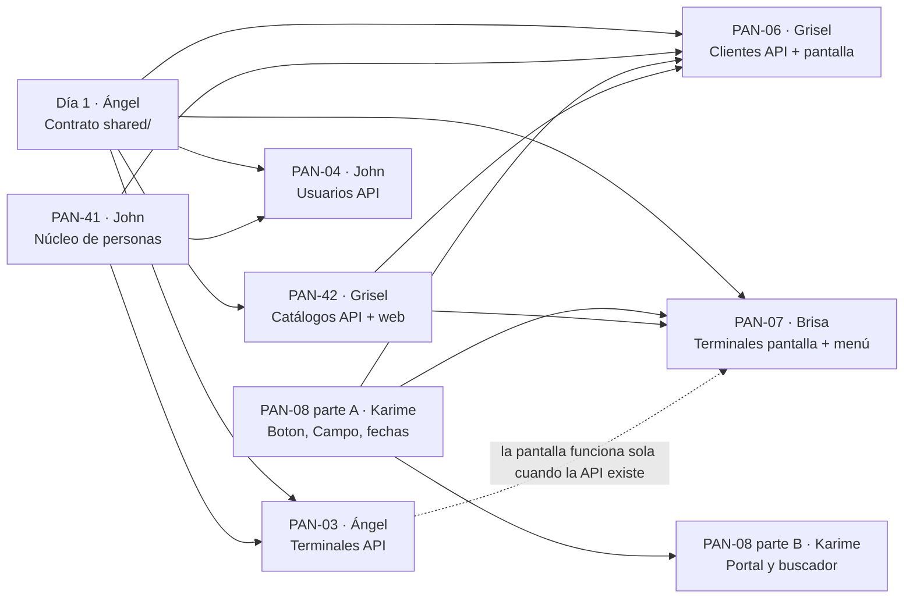

# Replicación del Sprint 1 — guía de gestión para Ángel

> **Fecha:** 23/09/2026 · **Para:** Ángel (Scrum Master) · **Documento interno:** no se copia al repositorio del equipo.
> **Referencia:** commit `04677cb` de `panamericana-base` (Sprint 1 completo, validado).
> **Situación:** el Sprint 1 cerró el 19/09 sin sus módulos; según el backlog (§7.3) sus tarjetas pasan **al inicio del Sprint 2 con prioridad máxima**. Agenda apretada: este documento ordena el trabajo en **5 días hábiles**.

---

## 0. Resumen

| | |
|---|---|
| **Qué está hecho aquí** | Los módulos del Sprint 1 funcionando de punta a punta: `catalogos`, `terminales`, `usuarios`, `clientes`, pantallas del panel, menú y portal público |
| **Base de datos** | **No cambia.** El Sprint 1 no necesita migraciones: usa el modelo v2.0 que ya está en la base y en el repositorio del equipo |
| **Pruebas** | 32 pruebas unitarias · **31 casos de aceptación contra la base real, 0 fallos** · pantallas revisadas en computadora y celular (375 px) |
| **Qué hace el equipo** | Cada integrante construye **su tarjeta en su rama**. Este código es la **solución de referencia**: sirve para revisar los PR y para destrabar a quien se atasque |
| **Tu trabajo** | Abrir el PR del contrato (día 1), vigilar el orden de los PR, revisar con la lista de la §6 y cerrar con la prueba de la §8 |

---

## 1. Congruencia de Trello (verificada el 23/09)

**Asignación:** correcta. Cada tarjeta tiene a su responsable (la cuenta "Oya Oya" lleva PAN-02 y PAN-03, que son tuyas).

**Incongruencias encontradas y corregidas en las tarjetas:**

| Tarjeta | Problema | Corrección |
|---|---|---|
| PAN-01 | Decía "listar 16 tablas" | 26 tablas y 4 vistas |
| PAN-03 | Tabla `terminales` con `ciudad` (texto) | `ciudad_id` → catálogo `ciudades`; la API devuelve la ciudad completa |
| PAN-04 | Tabla `usuarios` con `nombres`, `apellidos`, `rol` | Datos en `personas`; roles en `usuarios_roles` (varios por usuario) |
| PAN-05 | "Mover la tarjeta a **Review**" | La lista se llama **Testing** |
| PAN-06 | Tabla `clientes` con los datos personales | Datos en `personas`; `clientes` solo enlaza; reutiliza la persona si ya existe |
| PAN-07 | La ciudad se escribía a mano | Se elige de una lista (catálogo) |
| — | Nadie tenía a cargo las piezas que usan **varios** módulos | Tarjetas nuevas **PAN-41** y **PAN-42** |

**Tarjetas nuevas** (numeración desde PAN-41, como indica el backlog):

| Tarjeta | Responsable | Trabajo | Pts | Por qué a esa persona |
|---|---|---|---|---|
| **PAN-41** | John | Núcleo compartido de personas (reglas del CI, celular, correo; transacciones) | 2 | Es dueño de "base e identidad"; lo necesitan su PAN-04 y la PAN-06 |
| **PAN-42** | Grisel | Catálogos: API de ciudades, tipos de documento y roles + servicio web | 2 | Lo usa su propia PAN-06 y la PAN-07 de Brisa; es BE + FE |

**Carga resultante:** John 8 · Grisel 8 · Ángel 7 · Brisa 6 · Karime 6 (todos ≤ 10, incluye PAN-01).

> **Tarea tuya en Trello (la integración no asigna miembros):** agrega a **John** en PAN-41 y a **Grisel** en PAN-42. Las fechas de vencimiento quedaron sin cambiar, como se pidió.

---

## 2. Mapa de dependencias



**Regla de oro para no bloquear a nadie:** los PR **pequeños y compartidos** se fusionan primero (contrato, núcleo, componentes). Nadie espera a un módulo completo de otro.

---

## 3. Calendario de 5 días

| Día | Quién | PR que se fusiona ese día | Tamaño |
|---|---|---|---|
| **1** | Ángel | **Contrato**: todo `shared/src/` del Sprint 1 (§4.0) | Chico — lo copias tú |
| **1** | John | **PAN-41** núcleo de personas | Chico |
| **1** | Karime | **PAN-08 parte A**: `Boton`, `Campo`, `fechas` | Chico |
| **2** | Grisel | **PAN-42** catálogos (API + servicio web) | Chico |
| **2–3** | Ángel · John | **PAN-03** terminales API · **PAN-04** usuarios API | Medianos |
| **3–4** | Grisel · Brisa · Karime | **PAN-06** clientes · **PAN-07** pantalla de terminales y menú · **PAN-08 parte B** portal | Medianos |
| **5** | Todos | Integración, prueba de aceptación (§8), mover tarjetas a `Completao` | — |

John revisa los PR de backend (PAN-05) y Brisa/Karime se revisan entre ellas, según la tabla de revisores de siempre.

---

## 4. Detalle por tarjeta

Rutas relativas a la raíz del proyecto. La columna **Referencia** indica que el archivo está listo en `panamericana-base` con ese mismo nombre y ruta.

### 4.0 Contrato del Sprint 1 — Ángel, día 1

Un solo PR con los tipos y las direcciones de **todos** los módulos. Así nadie edita `endpoints.ts` o `index.ts` al mismo tiempo que otro (son los archivos que más conflictos generan).

| Archivo | Qué contiene |
|---|---|
| `shared/src/tipos/comunes.ts` | + `TipoDocumento` (`'ci' \| 'ce' \| 'pasaporte'`) |
| `shared/src/tipos/catalogo.ts` | `Ciudad`, `ElementoCatalogo` |
| `shared/src/tipos/terminal.ts` | `Terminal` (con la `ciudad` completa), `RegistrarTerminalEntrada` |
| `shared/src/tipos/usuario.ts` | `Usuario` (con `roles: string[]`), `RegistrarUsuarioEntrada` |
| `shared/src/tipos/cliente.ts` | `Cliente`, `RegistrarClienteEntrada` |
| `shared/src/endpoints.ts` | `catalogos`, `terminales`, `usuarios`, `clientes` (incluye `buscarPorDocumento`) |
| `shared/src/index.ts` | Exporta todo lo anterior |

Copiar con la receta de la §7 (lista "Contrato"), luego `npm run build`, commit `feat(PAN-02): contrato de la API del sprint 1` y PR.

### 4.1 PAN-41 · Núcleo de personas — John

Las reglas de los datos personales se escriben **una sola vez** y las reutilizan clientes, usuarios y (más adelante) choferes.

| Archivo | Qué contiene |
|---|---|
| `backend/src/compartido/dominio/Persona.ts` | `crearPersona`, `normalizarDocumento`, `normalizarTelefono`, `normalizarCorreo` |
| `backend/src/compartido/dominio/Persona.test.ts` | 10 pruebas |
| `backend/src/compartido/dominio/erroresPersona.ts` | `TipoDocumentoInvalidoError`, `DocumentoInvalidoError`, `TelefonoInvalidoError`, `CorreoInvalidoError`, `FechaNacimientoInvalidaError` |
| `backend/src/compartido/dominio/erroresComunes.ts` | `DatoObligatorioError` |
| `backend/src/compartido/adaptadores/pg/transaccion.ts` | `enTransaccion(pool, trabajo)` |
| `backend/src/compartido/adaptadores/pg/personasSql.ts` | `guardarPersona(conexion, persona)` → reutiliza la persona si el documento ya existe |
| `backend/src/compartido/adaptadores/pg/erroresPg.ts` | `CODIGOS_PG`, `codigoPg(error)` |

**Reglas:** CI de 5 a 10 dígitos con complemento opcional (`4827351-1A`) · CE y pasaporte de 5 a 15 letras o números · celular de 8 dígitos que empieza con 6 o 7 · correo con formato · fecha de nacimiento no futura · nombres y apellidos no vacíos.

**Aceptación:** `npm test` → `Persona.test.ts` con 10 pruebas en verde.

### 4.2 PAN-42 · Catálogos — Grisel

| Archivo | Qué contiene |
|---|---|
| `backend/src/modulos/catalogos/dominio/Catalogo.ts` y `CatalogoRepositorio.ts` | Tipos e interfaz (módulo de solo lectura) |
| `backend/src/modulos/catalogos/casos-de-uso/` | `ListarCiudades.ts`, `ListarTiposDocumento.ts`, `ListarRoles.ts` |
| `backend/src/modulos/catalogos/adaptadores/` | `PgCatalogoRepositorio.ts`, `catalogoRutas.ts` |
| `backend/src/contenedor.ts` · `backend/src/rutas.ts` | Bloque `// modulo: catalogos` |
| `web/src/modulos/catalogos/servicios/catalogosServicio.ts` | `ciudades`, `tiposDocumento`, `roles` |
| `web/src/modulos/catalogos/hooks/useCatalogos.ts` | `useCiudades`, `useTiposDocumento`, `useRoles` (10 min en caché) |

**Aceptación:** los tres `GET` de la §8.1 responden 200 con 3 ciudades, 3 tipos de documento y 4 roles.

### 4.3 PAN-03 · Terminales (API) — Ángel

| Archivo | Qué contiene |
|---|---|
| `backend/src/modulos/terminales/dominio/` | `Terminal.ts`, `TerminalRepositorio.ts`, `errores.ts` (`NombreDuplicadoError` 409, `CiudadNoEncontradaError` 400, `TerminalNoEncontradaError` 404) |
| `backend/src/modulos/terminales/casos-de-uso/` | `ListarTerminales.ts`, `ObtenerTerminal.ts`, `RegistrarTerminal.ts` + `RegistrarTerminal.test.ts` (5 pruebas) |
| `backend/src/modulos/terminales/adaptadores/` | `PgTerminalRepositorio.ts` (join con `ciudades`), `terminalRutas.ts` |
| `contenedor.ts` · `rutas.ts` | Bloque `// modulo: terminales` |

**Reglas:** la ciudad debe existir y estar activa · nombre y dirección obligatorios (se limpian espacios) · el nombre no se repite **sin importar mayúsculas**.

**Detalle a revisar en el PR:** la respuesta trae `ciudad: { id, nombre, departamento }` (objeto anidado, armado con `json_build_object`), no solo `ciudad_id`: así la pantalla muestra el nombre sin otra consulta.

### 4.4 PAN-04 · Usuarios (API) — John

| Archivo | Qué contiene |
|---|---|
| `backend/src/modulos/usuarios/dominio/` | `Usuario.ts`, `UsuarioRepositorio.ts`, `errores.ts` (`CorreoDuplicadoError` 409, `UsuarioDuplicadoError` 409, `RolInvalidoError` 400) |
| `backend/src/modulos/usuarios/casos-de-uso/` | `ListarUsuarios.ts`, `RegistrarUsuario.ts` + `RegistrarUsuario.test.ts` (7 pruebas) |
| `backend/src/modulos/usuarios/adaptadores/` | `PgUsuarioRepositorio.ts` (persona + cuenta + roles en una transacción), `usuarioRutas.ts` |
| `contenedor.ts` · `rutas.ts` | Bloque `// modulo: usuarios` |

**Reglas:** correo de la cuenta obligatorio, con formato, en minúsculas y único · al menos un rol y todos deben existir en el catálogo `roles` (se comparan **contra la base**, no contra una lista escrita en el código) · una persona tiene como máximo una cuenta · `id` opcional (será el de Supabase Auth en PAN-10).

### 4.5 PAN-06 · Clientes de punta a punta — Grisel

| Archivo | Qué contiene |
|---|---|
| `backend/src/modulos/clientes/dominio/` | `Cliente.ts`, `ClienteRepositorio.ts`, `errores.ts` (`ClienteDuplicadoError` 409, `ClienteNoEncontradoError` 404) |
| `backend/src/modulos/clientes/casos-de-uso/` | `ListarClientes.ts`, `RegistrarCliente.ts`, `BuscarClientePorDocumento.ts` + `RegistrarCliente.test.ts` (6 pruebas) |
| `backend/src/modulos/clientes/adaptadores/` | `PgClienteRepositorio.ts`, `clienteRutas.ts` |
| `contenedor.ts` · `rutas.ts` | Bloque `// modulo: clientes` |
| `web/src/modulos/clientes/servicios/clientesServicio.ts` | `listar`, `registrar`, `buscarPorDocumento` |
| `web/src/modulos/clientes/hooks/` | `useClientes.ts`, `useRegistrarCliente.ts` |
| `web/src/modulos/clientes/componentes/` | `TablaClientes.tsx`, `FormularioCliente.tsx` |
| `web/src/app/(backoffice)/admin/clientes/page.tsx` | Página |

**Reglas:** las de PAN-41 · un documento no se registra dos veces como cliente · si la persona **ya existe** (por ejemplo, es chofer), se reutiliza y **se conservan sus nombres**; la API devuelve lo que realmente quedó guardado.

**Detalle a revisar en el PR:** los campos opcionales vacíos del formulario se envían como `null` (la API rechaza una fecha vacía `""`).

### 4.6 PAN-07 · Pantalla de terminales y menú — Brisa

| Archivo | Qué contiene |
|---|---|
| `web/src/modulos/terminales/servicios/terminalesServicio.ts` | `listar`, `obtener`, `registrar` |
| `web/src/modulos/terminales/hooks/` | `useTerminales.ts`, `useRegistrarTerminal.ts` |
| `web/src/modulos/terminales/componentes/` | `TablaTerminales.tsx`, `FormularioTerminal.tsx` (ciudad con `useCiudades`) |
| `web/src/app/(backoffice)/admin/terminales/page.tsx` | Página |
| `web/src/compartido/componentes/MenuLateral.tsx` | Menú con Buses, Terminales y Clientes; resalta la opción activa (`usePathname`) |
| `web/src/app/(backoffice)/layout.tsx` | Usa `MenuLateral`; en celular el menú va arriba |

**Detalle a revisar en el PR:** el menú ya **no** vive en `layout.tsx`. Las pantallas nuevas de los próximos sprints se agregan en `OPCIONES` de `MenuLateral.tsx`.

### 4.7 PAN-08 · Portal público — Karime

**Parte A (día 1, PR chico):**

| Archivo | Qué contiene |
|---|---|
| `web/src/compartido/componentes/Boton.tsx` | Variante principal/secundaria y estado `cargando` |
| `web/src/compartido/componentes/Campo.tsx` | `Campo` (input) y `CampoSeleccion` (select), con etiqueta y error |
| `web/src/compartido/utilidades/fechas.ts` | `hoyEnBolivia()` y `formatearFecha()` |

**Parte B:**

| Archivo | Qué contiene |
|---|---|
| `web/src/app/page.tsx` | **Se elimina** (chocaba con la portada en `/`) |
| `web/src/app/(publico)/layout.tsx` | Cabecera y pie |
| `web/src/app/(publico)/page.tsx` | Portada con el buscador y tres beneficios |
| `web/src/modulos/viajes/componentes/BuscadorViajes.tsx` | Origen, destino y fecha; valida vacíos, origen ≠ destino (sin importar mayúsculas) y fecha desde hoy |

**Detalle a revisar en el PR:** la portada se genera por adelantado, así que "hoy" se calcula **al validar** y el campo de fecha lleva `suppressHydrationWarning` (si no, el navegador avisa cuando el día cambió desde la compilación).

---

## 5. Archivos que tocan varias personas

| Archivo | Quién lo toca | Cómo evitar conflictos |
|---|---|---|
| `shared/src/endpoints.ts`, `shared/src/index.ts` | Todos los módulos | Resuelto con el **contrato del día 1**: nadie más los edita en este sprint |
| `backend/src/contenedor.ts`, `backend/src/rutas.ts` | Grisel, Ángel, John | Cada uno agrega **solo su bloque** `// modulo: …`. Si hay conflicto, se conservan **las dos** partes |
| `web/src/compartido/componentes/*` | Karime crea; Brisa agrega `MenuLateral` | Nadie modifica un componente de otro sin avisar |
| `web/src/app/(backoffice)/layout.tsx` | Solo Brisa | — |

> Antes de abrir cada PR: `git checkout dev/<nombre> && git pull origin main` para traer lo que ya se fusionó.

---

## 6. Lista para revisar cada PR (tú y John)

- [ ] `npm run lint`, `npm test` y `npm run build` sin errores (la CI lo confirma).
- [ ] Capa correcta: el **dominio** no importa `express`, `pg`, `zod` ni `@panamericana/shared`; el **SQL** está solo en `Pg…Repositorio.ts`; las **rutas** no tienen `try/catch`; solo `contenedor.ts` usa `new`.
- [ ] Las reglas de persona **no se copian**: se usa `crearPersona` del núcleo.
- [ ] Varias escrituras en la base van dentro de `enTransaccion`.
- [ ] Las direcciones salen de `RUTAS_API`; ningún componente usa `fetch`.
- [ ] Los campos se llaman igual que en la base (`numero_documento`, no `numeroDocumento`).
- [ ] SQL en minúsculas, con `$1`, `$2`… (nunca valores pegados en el texto).
- [ ] Sin `.env`, sin archivos `.md` nuevos, sin carpetas nuevas en la raíz.
- [ ] Si alguien probó en la base compartida, **borró lo que creó**.
- [ ] Comparación con la referencia (§7.2): las diferencias tienen una razón.

> ⚠️ Si dentro de `web/` aparecen `AGENTS.md` o `CLAUDE.md`, **se borran y no se suben**. Next.js 16 los crea solo cuando detecta un asistente de IA en la terminal; en una terminal normal no aparecen.

---

## 7. Modo rescate y comparación

### 7.1 Copiar una tarjeta desde la referencia

Si alguien queda bloqueado y el calendario no da margen, se copian los archivos de **su** tarjeta en **su** rama y se le pide que los lea y explique en la revisión. En PowerShell, desde cualquier carpeta:

```powershell
$origen = "F:\Universidad\6to\Proyecto III\project_bus"
$destino = "F:\Universidad\6to\Proyecto III\panamericana"
function Copiar-Archivos($lista) {
  foreach ($a in $lista) {
    $d = Join-Path $destino $a
    New-Item -ItemType Directory -Force (Split-Path $d) | Out-Null
    Copy-Item -LiteralPath (Join-Path $origen $a) -Destination $d -Force
  }
}
```

Luego se ejecuta **solo** la lista de la tarjeta:

```powershell
# Contrato (Ángel, día 1)
Copiar-Archivos @("shared\src\tipos\comunes.ts","shared\src\tipos\catalogo.ts","shared\src\tipos\terminal.ts","shared\src\tipos\usuario.ts","shared\src\tipos\cliente.ts","shared\src\endpoints.ts","shared\src\index.ts")
```

```powershell
# PAN-41 (John)
Copiar-Archivos @("backend\src\compartido\dominio\Persona.ts","backend\src\compartido\dominio\Persona.test.ts","backend\src\compartido\dominio\erroresPersona.ts","backend\src\compartido\dominio\erroresComunes.ts","backend\src\compartido\adaptadores\pg\transaccion.ts","backend\src\compartido\adaptadores\pg\personasSql.ts","backend\src\compartido\adaptadores\pg\erroresPg.ts")
```

```powershell
# PAN-08 parte A (Karime)
Copiar-Archivos @("web\src\compartido\componentes\Boton.tsx","web\src\compartido\componentes\Campo.tsx","web\src\compartido\utilidades\fechas.ts")
```

```powershell
# PAN-42 (Grisel) · luego agregar a mano su bloque en contenedor.ts y rutas.ts
Copiar-Archivos @("backend\src\modulos\catalogos\dominio\Catalogo.ts","backend\src\modulos\catalogos\dominio\CatalogoRepositorio.ts","backend\src\modulos\catalogos\casos-de-uso\ListarCiudades.ts","backend\src\modulos\catalogos\casos-de-uso\ListarTiposDocumento.ts","backend\src\modulos\catalogos\casos-de-uso\ListarRoles.ts","backend\src\modulos\catalogos\adaptadores\PgCatalogoRepositorio.ts","backend\src\modulos\catalogos\adaptadores\catalogoRutas.ts","web\src\modulos\catalogos\servicios\catalogosServicio.ts","web\src\modulos\catalogos\hooks\useCatalogos.ts")
```

```powershell
# PAN-03 (Ángel) · luego su bloque en contenedor.ts y rutas.ts
Copiar-Archivos @("backend\src\modulos\terminales\dominio\Terminal.ts","backend\src\modulos\terminales\dominio\TerminalRepositorio.ts","backend\src\modulos\terminales\dominio\errores.ts","backend\src\modulos\terminales\casos-de-uso\ListarTerminales.ts","backend\src\modulos\terminales\casos-de-uso\ObtenerTerminal.ts","backend\src\modulos\terminales\casos-de-uso\RegistrarTerminal.ts","backend\src\modulos\terminales\casos-de-uso\RegistrarTerminal.test.ts","backend\src\modulos\terminales\adaptadores\PgTerminalRepositorio.ts","backend\src\modulos\terminales\adaptadores\terminalRutas.ts")
```

```powershell
# PAN-04 (John) · luego su bloque en contenedor.ts y rutas.ts
Copiar-Archivos @("backend\src\modulos\usuarios\dominio\Usuario.ts","backend\src\modulos\usuarios\dominio\UsuarioRepositorio.ts","backend\src\modulos\usuarios\dominio\errores.ts","backend\src\modulos\usuarios\casos-de-uso\ListarUsuarios.ts","backend\src\modulos\usuarios\casos-de-uso\RegistrarUsuario.ts","backend\src\modulos\usuarios\casos-de-uso\RegistrarUsuario.test.ts","backend\src\modulos\usuarios\adaptadores\PgUsuarioRepositorio.ts","backend\src\modulos\usuarios\adaptadores\usuarioRutas.ts")
```

```powershell
# PAN-06 (Grisel) · luego su bloque en contenedor.ts y rutas.ts
Copiar-Archivos @("backend\src\modulos\clientes\dominio\Cliente.ts","backend\src\modulos\clientes\dominio\ClienteRepositorio.ts","backend\src\modulos\clientes\dominio\errores.ts","backend\src\modulos\clientes\casos-de-uso\ListarClientes.ts","backend\src\modulos\clientes\casos-de-uso\RegistrarCliente.ts","backend\src\modulos\clientes\casos-de-uso\BuscarClientePorDocumento.ts","backend\src\modulos\clientes\casos-de-uso\RegistrarCliente.test.ts","backend\src\modulos\clientes\adaptadores\PgClienteRepositorio.ts","backend\src\modulos\clientes\adaptadores\clienteRutas.ts","web\src\modulos\clientes\servicios\clientesServicio.ts","web\src\modulos\clientes\hooks\useClientes.ts","web\src\modulos\clientes\hooks\useRegistrarCliente.ts","web\src\modulos\clientes\componentes\TablaClientes.tsx","web\src\modulos\clientes\componentes\FormularioCliente.tsx","web\src\app\(backoffice)\admin\clientes\page.tsx")
```

```powershell
# PAN-07 (Brisa)
Copiar-Archivos @("web\src\modulos\terminales\servicios\terminalesServicio.ts","web\src\modulos\terminales\hooks\useTerminales.ts","web\src\modulos\terminales\hooks\useRegistrarTerminal.ts","web\src\modulos\terminales\componentes\TablaTerminales.tsx","web\src\modulos\terminales\componentes\FormularioTerminal.tsx","web\src\app\(backoffice)\admin\terminales\page.tsx","web\src\compartido\componentes\MenuLateral.tsx","web\src\app\(backoffice)\layout.tsx")
```

```powershell
# PAN-08 parte B (Karime) · y borrar la portada vieja
Copiar-Archivos @("web\src\app\(publico)\layout.tsx","web\src\app\(publico)\page.tsx","web\src\modulos\viajes\componentes\BuscadorViajes.tsx")
Remove-Item -LiteralPath (Join-Path $destino "web\src\app\page.tsx") -ErrorAction SilentlyContinue
```

> `contenedor.ts` y `rutas.ts` **no** se copian enteros en modo rescate (pisarían el trabajo de otros): se agrega a mano el bloque del módulo. Cuando todos los PR estén fusionados, esos dos archivos deben quedar iguales a la referencia (§7.2).

### 7.2 Comparar el repositorio del equipo con la referencia

Al final del día 5 (o cuando quieras ver el avance real), este comando lista lo que **falta** o **es distinto** en el repositorio del equipo:

```powershell
$origen = "F:\Universidad\6to\Proyecto III\project_bus"
$destino = "F:\Universidad\6to\Proyecto III\panamericana"
foreach ($carpeta in "shared\src", "backend\src", "web\src") {
  Get-ChildItem -Recurse -File (Join-Path $origen $carpeta) | ForEach-Object {
    $relativo = $_.FullName.Substring($origen.Length + 1)
    $otro = Join-Path $destino $relativo
    if (-not (Test-Path -LiteralPath $otro)) { "FALTA      $relativo" }
    elseif ((Get-FileHash -LiteralPath $_.FullName).Hash -ne (Get-FileHash -LiteralPath $otro).Hash) { "DISTINTO   $relativo" }
  }
}
```

- **FALTA**: la tarjeta de ese archivo no está fusionada.
- **DISTINTO**: normal si el integrante lo escribió a su manera; revisa que cumpla la §6. Si solo cambian saltos de línea, ignóralo.
- Si no imprime nada, el repositorio del equipo coincide con la referencia.

---

## 8. Prueba de aceptación del sprint (día 5)

Con `npm run dev:backend` corriendo, en Git Bash. Cada línea indica el código que **debe** responder.

### 8.1 Catálogos (PAN-42)

```bash
curl -s http://localhost:4000/v1/catalogos/ciudades
```

200 · La Paz, Oruro y Cochabamba. Igual con `/v1/catalogos/tipos-documento` (3) y `/v1/catalogos/roles` (4).

### 8.2 Terminales (PAN-03)

```bash
curl -s http://localhost:4000/v1/terminales
```

200 · 3 terminales, cada una con `ciudad.nombre`.

Copia el `id` de cualquier ciudad de la respuesta de `/v1/catalogos/ciudades` y reemplaza `ID_DE_UNA_CIUDAD`:

```bash
curl -s -i -X POST http://localhost:4000/v1/terminales -H "Content-Type: application/json" -d '{"nombre":"terminal de buses oruro","ciudad_id":"ID_DE_UNA_CIUDAD","direccion":"x"}'
```

**409** `terminal_duplicada` (el nombre existe aunque cambien las mayúsculas). Con un `ciudad_id` que no existe → **400** `ciudad_invalida` (la ciudad se comprueba primero).

### 8.3 Usuarios (PAN-04)

```bash
curl -s http://localhost:4000/v1/usuarios
```

200 · Ana (`administrador`) y Luis (`vendedor`).

```bash
curl -s -i -X POST http://localhost:4000/v1/usuarios -H "Content-Type: application/json" -d '{"correo":"prueba@panamericana.test","roles":["supervisor"],"tipo_documento":"ci","numero_documento":"6600222","nombres":"X","apellidos":"Y"}'
```

**400** `rol_invalido`. Con el correo `ana.quispe@panamericana.test` y un rol válido → **409** `correo_duplicado`.

### 8.4 Clientes (PAN-06)

```bash
curl -s "http://localhost:4000/v1/clientes/buscar?tipo_documento=ci&numero_documento=4827351"
```

200 · Maria Flores. Con `9999999` → **404**. Un `POST` con `"numero_documento":"4827351"` → **409**; con `"ABC123"` → **400** `documento_invalido`; con `"telefono":"12345678"` → **400** `telefono_invalido`.

### 8.5 Pantallas (PAN-06, PAN-07, PAN-08)

| Dónde | Qué comprobar |
|---|---|
| `/admin/terminales` | Menú con la opción activa resaltada · tabla con ciudad · registrar una terminal repetida muestra el mensaje de la API |
| `/admin/clientes` | Registrar un cliente lo muestra en la tabla **sin recargar** · repetir el documento muestra el mensaje |
| `/` en celular (375 px) | Portada en una columna · origen igual al destino muestra error · búsqueda válida muestra el aviso |

**Al terminar:** borrar en la base todo lo creado en la prueba (la base es compartida).

---

## 9. Mensaje para el equipo (se puede copiar tal cual)

> **Plan de la semana — tareas del Sprint 1**
>
> Las tarjetas del Sprint 1 pasan al inicio de este sprint con prioridad. Orden para no bloquearnos:
>
> 1. **Hoy:** yo subo el contrato (`shared/`). John sube las reglas de personas (PAN-41) y Karime los componentes `Boton`, `Campo` y `fechas` (primera parte de PAN-08). Son PR chicos: revisemos y fusionemos rápido.
> 2. **Mañana:** Grisel sube los catálogos (PAN-42): ciudades, tipos de documento y roles.
> 3. **Después:** cada quien su módulo. Antes de abrir el PR, `git pull origin main` en tu rama.
>
> Reglas nuevas de este sprint:
> - Las reglas del CI, el celular y el correo **ya existen** en `backend/src/compartido/dominio/Persona.ts`: úsenlas, no las copien.
> - Si guardas en varias tablas a la vez, usa `enTransaccion`.
> - En la web, los formularios usan `Campo`, `CampoSeleccion` y `Boton` de `web/src/compartido/componentes/`.
> - Las pantallas nuevas se agregan al menú en `MenuLateral.tsx`.
> - Si pruebas en la base, **borra lo que creaste**.
>
> Las tarjetas de Trello ya tienen los archivos y las reglas actualizadas.

---

## 10. Estado

| Paso | Estado |
|---|---|
| Sprint 1 construido y validado en `panamericana-base` | ✅ 23/09 (`04677cb`) |
| Tarjetas de Trello corregidas y PAN-41 / PAN-42 creadas | ✅ 23/09 |
| Contrato `shared/` fusionado en el repositorio del equipo | ⏳ |
| PAN-41 · PAN-08 A | ⏳ |
| PAN-42 | ⏳ |
| PAN-03 · PAN-04 | ⏳ |
| PAN-06 · PAN-07 · PAN-08 B | ⏳ |
| Prueba de aceptación (§8) y comparación (§7.2) | ⏳ |
| Tarjetas en `Completao` y resultado registrado en el backlog | ⏳ |
