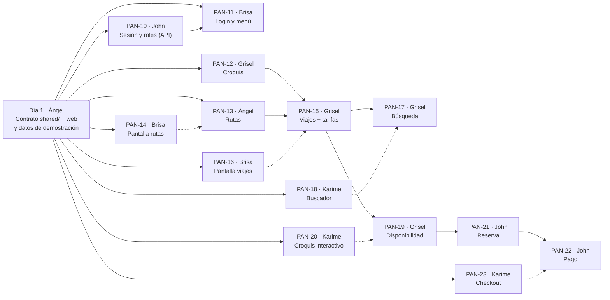

# Replicación del Sprint 2 — guía de gestión para Ángel

> **Fecha:** 23/09/2026 · **Para:** Ángel (Scrum Master) · **Documento interno:** no se copia al repositorio del equipo.
> **Referencia:** rama `sprint02` de `panamericana-base`, commit `399a8cb` (Sprint 2 completo y validado).
> **Requisito previo:** el Sprint 1 fusionado en el repositorio del equipo (`REPLICACION_SPRINT_01.md` §10). El Sprint 2 **modifica** archivos del Sprint 1 (las rutas pasan a exigir sesión).

---

## 0. Resumen

| | |
|---|---|
| **Incremento** | **MVP 1: venta web por tramos.** Login del panel con roles, croquis de asientos, rutas con paradas, viajes con tarifas, búsqueda por ciudad y fecha (incluye tramos intermedios), croquis interactivo, reserva de 10 min con control de concurrencia y compra con pago simulado |
| **Base de datos** | **1 migración nueva**, `rutas_nombre_unico` (índice único del nombre de la ruta). **Ya está aplicada** en la base compartida: el equipo solo copia el archivo. Los datos de prueba ahora traen el croquis completo de los dos buses y hay un script de **viajes de demostración** |
| **Cuentas** | Ya existen en Supabase Auth: `ana.quispe@panamericana.test` (administradora) y `luis.rojas@panamericana.test` (vendedor). La contraseña la tienes tú: compártela **por privado** |
| **Pruebas** | 78 pruebas unitarias (46 nuevas) · **60 casos de aceptación contra la base real, 0 fallos**, incluidas 8 reservas simultáneas del mismo asiento (gana 1, pierden 7) · compra completa revisada en el navegador (computadora y celular 375 px) · revisión de código con 9 hallazgos, **todos corregidos** |
| **Tu trabajo** | Día 1: PR del contrato y del cambio de `.env`. Después: PAN-13, vigilar el orden de los PR (§3), revisar con la §7 y cerrar con la prueba de la §9 |

**Qué puede mostrar el equipo al terminar:** un cliente busca *Oruro → Cochabamba* para mañana, ve el croquis con los asientos libres **solo para su tramo**, elige dos asientos, llena los datos de los pasajeros, paga (simulado) antes de que termine la cuenta regresiva y recibe sus códigos de pasaje. Si otra persona toma el mismo asiento un segundo antes, la pantalla avisa y lo marca ocupado.

---

## 1. Tarjetas del Sprint 2 (para Trello)

> Solo se cargan en Trello **cuando lo decidas**. Formato de siempre: título `PAN-xx · Trabajo · Responsable · N pts`, descripción corta y checklist "Criterios de aceptación". La columna **Rama** es la de cada integrante (`dev/<nombre>`) y el revisor sigue la tabla de siempre.

### 1.1 Resumen y carga

| Tarjeta | Responsable | Trabajo | Pts | Depende de | Revisor |
|---|---|---|---|---|---|
| **PAN-10** | John | Autenticación en la API: token de Supabase, roles y rutas protegidas | 3 | Contrato | Grisel |
| **PAN-11** | Brisa | Login del panel, protección de `/admin` y menú por rol | 3 | Contrato (PAN-10 para probar) | Karime |
| **PAN-12** | Grisel | Croquis de asientos de un bus (API) | 2 | Contrato | John |
| **PAN-13** | Ángel | Rutas con paradas (API) | 5 | Contrato | John |
| **PAN-14** | Brisa | Pantalla de rutas y paradas | 3 | Contrato | Karime |
| **PAN-15** | Grisel | Programación de viajes **con sus tarifas** (API) | 3 | PAN-12, PAN-13 | John |
| **PAN-16** | Brisa | Pantalla de programación de viajes | 3 | Contrato | Karime |
| **PAN-17** | Grisel | Búsqueda de viajes por ciudad y fecha, con tramos intermedios (API) | 2 | PAN-15 | John |
| **PAN-18** | Karime | Buscador conectado y lista de resultados | 2 | Contrato | Brisa |
| **PAN-19** | Grisel | Disponibilidad de asientos por tramo (API) | 3 | PAN-15 | John |
| **PAN-20** | Karime | Croquis interactivo y datos de los pasajeros | 5 | Contrato | Brisa |
| **PAN-21** | John | Reserva con retención de 10 min y control de concurrencia (API) | 5 | PAN-19 | Grisel |
| **PAN-22** | John | Pago simulado y emisión de pasajes (API) | 3 | PAN-21 | Grisel |
| **PAN-23** | Karime | Checkout con cuenta regresiva, confirmación y aviso del 409 | 3 | Contrato | Brisa |

**Carga:** John 11 · Grisel 10 · Brisa 9 · Karime 10 · Ángel 5 (+ contrato). Igual que el backlog.

**Cambio respecto al backlog (ajuste A1):** el modelo v2.0 guarda el precio **solo** en `tarifas`. Por eso **PAN-15 crea las tarifas del viaje** (una por cada tipo de asiento del bus); en el Sprint 3, PAN-35 pasa a ser *editar tarifas* y PAN-36 ya queda cubierta por PAN-20 y PAN-23 (el croquis y el checkout muestran el precio por tipo de asiento).

### 1.2 Descripción y criterios de cada tarjeta

**PAN-10 · Autenticación en la API · John · 3 pts**
Como personal de Panamericana quiero que el panel exija iniciar sesión para que nadie ajeno vea o cambie datos.
Archivos: módulo `backend/src/modulos/sesion/`, `compartido/adaptadores/http/autorizacion.ts`; proteger las rutas de buses, terminales, usuarios y clientes. Librería `jose` (JWKS de Supabase, ES256).
- [ ] Sin token → 401 `no_autenticado`; token falso o vencido → 401
- [ ] `GET /v1/sesion` devuelve nombre, correo y roles del usuario
- [ ] Un vendedor que intenta registrar una ruta → 403 `sin_permiso`
- [ ] Cuenta desactivada → 401
- [ ] Catálogos, búsqueda de viajes, asientos del tramo y compra del portal siguen **sin** sesión
- [ ] 6 pruebas de `IdentificarUsuario` en verde

**PAN-11 · Login del panel y menú por rol · Brisa · 3 pts**
Como personal quiero entrar con mi correo y contraseña y ver solo las opciones de mi rol.
Archivos: módulo `web/src/modulos/sesion/`, páginas `/login` y `/admin`, `layout.tsx` del panel, `MenuLateral.tsx` (opciones con roles), `clienteHttp.ts` (envía el token), `proveedores.tsx`. Librería `@supabase/supabase-js`.
- [ ] Entrar a `/admin/...` sin sesión lleva a `/login` y, al entrar, vuelve a la página pedida
- [ ] Contraseña incorrecta muestra un mensaje claro
- [ ] Ana ve Viajes, Rutas, Buses, Terminales y Clientes; Luis solo Inicio y Clientes
- [ ] "Cerrar sesión" vuelve al login
- [ ] `/login?volver=https://otro-sitio` no redirige fuera del panel

**PAN-12 · Croquis de asientos (API) · Grisel · 2 pts**
Como administradora quiero generar el croquis de un bus para poder venderlo por asiento.
Archivos: módulo `backend/src/modulos/croquis/`.
- [ ] `POST /v1/buses/:id/asientos/generar` crea el croquis estándar por piso (filas, 3 o 4 por fila, tipo)
- [ ] Generar otra vez → 409 `croquis_existente`
- [ ] Asiento con número repetido → 409; piso que el bus no tiene → 400; tipo fuera del catálogo → 400
- [ ] `GET /v1/buses/:id/asientos` lo ve todo el personal
- [ ] 5 pruebas en verde

**PAN-13 · Rutas con paradas (API) · Ángel · 5 pts**
Como administradora quiero registrar una ruta con sus paradas para vender tramos intermedios.
Archivos: módulo `backend/src/modulos/rutas/` y la migración `rutas_nombre_unico` (ya aplicada en la base).
- [ ] Al menos 2 paradas, sin terminal repetida; el origen tiene 0 minutos; los minutos crecen y los km no bajan
- [ ] La respuesta trae duración y distancia (de la vista `rutas_resumen`)
- [ ] Nombre repetido (sin importar mayúsculas) → 409, **también si dos personas lo registran a la vez**
- [ ] Terminal inexistente o inactiva → 400
- [ ] 6 pruebas en verde

**PAN-14 · Pantalla de rutas · Brisa · 3 pts**
Archivos: `web/src/modulos/rutas/componentes/`, página `/admin/rutas`, opción "Rutas" del menú.
- [ ] Tabla con nombre, paradas, duración y distancia
- [ ] Formulario para agregar y quitar paradas; la primera siempre con 0 minutos
- [ ] Los errores de la API se muestran en el formulario

**PAN-15 · Programación de viajes con tarifas (API) · Grisel · 3 pts**
Como administradora quiero programar un viaje con su bus y sus precios para ponerlo a la venta.
Archivos: módulo `backend/src/modulos/viajes/` (programar y listar), `compartido/dominio/Tramo.ts`, `compartido/dominio/erroresViaje.ts`, `compartido/adaptadores/pg/reservasSql.ts`, `infraestructura/reloj.ts`.
- [ ] Una tarifa por cada tipo de asiento del bus (ni más ni menos); precio > 0 y ≤ Bs 5000
- [ ] Fecha futura; bus activo y con croquis
- [ ] El mismo bus en un horario que se cruza → 409 `bus_ocupado` (se revisa de nuevo con el bus bloqueado)
- [ ] La llegada se calcula (salida + duración de la ruta), no se guarda
- [ ] La lista muestra la ocupación (vendidos / total)
- [ ] 7 pruebas en verde (más 8 de `Tramo`)

**PAN-16 · Pantalla de viajes · Brisa · 3 pts**
Archivos: `web/src/modulos/viajes/componentes/TablaViajes.tsx`, `FormularioViaje.tsx`, página `/admin/viajes`, opción "Viajes" del menú.
- [ ] Al elegir el bus, el formulario pide un precio por cada tipo de asiento de su croquis
- [ ] Fecha y hora en hora de La Paz
- [ ] La tabla muestra salida, llegada, ruta, bus, precios y ocupación

**PAN-17 · Búsqueda de viajes (API) · Grisel · 2 pts**
Como cliente quiero buscar por ciudad de origen, destino y fecha, aunque sean paradas intermedias.
- [ ] Encuentra viajes que pasan por el origen y **después** por el destino, en ese día de La Paz
- [ ] Solo viajes programados cuya salida desde mi parada es futura
- [ ] Precio del tramo proporcional al tiempo, redondeado a Bs 0,50
- [ ] Asientos libres **para ese tramo**
- [ ] Origen = destino → 400; sentido contrario → lista vacía

**PAN-18 · Buscador y resultados · Karime · 2 pts**
Archivos: `BuscadorViajes.tsx` (ciudades del catálogo), `ResultadosBusqueda.tsx`, página `/viajes`.
- [ ] La búsqueda queda en la dirección (`/viajes?origen=…&destino=…&fecha=…`) y se puede compartir
- [ ] Cada resultado: hora de salida y llegada al tramo, duración, precio desde, asientos libres y botón "Elegir asiento"
- [ ] Sin resultados muestra un mensaje

**PAN-19 · Disponibilidad por tramo (API) · Grisel · 3 pts**
- [ ] `GET /v1/viajes/:id/asientos?desde=&hasta=` devuelve cada asiento con su precio del tramo y si está disponible
- [ ] Un asiento vendido en 1→2 está **libre** en 2→3
- [ ] Las reservas vencidas se liberan al consultar
- [ ] Tramo al revés → 400; viaje inexistente → 404

**PAN-20 · Croquis interactivo · Karime · 5 pts**
Archivos: `compartido/componentes/PlanoAsientos.tsx`, `modulos/ventas/componentes/CompraDeAsientos.tsx` y `FormularioPasajeros.tsx`, página `/viajes/[id]`.
- [ ] Croquis por piso con libre, elegido y ocupado; hasta 5 asientos
- [ ] Un formulario de pasajero por asiento; el total se actualiza
- [ ] El croquis se refresca solo cada 20 s
- [ ] Si la API responde 409, avisa y marca el asiento como ocupado sin perder lo escrito
- [ ] Se ve bien en celular (375 px)

**PAN-21 · Reserva con control de concurrencia (API) · John · 5 pts**
Como cliente quiero que mi asiento quede apartado mientras pago, sin que nadie más lo compre.
Archivos: módulo `backend/src/modulos/ventas/` (reservar), `compartido/dominio/Codigo.ts`, `compartido/adaptadores/http/limiteDePeticiones.ts`.
- [ ] Reserva de 1 a 5 pasajeros, asientos y documentos distintos; retención de 10 min
- [ ] Tres defensas: revisión previa, turno en la base (`for update` del viaje) y la restricción de exclusión (23P01 → 409)
- [ ] 8 reservas simultáneas del mismo asiento y tramo → 1 gana, 7 reciben 409
- [ ] Tramos que no se cruzan del mismo asiento → ambos ganan
- [ ] La respuesta pública oculta los documentos (`****351`)
- [ ] Más de `LIMITE_RESERVAS_POR_HORA` reservas desde la misma conexión → 429
- [ ] 11 pruebas (reservar y pagar) + 3 del límite en verde

**PAN-22 · Pago simulado y pasajes (API) · John · 3 pts**
- [ ] `POST /v1/ventas/:codigo/pagar` en **una transacción**: pago aprobado por el total, pasajes y venta pagados
- [ ] Referencia `SIMULADO-<codigo>`; método `tarjeta` en la web
- [ ] Pagar dos veces → 409 `venta_no_pendiente`
- [ ] Reserva vencida → 409 `reserva_expirada` y la venta queda expirada (el asiento se libera)
- [ ] `GET /v1/ventas/:codigo` muestra el detalle con el tramo, los asientos y los pasajeros

**PAN-23 · Checkout y confirmación · Karime · 3 pts**
Archivos: `Checkout.tsx`, `DetalleVenta.tsx`, `compartido/componentes/CuentaRegresiva.tsx`, página `/compra/[codigo]`.
- [ ] Cuenta regresiva de la reserva; al llegar a cero ya no deja pagar
- [ ] "Pagar" confirma y muestra los códigos de pasaje
- [ ] Reserva vencida muestra un mensaje y un enlace para buscar de nuevo

---

## 2. Mapa de dependencias



Las flechas punteadas significan "la pantalla **funciona** cuando la API existe": el frontend trabaja contra el contrato desde el día 1 y no espera a nadie.

**La cadena crítica es del backend:** PAN-12/13 → PAN-15 → PAN-19 → PAN-21 → PAN-22. Si se atrasa, se atrasa la demo. Vigílala a diario.

---

## 3. Calendario (10 días hábiles, 22/09 → 03/10)

| Día | Quién | PR que se fusiona | Tamaño |
|---|---|---|---|
| **1** | Ángel | **Contrato**: `shared/` + servicios y hooks web + utilidades de fechas y dinero (§4.0) | Mediano — lo copias tú |
| **1** | Ángel | **Datos de demostración** y `.env.example` (§4.1) | Chico |
| **2** | John | **PAN-10** sesión y roles | Mediano |
| **2** | Grisel | **PAN-12** croquis | Chico |
| **2–3** | Ángel | **PAN-13** rutas | Mediano |
| **3** | Brisa | **PAN-11** login y menú (necesita PAN-10 para probar) | Mediano |
| **3–4** | Grisel | **PAN-15** viajes con tarifas | Mediano |
| **4–5** | Brisa · Karime | **PAN-14** · **PAN-18** | Medianos |
| **5–6** | Grisel | **PAN-17** · **PAN-19** | Chicos |
| **6–7** | John · Brisa | **PAN-21** reserva · **PAN-16** pantalla de viajes | Grande · mediano |
| **7–8** | John · Karime | **PAN-22** pago · **PAN-20** croquis interactivo | Mediano · grande |
| **9** | Karime | **PAN-23** checkout | Mediano |
| **10** | Todos | Prueba de aceptación (§9), demo en el navegador, tarjetas a `Completao`, Review | — |

> **Si el Sprint 1 todavía no terminó:** la regla del backlog (§7.3) sigue valiendo. Primero se cierra el Sprint 1; el calendario se corre y, si hace falta, **PAN-16** (no bloquea a nadie) pasa al Sprint 3.

---

## 4. Detalle por tarjeta (el flujo de archivos)

Rutas relativas a la raíz del proyecto. Todos los archivos están listos en la rama `sprint02` de `panamericana-base` con el mismo nombre y ruta.

### 4.0 Contrato del Sprint 2 — Ángel, día 1

Un solo PR con **todo lo que comparten** backend y web, para que nadie edite estos archivos a la vez:

| Archivo | Qué contiene |
|---|---|
| `shared/src/tipos/sesion.ts` | `RolInterno`, `SesionUsuario` |
| `shared/src/tipos/croquis.ts` | `Asiento`, `Croquis`, `GenerarCroquisEntrada`, `PisoCroquisEntrada`, `RegistrarAsientoEntrada` |
| `shared/src/tipos/ruta.ts` | `ParadaRuta`, `Ruta`, `ParadaRutaEntrada`, `RegistrarRutaEntrada` |
| `shared/src/tipos/viaje.ts` | `Viaje`, `Tarifa`, `ProgramarViajeEntrada`, `ResultadoBusqueda`, `AsientoDisponible`, `DisponibilidadTramo` |
| `shared/src/tipos/venta.ts` | `ReservarEntrada`, `PasajeroEntrada`, `Venta`, `PasajeDeVenta`, estados |
| `shared/src/endpoints.ts` · `shared/src/index.ts` | `sesion`, `croquis`, `rutas`, `viajes`, `ventas` |
| `web/src/modulos/{croquis,rutas,viajes,ventas}/servicios/*.ts` | Qué endpoint llama cada acción (una línea por acción) |
| `web/src/modulos/{croquis,rutas,viajes,ventas}/hooks/*.ts` | Hooks de TanStack Query sobre esos servicios |
| `web/src/compartido/utilidades/fechas.ts` · `dinero.ts` | Horas en La Paz (`aIsoBolivia`, `horaEnBolivia`…) y `formatearBs` |

**Por qué los servicios y hooks van en el contrato:** `viajesServicio.ts` y `useViajes.ts` los usan Brisa (listar y programar) **y** Karime (buscar y disponibilidad). Si cada una agrega su parte, chocan. Son archivos cortos que solo repiten el contrato.

Receta en la §6 (lista "Contrato"), luego `npm run build`, commit `feat(PAN-02): contrato de la API del sprint 2` y PR.

### 4.1 Datos de demostración y configuración — Ángel, día 1

| Archivo | Qué contiene |
|---|---|
| `supabase/seed.sql` | Croquis completo: bus `2045KLP` con 2 pisos (cama abajo, 32 semicama arriba) y `3187HTR` con 40 semicama; viaje de prueba el 01/10 a las 08:00 |
| `supabase/demo.sql` | Viajes de **hoy a 6 días** (08:00, 14:00 y 21:00) La Paz → Oruro → Cochabamba con tarifas. Se puede ejecutar las veces que quieras: no duplica ni cruza horarios |
| `backend/src/infraestructura/ejecutarSql.ts` | Ejecuta un archivo de `supabase/` contra la base |
| `package.json` (raíz) y `backend/package.json` | Scripts `db:semilla` y `db:demo` |
| `backend/.env.example` · `web/.env.local.example` | Variables nuevas (§5) |

> La base compartida **ya tiene** la semilla y la demo cargadas. `npm run db:demo` sirve para renovar los viajes antes de presentar (los de días pasados dejan de aparecer en el portal).

### 4.2 PAN-10 · Sesión y roles (API) — John

```
petición ─► autorizacion.requiere(...roles)          compartido/adaptadores/http/autorizacion.ts (interfaz + grupos de roles)
             └─ crearAutorizacion()                   modulos/sesion/adaptadores/middlewareSesion.ts
                 └─ IdentificarUsuario.ejecutar(token) modulos/sesion/casos-de-uso/IdentificarUsuario.ts
                     ├─ VerificadorDeToken (puerto)    modulos/sesion/dominio/puertos.ts
                     │   └─ JoseVerificadorDeToken     adaptadores/ — firma ES256 con el JWKS de Supabase
                     ├─ CuentaRepositorio (puerto)
                     │   └─ PgCuentaRepositorio        adaptadores/ — usuario activo + roles
                     └─ puedeAcceder(cuenta, roles)    modulos/sesion/dominio/Cuenta.ts
```

| Archivo | Qué contiene |
|---|---|
| `backend/src/modulos/sesion/dominio/` | `Cuenta.ts`, `puertos.ts`, `errores.ts` (`NoAutenticadoError` 401, `SinPermisoError` 403) |
| `backend/src/modulos/sesion/casos-de-uso/` | `IdentificarUsuario.ts` + `IdentificarUsuario.test.ts` (6 pruebas) |
| `backend/src/modulos/sesion/adaptadores/` | `JoseVerificadorDeToken.ts`, `PgCuentaRepositorio.ts`, `middlewareSesion.ts`, `sesionRutas.ts` |
| `backend/src/compartido/adaptadores/http/autorizacion.ts` | `Autorizacion`, `ROLES_INTERNOS`, `SOLO_ADMINISTRADOR`, `ROLES_VENTA`, `ROLES_ENCOMIENDAS`, `usuarioEnSesion` |
| `backend/src/infraestructura/config.ts` | `SUPABASE_URL` obligatorio |
| `backend/src/modulos/{buses,terminales,usuarios,clientes}/adaptadores/*Rutas.ts` | Reciben `(casos, autorizacion)` y protegen cada endpoint |
| `backend/src/contenedor.ts` · `rutas.ts` | Crea `autorizacion`; separa rutas públicas y protegidas |

**Instalar:** `npm install jose --workspace backend` (no copiar `package.json` a mano).

**Detalle a revisar en el PR:** el dominio (`IdentificarUsuario`) **no** importa `jose` ni `express`: depende de dos puertos. Por eso se prueba con dobles en memoria. Solo `contenedor.ts` hace `new JoseVerificadorDeToken(...)`.

### 4.3 PAN-11 · Login y menú por rol — Brisa

| Archivo | Qué contiene |
|---|---|
| `web/src/modulos/sesion/servicios/clienteSupabase.ts` · `sesionServicio.ts` | Cliente de Supabase (clave publicable) · iniciar y cerrar sesión, leer `/v1/sesion` |
| `web/src/modulos/sesion/hooks/useSesion.ts` | `useSesion`, `useIniciarSesion`, `useCerrarSesion` |
| `web/src/modulos/sesion/componentes/` | `FormularioLogin.tsx` (`destinoSeguro`: solo vuelve a `/admin…`), `PanelConSesion.tsx` (guardia + estructura), `Bienvenida.tsx` |
| `web/src/app/(publico)/login/page.tsx` · `web/src/app/(backoffice)/admin/page.tsx` | Páginas |
| `web/src/app/(backoffice)/layout.tsx` | Usa `PanelConSesion` |
| `web/src/compartido/componentes/MenuLateral.tsx` | Recibe `roles`, `nombre`, `alCerrarSesion`; `OPCIONES` con roles |
| `web/src/compartido/servicios/clienteHttp.ts` · `web/src/app/proveedores.tsx` | `registrarProveedorDeToken`: cada petición lleva `Authorization: Bearer …` |
| `web/src/app/(publico)/layout.tsx` | Enlace "Acceso del personal" a `/login` |

**Instalar:** `npm install @supabase/supabase-js --workspace web`.

**Detalle a revisar en el PR:** el menú **oculta** opciones pero no protege nada; la protección real es la API (PAN-10). `destinoSeguro` evita que `?volver=` mande a otro sitio.

### 4.4 PAN-12 · Croquis — Grisel

| Archivo | Qué contiene |
|---|---|
| `backend/src/modulos/croquis/dominio/` | `Croquis.ts` (`validarAsiento`, `generarCroquisEstandar`, `chocaConOtro`), `CroquisRepositorio.ts`, `errores.ts` |
| `backend/src/modulos/croquis/casos-de-uso/` | `ObtenerCroquis.ts`, `GenerarCroquis.ts`, `RegistrarAsiento.ts` + `GenerarCroquis.test.ts` (5 pruebas) |
| `backend/src/modulos/croquis/adaptadores/` | `PgCroquisRepositorio.ts`, `croquisRutas.ts` |
| `contenedor.ts` · `rutas.ts` | Bloque `// modulo: croquis` |

**Regla del estándar:** 4 por fila → columnas 1, 2, 4, 5 (pasillo en la 3); 3 por fila → 1, 3, 4; máximo 20 filas por piso.

### 4.5 PAN-13 · Rutas — Ángel

| Archivo | Qué contiene |
|---|---|
| `backend/src/modulos/rutas/dominio/` | `Ruta.ts` (`crearRuta`), `RutaRepositorio.ts`, `errores.ts` |
| `backend/src/modulos/rutas/casos-de-uso/` | `ListarRutas.ts`, `ObtenerRuta.ts`, `RegistrarRuta.ts` + `RegistrarRuta.test.ts` (6 pruebas) |
| `backend/src/modulos/rutas/adaptadores/` | `PgRutaRepositorio.ts` (ruta y paradas en una transacción; 23505 → `RutaDuplicadaError`), `rutaRutas.ts` |
| `supabase/migrations/20260924022028_rutas_nombre_unico.sql` | Índice único `lower(nombre)`. **Ya aplicada**: solo se copia el archivo |
| `contenedor.ts` · `rutas.ts` | Bloque `// modulo: rutas` |

**Detalle a revisar en el PR:** la revisión previa del nombre da un mensaje amable; el **índice único** es el que garantiza la regla cuando dos personas registran a la vez.

### 4.6 PAN-14 · Pantalla de rutas — Brisa

| Archivo | Qué contiene |
|---|---|
| `web/src/modulos/rutas/componentes/TablaRutas.tsx` · `FormularioRuta.tsx` | Tabla y formulario de paradas (al quitar la primera, la nueva primera queda en 0 minutos) |
| `web/src/app/(backoffice)/admin/rutas/page.tsx` | Página |
| `MenuLateral.tsx` | Opción `Rutas` (solo administrador) |

### 4.7 PAN-15, PAN-17 y PAN-19 · Módulo de viajes (API) — Grisel

Es **un solo módulo** que crece en tres PR. Cada PR agrega su caso de uso y sus métodos del repositorio.

```
PAN-15  POST /v1/viajes ─► ProgramarViaje ─► programarViaje() (dominio) ─► PgViajeRepositorio.guardar (bus bloqueado + choque de horario)
        GET  /v1/viajes ─► ListarViajes   ─► PgViajeRepositorio.listar
PAN-17  GET  /v1/viajes/buscar ─► BuscarViajes ─► buscarCandidatos (SQL) + precioDeTramo (dominio compartido)
PAN-19  GET  /v1/viajes/:id/asientos ─► ConsultarDisponibilidad ─► resolverTramo + liberarReservasVencidas + asientosDelTramo
```

| Archivo | PR | Qué contiene |
|---|---|---|
| `backend/src/compartido/dominio/Tramo.ts` + `Tramo.test.ts` (8 pruebas) | 15 | `resolverTramo`, `horaDePaso`, `exigirTramoALaVenta`, `precioDeTramo` (lo usa también ventas) |
| `backend/src/compartido/dominio/erroresViaje.ts` | 15 | `ViajeNoEncontradoError` 404, `ViajeNoDisponibleError` 409, `TramoInvalidoError` 400 |
| `backend/src/compartido/adaptadores/pg/reservasSql.ts` | 15 | `PASAJE_ACTIVO` y `liberarReservasVencidas` (lo usa también ventas) |
| `backend/src/infraestructura/reloj.ts` | 15 | `hoyEnBolivia()` |
| `backend/src/modulos/viajes/dominio/` | 15 | `Programacion.ts`, `ViajeRepositorio.ts`, `errores.ts` |
| `backend/src/modulos/viajes/casos-de-uso/ProgramarViaje.ts` + test (7) · `ListarViajes.ts` | 15 | Programar y listar |
| `backend/src/modulos/viajes/casos-de-uso/BuscarViajes.ts` | 17 | Búsqueda por ciudad y fecha |
| `backend/src/modulos/viajes/casos-de-uso/ConsultarDisponibilidad.ts` | 19 | Croquis del tramo |
| `backend/src/modulos/viajes/adaptadores/PgViajeRepositorio.ts` · `viajeRutas.ts` | 15 → 19 | Crecen en cada PR |
| `contenedor.ts` · `rutas.ts` | 15 | Bloque `// modulo: viajes` |

**Detalles a revisar:** la búsqueda y la disponibilidad son **públicas**; listar es del personal y programar solo de la administradora. `ruta` y `bus` se devuelven **anidados** (`ruta.nombre`, `bus.placa`), igual que `terminal.ciudad`.

### 4.8 PAN-16 · Pantalla de viajes — Brisa

| Archivo | Qué contiene |
|---|---|
| `web/src/modulos/viajes/componentes/TablaViajes.tsx` · `FormularioViaje.tsx` | Tabla con ocupación · formulario que pide un precio por tipo de asiento del croquis del bus (`useCroquis`) |
| `web/src/app/(backoffice)/admin/viajes/page.tsx` | Página |
| `MenuLateral.tsx` | Opción `Viajes` (solo administrador) |

### 4.9 PAN-18 · Buscador y resultados — Karime

| Archivo | Qué contiene |
|---|---|
| `web/src/modulos/viajes/componentes/BuscadorViajes.tsx` | Ahora con ciudades del catálogo; navega a `/viajes?origen&destino&fecha` |
| `web/src/modulos/viajes/componentes/ResultadosBusqueda.tsx` | Tarjetas de resultado |
| `web/src/app/(publico)/viajes/page.tsx` | Página de resultados |

### 4.10 PAN-21 y PAN-22 · Módulo de ventas (API) — John

```
PAN-21  POST /v1/ventas/reservas ─► limiteReservas ─► ReservarAsientos
          ├─ contextoDeReserva (viaje, paradas, tarifas, asientos ocupados)
          ├─ reservarAsientos() (dominio: pasajeros, tramo, precios)        ◄─ DEFENSA 1: revisión previa
          └─ PgVentaRepositorio.guardarReserva (una transacción)
               ├─ select ... for update del viaje                          ◄─ DEFENSA 2: turno en la base
               ├─ liberarReservasVencidas + volver a mirar los asientos
               ├─ guardarPersona + clientes + venta pendiente
               └─ insert pasajes ─ 23P01 → AsientoNoDisponibleError 409    ◄─ DEFENSA 3: restricción de exclusión
PAN-22  POST /v1/ventas/:codigo/pagar ─► PagarVenta ─► registrarPago (venta bloqueada; pago + pasajes + venta en una transacción)
        GET  /v1/ventas/:codigo       ─► ObtenerVenta ─► ocultarDocumentos
```

| Archivo | PR | Qué contiene |
|---|---|---|
| `backend/src/compartido/dominio/Codigo.ts` | 21 | `generarCodigo('V'|'P')` (8 caracteres sin ambiguos), `enmascararDocumento` |
| `backend/src/compartido/adaptadores/http/limiteDePeticiones.ts` + test (3) | 21 | `limitarPorIp`, `DemasiadasPeticionesError` 429 |
| `backend/src/infraestructura/config.ts` | 21 | `LIMITE_RESERVAS_POR_HORA` |
| `backend/src/modulos/ventas/dominio/` | 21 | `Venta.ts`, `VentaRepositorio.ts`, `errores.ts`, `privacidad.ts` |
| `backend/src/modulos/ventas/casos-de-uso/ReservarAsientos.ts` + `ReservarAsientos.test.ts` | 21 → 22 | 11 pruebas (reservar y pagar) |
| `backend/src/modulos/ventas/casos-de-uso/ObtenerVenta.ts` · `PagarVenta.ts` | 22 | Detalle y pago |
| `backend/src/modulos/ventas/adaptadores/PgVentaRepositorio.ts` · `ventaRutas.ts` | 21 → 22 | Crecen en cada PR |
| `contenedor.ts` · `rutas.ts` | 21 | Bloque `// modulo: ventas` y `limiteReservas` |

**Detalle a revisar:** el pago revisa en la base que **todos** los pasajes sigan vigentes; si uno venció, deshace todo y responde `reserva_expirada`.

### 4.11 PAN-20 · Croquis interactivo — Karime

| Archivo | Qué contiene |
|---|---|
| `web/src/compartido/componentes/PlanoAsientos.tsx` | Grilla por piso con estados libre, elegido y ocupado |
| `web/src/modulos/ventas/componentes/CompraDeAsientos.tsx` | Croquis + pasajeros + total + reservar; maneja el 409 |
| `web/src/modulos/ventas/componentes/FormularioPasajeros.tsx` | Un formulario por asiento |
| `web/src/app/(publico)/viajes/[id]/page.tsx` | Página |

### 4.12 PAN-23 · Checkout — Karime

| Archivo | Qué contiene |
|---|---|
| `web/src/compartido/componentes/CuentaRegresiva.tsx` | Reloj de la reserva |
| `web/src/modulos/ventas/componentes/Checkout.tsx` · `DetalleVenta.tsx` | Pagar, confirmación y reserva vencida |
| `web/src/app/(publico)/compra/[codigo]/page.tsx` | Página |

---

## 5. Configuración (`.env`) — avisar al equipo el día 1

| Archivo | Variable nueva | Valor |
|---|---|---|
| `backend/.env` | `LIMITE_RESERVAS_POR_HORA` | `30` (para la prueba de aceptación, `1000`) |
| `web/.env.local` | `NEXT_PUBLIC_SUPABASE_URL` | `https://tvyhpwpyxmbdfxogopnl.supabase.co` |
| `web/.env.local` | `NEXT_PUBLIC_SUPABASE_PUBLISHABLE_KEY` | `sb_publishable_pekXdkyDZys5MbAEw4KJWA_pVnIHBMi` (pública por diseño) |

`SUPABASE_URL` ya estaba en `backend/.env`; desde este sprint es **obligatoria** (sin ella la API no arranca).

La **guía de desarrollo v1.3** (`compartir/GUIA_DESARROLLO_PANAMERICANA.md`) ya trae los `.env` completos, cómo pedir un token para probar la API con `curl` y el ejemplo `choferes` con rutas protegidas. Compártela por privado junto con la contraseña de las cuentas de prueba.

---

## 6. Modo rescate y comparación

Misma función `Copiar-Archivos` del Sprint 1 (`REPLICACION_SPRINT_01.md` §7.1), apuntando `$origen` a la carpeta de `panamericana-base` **con la rama `sprint02` activa** (`git checkout sprint02`).

```powershell
# Contrato (Ángel, día 1)
Copiar-Archivos @("shared\src\tipos\sesion.ts","shared\src\tipos\croquis.ts","shared\src\tipos\ruta.ts","shared\src\tipos\viaje.ts","shared\src\tipos\venta.ts","shared\src\endpoints.ts","shared\src\index.ts","web\src\modulos\croquis\servicios\croquisServicio.ts","web\src\modulos\croquis\hooks\useCroquis.ts","web\src\modulos\rutas\servicios\rutasServicio.ts","web\src\modulos\rutas\hooks\useRutas.ts","web\src\modulos\viajes\servicios\viajesServicio.ts","web\src\modulos\viajes\hooks\useViajes.ts","web\src\modulos\ventas\servicios\ventasServicio.ts","web\src\modulos\ventas\hooks\useVentas.ts","web\src\compartido\utilidades\fechas.ts","web\src\compartido\utilidades\dinero.ts")
```

```powershell
# Datos de demostracion (Angel, dia 1) · luego agregar a mano los scripts db:semilla y db:demo en package.json (raiz y backend)
Copiar-Archivos @("supabase\seed.sql","supabase\demo.sql","backend\src\infraestructura\ejecutarSql.ts","backend\.env.example","web\.env.local.example")
```

```powershell
# PAN-10 (John) · antes: npm install jose --workspace backend
Copiar-Archivos @("backend\src\compartido\adaptadores\http\autorizacion.ts","backend\src\modulos\sesion\dominio\Cuenta.ts","backend\src\modulos\sesion\dominio\puertos.ts","backend\src\modulos\sesion\dominio\errores.ts","backend\src\modulos\sesion\casos-de-uso\IdentificarUsuario.ts","backend\src\modulos\sesion\casos-de-uso\IdentificarUsuario.test.ts","backend\src\modulos\sesion\adaptadores\JoseVerificadorDeToken.ts","backend\src\modulos\sesion\adaptadores\PgCuentaRepositorio.ts","backend\src\modulos\sesion\adaptadores\middlewareSesion.ts","backend\src\modulos\sesion\adaptadores\sesionRutas.ts","backend\src\infraestructura\config.ts","backend\src\modulos\buses\adaptadores\busRutas.ts","backend\src\modulos\terminales\adaptadores\terminalRutas.ts","backend\src\modulos\usuarios\adaptadores\usuarioRutas.ts","backend\src\modulos\clientes\adaptadores\clienteRutas.ts")
```

```powershell
# PAN-11 (Brisa) · antes: npm install @supabase/supabase-js --workspace web
Copiar-Archivos @("web\src\modulos\sesion\servicios\clienteSupabase.ts","web\src\modulos\sesion\servicios\sesionServicio.ts","web\src\modulos\sesion\hooks\useSesion.ts","web\src\modulos\sesion\componentes\FormularioLogin.tsx","web\src\modulos\sesion\componentes\PanelConSesion.tsx","web\src\modulos\sesion\componentes\Bienvenida.tsx","web\src\app\(publico)\login\page.tsx","web\src\app\(backoffice)\admin\page.tsx","web\src\app\(backoffice)\layout.tsx","web\src\app\(publico)\layout.tsx","web\src\app\proveedores.tsx","web\src\compartido\servicios\clienteHttp.ts","web\src\compartido\componentes\MenuLateral.tsx")
```

```powershell
# PAN-12 (Grisel)
Copiar-Archivos @("backend\src\modulos\croquis\dominio\Croquis.ts","backend\src\modulos\croquis\dominio\CroquisRepositorio.ts","backend\src\modulos\croquis\dominio\errores.ts","backend\src\modulos\croquis\casos-de-uso\ObtenerCroquis.ts","backend\src\modulos\croquis\casos-de-uso\GenerarCroquis.ts","backend\src\modulos\croquis\casos-de-uso\RegistrarAsiento.ts","backend\src\modulos\croquis\casos-de-uso\GenerarCroquis.test.ts","backend\src\modulos\croquis\adaptadores\PgCroquisRepositorio.ts","backend\src\modulos\croquis\adaptadores\croquisRutas.ts")
```

```powershell
# PAN-13 (Angel)
Copiar-Archivos @("backend\src\modulos\rutas\dominio\Ruta.ts","backend\src\modulos\rutas\dominio\RutaRepositorio.ts","backend\src\modulos\rutas\dominio\errores.ts","backend\src\modulos\rutas\casos-de-uso\ListarRutas.ts","backend\src\modulos\rutas\casos-de-uso\ObtenerRuta.ts","backend\src\modulos\rutas\casos-de-uso\RegistrarRuta.ts","backend\src\modulos\rutas\casos-de-uso\RegistrarRuta.test.ts","backend\src\modulos\rutas\adaptadores\PgRutaRepositorio.ts","backend\src\modulos\rutas\adaptadores\rutaRutas.ts","supabase\migrations\20260924022028_rutas_nombre_unico.sql")
```

```powershell
# PAN-14 (Brisa) · luego la opcion Rutas en MenuLateral.tsx
Copiar-Archivos @("web\src\modulos\rutas\componentes\TablaRutas.tsx","web\src\modulos\rutas\componentes\FormularioRuta.tsx","web\src\app\(backoffice)\admin\rutas\page.tsx")
```

```powershell
# PAN-15 + PAN-17 + PAN-19 (Grisel, modulo viajes completo)
Copiar-Archivos @("backend\src\compartido\dominio\Tramo.ts","backend\src\compartido\dominio\Tramo.test.ts","backend\src\compartido\dominio\erroresViaje.ts","backend\src\compartido\adaptadores\pg\reservasSql.ts","backend\src\infraestructura\reloj.ts","backend\src\modulos\viajes\dominio\Programacion.ts","backend\src\modulos\viajes\dominio\ViajeRepositorio.ts","backend\src\modulos\viajes\dominio\errores.ts","backend\src\modulos\viajes\casos-de-uso\ProgramarViaje.ts","backend\src\modulos\viajes\casos-de-uso\ProgramarViaje.test.ts","backend\src\modulos\viajes\casos-de-uso\ListarViajes.ts","backend\src\modulos\viajes\casos-de-uso\BuscarViajes.ts","backend\src\modulos\viajes\casos-de-uso\ConsultarDisponibilidad.ts","backend\src\modulos\viajes\adaptadores\PgViajeRepositorio.ts","backend\src\modulos\viajes\adaptadores\viajeRutas.ts")
```

```powershell
# PAN-16 (Brisa) · luego la opcion Viajes en MenuLateral.tsx
Copiar-Archivos @("web\src\modulos\viajes\componentes\TablaViajes.tsx","web\src\modulos\viajes\componentes\FormularioViaje.tsx","web\src\app\(backoffice)\admin\viajes\page.tsx")
```

```powershell
# PAN-18 (Karime)
Copiar-Archivos @("web\src\modulos\viajes\componentes\BuscadorViajes.tsx","web\src\modulos\viajes\componentes\ResultadosBusqueda.tsx","web\src\app\(publico)\viajes\page.tsx")
```

```powershell
# PAN-21 + PAN-22 (John, modulo ventas completo)
Copiar-Archivos @("backend\src\compartido\dominio\Codigo.ts","backend\src\compartido\adaptadores\http\limiteDePeticiones.ts","backend\src\compartido\adaptadores\http\limiteDePeticiones.test.ts","backend\src\modulos\ventas\dominio\Venta.ts","backend\src\modulos\ventas\dominio\VentaRepositorio.ts","backend\src\modulos\ventas\dominio\errores.ts","backend\src\modulos\ventas\dominio\privacidad.ts","backend\src\modulos\ventas\casos-de-uso\ReservarAsientos.ts","backend\src\modulos\ventas\casos-de-uso\ReservarAsientos.test.ts","backend\src\modulos\ventas\casos-de-uso\ObtenerVenta.ts","backend\src\modulos\ventas\casos-de-uso\PagarVenta.ts","backend\src\modulos\ventas\adaptadores\PgVentaRepositorio.ts","backend\src\modulos\ventas\adaptadores\ventaRutas.ts")
```

```powershell
# PAN-20 (Karime)
Copiar-Archivos @("web\src\compartido\componentes\PlanoAsientos.tsx","web\src\modulos\ventas\componentes\CompraDeAsientos.tsx","web\src\modulos\ventas\componentes\FormularioPasajeros.tsx","web\src\app\(publico)\viajes\[id]\page.tsx")
```

```powershell
# PAN-23 (Karime)
Copiar-Archivos @("web\src\compartido\componentes\CuentaRegresiva.tsx","web\src\modulos\ventas\componentes\Checkout.tsx","web\src\modulos\ventas\componentes\DetalleVenta.tsx","web\src\app\(publico)\compra\[codigo]\page.tsx")
```

> `contenedor.ts` y `rutas.ts` **no** se copian enteros en modo rescate: se agrega a mano el bloque del módulo. Al final del sprint deben quedar **iguales** a la referencia. Con PAN-10 cambia la firma de **todos** los routers del panel: `xxxRutas(casosDeUso, autorizacion)`.
>
> `.github/workflows/ci.yml` **no** se copia: en `panamericana-base` se amplió a las ramas `sprint*`, que no existen en el repositorio del equipo.

**Comparación:** el mismo comando de `REPLICACION_SPRINT_01.md` §7.2, con la rama `sprint02` activa en `panamericana-base`. Agrega `"supabase"` a la lista de carpetas para ver también la migración y los datos.

---

## 7. Lista para revisar cada PR (además de la del Sprint 1)

- [ ] Todo endpoint del panel lleva `autorizacion.requiere(...)` con el grupo de roles correcto; solo son públicos catálogos, búsqueda, asientos del tramo y compra.
- [ ] Las reglas del tramo (`Tramo.ts`) y los códigos (`Codigo.ts`) **no se copian** dentro de un módulo.
- [ ] Varias escrituras relacionadas van en `enTransaccion`; lo que puede chocar con otra persona se **bloquea** (`for update`) y se vuelve a revisar dentro de la transacción.
- [ ] Horas: se guardan en UTC y se muestran en hora de La Paz (utilidades de `fechas.ts`); nunca `new Date().toLocaleString()` suelto.
- [ ] Montos con `formatearBs`; precios del tramo solo desde el backend.
- [ ] Referencias anidadas en el JSON (`ruta.nombre`, `bus.placa`).
- [ ] Nadie sube `.env`, `.env.local`, contraseñas ni tokens (tampoco en capturas o mensajes).

---

## 8. Datos para la demo

| Qué | Cómo |
|---|---|
| Renovar los viajes de la semana | `npm run db:demo` (no duplica; los viajes pasados quedan en la base pero no se venden) |
| Volver a la semilla | `npm run db:semilla` (idempotente) |
| Recorrido sugerido | Portal → *Oruro → Cochabamba*, mañana → bus `3187HTR` → 2 asientos → pasajeros con CI → pagar → códigos `P-…`. Luego, con Ana, `/admin/viajes` muestra la ocupación actualizada |
| Demostrar la concurrencia | Dos navegadores en el mismo asiento y tramo: el segundo recibe el aviso. Y, en consola, la prueba de aceptación (§9) con las 8 reservas simultáneas |

---

## 9. Prueba de aceptación del sprint (día 10)

**Automática (recomendada).** Con la API del repositorio del equipo corriendo y `LIMITE_RESERVAS_POR_HORA=1000` en su `backend/.env`, desde la carpeta de `panamericana-base`:

```bash
PROYECTO="F:/Universidad/6to/Proyecto III/panamericana" CLAVE_DEMO=<contraseña> node docs/pruebas/aceptacion_sprint02.mjs
```

Debe terminar con **`fallos: 0 de 60`** y la base igual que antes (`personas 5 · clientes 2 · ventas 1 · pasajes 1 · pagos 1 · buses 2 · rutas 1`). El script crea sus datos y los borra aunque algo falle. Después, devuelve `LIMITE_RESERVAS_POR_HORA` a `30`.

**Manual (para verlo con el equipo).**

| Dónde | Qué comprobar |
|---|---|
| http://localhost:4000/v1/buses | 401 sin sesión |
| `/admin` | Lleva a `/login`; Ana ve todo el menú, Luis solo Inicio y Clientes |
| `/admin/rutas` | Registrar una ruta de 3 paradas; repetir el nombre en mayúsculas muestra el error |
| `/admin/viajes` | Programar un viaje: pide un precio por tipo de asiento; el mismo bus en horario cruzado muestra el error |
| `/` → buscar | *Oruro → Cochabamba* muestra precio del tramo (mitad del total, redondeado a Bs 0,50) |
| `/viajes/[id]` | Croquis con 2 pisos en el bus `2045KLP`; en celular cabe sin desplazamiento horizontal |
| `/compra/[codigo]` | Cuenta regresiva; pagar muestra los códigos `P-…` |

**Al terminar:** borrar en la base lo creado a mano (la base es compartida).

---

## 10. Mensaje para el equipo (se puede copiar tal cual)

> **Plan del Sprint 2 — venta web por tramos**
>
> 1. **Hoy** subo el contrato del sprint (`shared/`, servicios y hooks de la web, utilidades de fechas y dinero) y los datos de demostración. Actualicen su `.env` y `.env.local` con la guía v1.3 que les paso por privado, junto con la contraseña de las cuentas de prueba.
> 2. **Backend, en cadena:** croquis (Grisel) y rutas (yo) → viajes con tarifas (Grisel) → búsqueda y disponibilidad (Grisel) → reserva y pago (John). John empieza por la sesión y los roles (PAN-10), que protege todo el panel.
> 3. **Frontend, desde el día 1** contra el contrato: Brisa login, rutas y viajes; Karime buscador, croquis y checkout. Si la API todavía no existe, la pantalla debe mostrar el error sin romperse.
>
> Reglas nuevas:
> - Todo endpoint del panel se protege con `autorizacion.requiere(...)`. Para probar con `curl`, pidan un token como explica la guía (paso 6).
> - Las reglas del tramo y el precio están en `backend/src/compartido/dominio/Tramo.ts`: úsenlas, no las copien.
> - Fechas y montos con `fechas.ts` y `dinero.ts` (hora de La Paz, `Bs 47,50`).
> - Si prueban en la base, **borren lo que crearon**. Para renovar los viajes de la demo: `npm run db:demo`.

---

## 11. Estado

| Paso | Estado |
|---|---|
| Sprint 2 construido y validado en `panamericana-base` (rama `sprint02`) | ✅ 23/09 (`399a8cb`) |
| Migración `rutas_nombre_unico` aplicada en la base compartida | ✅ 23/09 |
| Cuentas de prueba en Supabase Auth | ✅ |
| Tarjetas PAN-10 a PAN-23 cargadas en Trello | ⏳ cuando lo decidas (textos en §1.2) |
| Contrato y datos de demostración fusionados en el repositorio del equipo | ⏳ |
| PAN-10 · PAN-12 · PAN-13 | ⏳ |
| PAN-11 · PAN-14 · PAN-15 | ⏳ |
| PAN-16 · PAN-17 · PAN-18 · PAN-19 | ⏳ |
| PAN-20 · PAN-21 · PAN-22 · PAN-23 | ⏳ |
| Prueba de aceptación (§9) y comparación (§6) | ⏳ |
| Tarjetas en `Completao` y velocidad registrada en el backlog | ⏳ |
