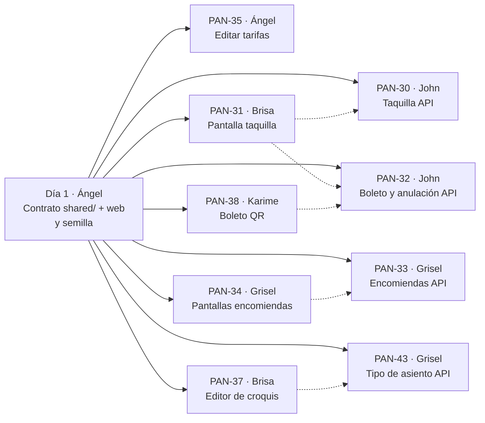

# Replicación del Sprint 3 — guía de gestión para Ángel

> **Fecha:** 24/09/2026 · **Para:** Ángel (Scrum Master) · **Documento interno:** no se copia al repositorio del equipo.
> **Referencia:** rama `sprint03` de `panamericana-base`, commit `f6f2b97` (Sprint 3 completo y validado).
> **Requisito previo:** el Sprint 2 fusionado en el repositorio del equipo (`REPLICACION_SPRINT_02.md` §11).
> **Calendario del docente:** 06/10 → 17/10 (todavía sin confirmar). Si no se confirma, se aplica la contingencia del backlog (§7.1).

---

## 0. Resumen

| | |
|---|---|
| **Incremento** | **MVP 2: operación multicanal.** Venta en taquilla sobre el mismo inventario que la web, boleto electrónico con QR, anulación con reembolso, encomiendas cobradas en origen con seguimiento público, edición de tarifas y editor visual del croquis |
| **Base de datos** | **Sin migraciones.** Todo cabe en el modelo v2.0. Solo cambia `supabase/seed.sql`: el viaje de prueba ya no tiene una tarifa `normal` (su bus no tiene asientos normales). **La base compartida ya está corregida** |
| **Pruebas** | 101 pruebas unitarias (23 nuevas) · **52 casos de aceptación contra la base real, 0 fallos** (entre ellos: web y taquilla a la vez por el mismo asiento → gana uno; 5 anulaciones simultáneas → un solo reembolso; 4 despachos simultáneos de una encomienda → uno solo cambia el estado) · regresión del Sprint 2: 60/60 · revisión en el navegador en computadora y celular (375 px, ninguna pantalla desborda) · revisión de código: 8 hallazgos, 7 corregidos |
| **Tu trabajo** | Día 1: contrato y semilla. Después: PAN-35, vigilar el orden de los PR (§3), revisar con la §7 y cerrar con la prueba de la §9 |

**Qué puede mostrar el equipo al terminar:** Luis vende en taquilla el asiento 12 del bus de las 21:00, cobra en efectivo e imprime el boleto con QR. Un cliente consulta su boleto en `/boleto`. Luis lo anula y el asiento vuelve a estar libre en la web. Ana registra una encomienda La Paz → Cochabamba, la despacha en el bus de la noche y el remitente la sigue en `/seguimiento` sin ver datos de nadie.

---

## 1. Tarjetas del Sprint 3 (para Trello)

> Se cargan en Trello **solo cuando lo decidas**. Formato de siempre: `PAN-xx · Trabajo · Responsable · N pts`, descripción corta y checklist "Criterios de aceptación".

### 1.1 Resumen y carga

| Tarjeta | Responsable | Trabajo | Pts | Depende de | Revisor |
|---|---|---|---|---|---|
| **PAN-30** | John | Venta en taquilla (API) | 2 | Contrato | Grisel |
| **PAN-32** | John | Consultar y anular pasaje por código (API) | 3 | Contrato | Grisel |
| **PAN-33** | Grisel | Encomiendas: registro, estados, historial y seguimiento (API) | 5 | Contrato | John |
| **PAN-43** | Grisel | Cambiar el tipo de un asiento y catálogo de tipos (API) | 1 | Contrato | John |
| **PAN-35** | Ángel | Editar las tarifas de un viaje (API y pantalla) | 3 | Contrato | John |
| **PAN-31** | Brisa | Pantalla de taquilla: vender y anular | 5 | PAN-30, PAN-32 (para probar) | Karime |
| **PAN-37** | Brisa | Editor de croquis | 2 | PAN-43 (para probar) | Karime |
| **PAN-34** | Grisel | Pantallas de encomiendas y seguimiento público | 3 | PAN-33 (para probar) | Brisa |
| **PAN-38** | Karime | Boleto electrónico con QR y consulta por código | 3 | PAN-32 (para probar) | Brisa |

**Carga:** Grisel 9 · Brisa 7 · John 5 · Karime 3 · Ángel 3 (+ contrato). Karime queda liviana a propósito: en el Sprint 4 lleva la PWA y las pruebas de humo (PAN-39 y PAN-40); si termina antes, puede adelantar PAN-39.

**Cambios respecto al backlog:**
- **PAN-35** pasa a *editar* tarifas (crearlas ya lo hace PAN-15, ajuste A1). **PAN-36** no existe: el croquis y el checkout ya muestran el precio por tipo.
- **PAN-43 (nueva, Grisel, 1 pt):** el editor de croquis necesita cambiar el tipo de un asiento y leer el catálogo `tipos_asiento` desde la API (no escribir la lista en la web).
- PAN-25 a PAN-29, PAN-39 y PAN-40 pasan al **Sprint 4** (rama `sprint04`).

### 1.2 Descripción y criterios de cada tarjeta

**PAN-30 · Venta en taquilla (API) · John · 2 pts**
Como vendedor quiero vender pasajes presenciales sobre el mismo inventario que la web para que nunca se crucen las ventas.
Archivos: `ventas/casos-de-uso/VenderEnTaquilla.ts`, `ventas/adaptadores/taquillaRutas.ts`; `guardarCliente` en `compartido/adaptadores/pg/personasSql.ts`.
- [ ] `POST /v1/taquilla/ventas` solo para vendedor o administrador (sin sesión 401, otro rol 403)
- [ ] Reutiliza `ReservarAsientos` y `PagarVenta`: canal `taquilla`, vendedor registrado en la venta y pago `efectivo`
- [ ] El vendedor ve el documento completo del pasajero
- [ ] Web y taquilla a la vez por el mismo asiento y tramo → uno gana, el otro recibe 409
- [ ] Si el cobro falla, la reserva recién hecha se libera enseguida

**PAN-32 · Consultar y anular pasaje (API) · John · 3 pts**
Como vendedor quiero anular un pasaje por su código para liberar el asiento cuando el pasajero no viaja.
Archivos: `ventas/dominio/Anulacion.ts`, `PasajeRepositorio.ts`; casos de uso `ObtenerPasaje.ts` y `AnularPasaje.ts`; `adaptadores/PgPasajeRepositorio.ts`.
- [ ] `GET /v1/pasajes/:codigo` público: documento oculto (`****351`) y hora límite para anular
- [ ] `POST /v1/pasajes/:codigo/anular` solo vendedor o administrador
- [ ] Solo un pasaje **pagado** y hasta **2 horas antes de subir** (409 `pasaje_no_anulable` / `anulacion_fuera_de_plazo`)
- [ ] Pasaje `anulado`, asiento libre para ese tramo y pago `reembolsado` por el precio
- [ ] La venta queda `anulada` cuando ya no le queda nada activo
- [ ] 5 anulaciones simultáneas → un solo reembolso

**PAN-33 · Encomiendas (API) · Grisel · 5 pts**
Como encargado de encomiendas quiero registrar un envío y actualizar su estado para saber siempre dónde está.
Archivos: módulo `backend/src/modulos/encomiendas/`.
- [ ] Registro con remitente, destinatario (reglas bolivianas), terminales distintas y activas, contenido, peso (0,01 a 50 kg) y costo; código `E-XXXXXXXX`
- [ ] Se cobra en origen: venta `taquilla` pagada y pago en efectivo, todo en una transacción
- [ ] Estados `registrada → en_transito → en_destino → entregada` (o `cancelada` antes de salir); saltos → 409
- [ ] Al despachar se puede indicar el viaje; debe pasar por el origen y **después** por el destino
- [ ] Cancelar devuelve el costo (pago reembolsado, venta anulada)
- [ ] Cambios simultáneos → uno solo se guarda (409 `estado_cambiado`)
- [ ] `GET /v1/seguimiento/:codigo` público sin nombres, documentos ni observaciones
- [ ] Cada respuesta del panel trae `siguientes` (a qué estados puede pasar)

**PAN-43 · Tipo de asiento y catálogo (API) · Grisel · 1 pt**
- [ ] `GET /v1/catalogos/tipos-asiento` (normal, semicama, cama)
- [ ] `PUT /v1/buses/:id/asientos/:asientoId` cambia el tipo (solo administradora)
- [ ] Si un viaje programado del bus no tiene precio para el tipo nuevo → 409 `croquis_en_uso`
- [ ] Se revisa y se cambia con el bus bloqueado (programar un viaje también lo bloquea)

**PAN-35 · Editar tarifas · Ángel · 3 pts**
Como administradora quiero cambiar los precios de un viaje programado.
Archivos: `viajes/dominio/Programacion.ts` (`validarTarifas`), `casos-de-uso/EditarTarifas.ts` + prueba, repositorio y ruta; web `EditorTarifas.tsx` y botón "Precios" en `TablaViajes.tsx`.
- [ ] `PUT /v1/viajes/:id/tarifas`: una tarifa por cada tipo de asiento del bus, como al programar
- [ ] Solo viajes programados que no salieron (409); viaje inexistente 404; vendedor 403
- [ ] Los pasajes vendidos conservan su precio
- [ ] La pantalla pide un precio por cada tipo que el bus tiene **hoy** en su croquis

**PAN-31 · Pantalla de taquilla · Brisa · 5 pts**
Archivos: `ventas/componentes/SeleccionDeAsientos.tsx` (se extrae de `CompraDeAsientos.tsx`), `taquilla/componentes/VentaTaquilla.tsx` y `AnulacionPasaje.tsx`, página `/admin/taquilla`, menú y bienvenida.
- [ ] Buscar viaje (ciudades y fecha), elegir asientos en el mismo croquis que la web y cobrar en efectivo
- [ ] Al terminar muestra la venta y un enlace "Imprimir boleto" por pasaje
- [ ] El aviso del 409 funciona igual que en la web
- [ ] Anular: buscar el código, ver el pasaje y anular con confirmación; muestra cuánto devolver
- [ ] El portal sigue comprando igual (la compra web usa el mismo `SeleccionDeAsientos`)
- [ ] Menú "Taquilla" para vendedor y administradora

**PAN-37 · Editor de croquis · Brisa · 2 pts**
Archivos: `croquis/componentes/EditorCroquis.tsx`, página `/admin/buses/[id]/croquis`, enlace "Croquis" en `TablaBuses.tsx`.
- [ ] Bus sin asientos: formulario para generar el croquis estándar por piso
- [ ] Tocar un asiento permite cambiar su tipo (tipos del catálogo)
- [ ] El mensaje `croquis_en_uso` se muestra al lado del asiento

**PAN-34 · Pantallas de encomiendas · Grisel · 3 pts**
Archivos: `encomiendas/componentes/*`, páginas `/admin/encomiendas`, `/seguimiento` y `/seguimiento/[codigo]`.
- [ ] Formulario de registro que muestra el código de seguimiento y lo cobrado
- [ ] Lista filtrable por estado; al abrir una, historial y "Pasar a" con los pasos que manda la API
- [ ] Al despachar, solo se ofrecen los viajes que pasan por el origen y después por el destino
- [ ] Seguimiento público con línea de tiempo
- [ ] Menú "Encomiendas" para encomiendas y administradora

**PAN-38 · Boleto con QR · Karime · 3 pts**
Archivos: `compartido/componentes/CodigoQR.tsx` y `ConsultaPorCodigo.tsx`, `ventas/componentes/Boleto.tsx`, páginas `/boleto` y `/boleto/[codigo]`, enlaces del portal. Librería `qrcode`.
- [ ] Boleto con pasajero (documento oculto), tramo, horas, asiento, precio, estado y QR con el código
- [ ] Imprimible: cabecera, pie y botón no salen en papel
- [ ] `/boleto` consulta por código; la confirmación de compra enlaza "Ver boleto"
- [ ] Cabecera del portal con "Mi boleto" y "Encomiendas"

---

## 2. Mapa de dependencias



Las flechas punteadas significan "la pantalla funciona cuando la API existe". Este sprint **no tiene cadena larga**: los cuatro backends son independientes entre sí.

---

## 3. Calendario (10 días hábiles)

| Día | Quién | PR que se fusiona | Tamaño |
|---|---|---|---|
| **1** | Ángel | **Contrato** (§4.0) y **semilla** corregida | Mediano — lo copias tú |
| **2** | John · Grisel | **PAN-30** taquilla · **PAN-43** tipo de asiento | Chicos |
| **2–4** | Ángel | **PAN-35** editar tarifas | Mediano |
| **3–4** | John | **PAN-32** boleto y anulación | Mediano |
| **3–6** | Grisel | **PAN-33** encomiendas | Grande |
| **3–5** | Karime · Brisa | **PAN-38** boleto · **PAN-37** editor de croquis | Medianos |
| **5–7** | Brisa | **PAN-31** taquilla (primero el PR de `SeleccionDeAsientos`, que revisa Karime) | Grande |
| **7–8** | Grisel | **PAN-34** pantallas de encomiendas | Mediano |
| **9–10** | Todos | Prueba de aceptación (§9), demo, tarjetas a `Completao`, Review | — |

---

## 4. Detalle por tarjeta (el flujo de archivos)

Todos los archivos están en la rama `sprint03` de `panamericana-base`, con el mismo nombre y ruta.

### 4.0 Contrato del Sprint 3 — Ángel, día 1

| Archivo | Qué contiene |
|---|---|
| `shared/src/tipos/pasaje.ts` | `Pasaje` (boleto, con `anulable_hasta`), `AnulacionPasaje` |
| `shared/src/tipos/encomienda.ts` | `EstadoEncomienda`, entradas de registro y cambio de estado, `Encomienda` (con `siguientes`), `SeguimientoEncomienda` |
| `shared/src/tipos/venta.ts` · `viaje.ts` · `croquis.ts` | `VenderEnTaquillaEntrada`, `EditarTarifasEntrada`, `CambiarTipoAsientoEntrada` |
| `shared/src/endpoints.ts` · `index.ts` | `taquilla`, `pasajes`, `encomiendas` (seguimiento en `/v1/seguimiento/:codigo`), `viajes.tarifas`, `croquis.asiento`, `catalogos.tiposAsiento` |
| `web/src/modulos/{ventas,viajes,croquis,catalogos,encomiendas}/servicios/*` y `hooks/*` | Las llamadas nuevas y sus hooks (`usePasaje`, `useVenderEnTaquilla`, `useAnularPasaje`, `useEditarTarifas`, `useGenerarCroquis`, `useCambiarTipoAsiento`, `useTiposAsiento`, `useEncomiendas`…) |
| `supabase/seed.sql` | Quita la tarifa `normal` del viaje de prueba (ya aplicado en la base) |

Commit sugerido: `feat(PAN-02): contrato de la API del sprint 3`.

### 4.1 PAN-30 · Taquilla (API) — John

```
POST /v1/taquilla/ventas ─► autorizacion.requiere(...ROLES_VENTA)
   └─ VenderEnTaquilla.ejecutar(entrada, vendedor)
        ├─ ReservarAsientos (canal taquilla, vendedor)   ◄─ las MISMAS tres defensas que la web
        ├─ PagarVenta (efectivo)
        └─ si el cobro falla → VentaRepositorio.expirar (libera los asientos)
```

| Archivo | Qué contiene |
|---|---|
| `ventas/casos-de-uso/VenderEnTaquilla.ts` | Compone reservar + pagar |
| `ventas/adaptadores/taquillaRutas.ts` | Ruta de la venta (y la de anular, PAN-32) |
| `ventas/adaptadores/ventaRutas.ts` | Exporta `esquemaReserva` para reutilizarlo |
| `compartido/adaptadores/pg/personasSql.ts` | `guardarCliente` (persona + cliente); lo usan ventas y encomiendas |
| `ventas/adaptadores/PgVentaRepositorio.ts` | Usa `guardarCliente` |
| `contenedor.ts` | `reservarAsientos` y `pagarVenta` se crean **una vez** y los comparten el portal y la taquilla |

### 4.2 PAN-32 · Boleto y anulación (API) — John

```
GET  /v1/pasajes/:codigo        ─► ObtenerPasaje  ─► PgPasajeRepositorio.buscarPorCodigo ─► aBoleto (oculta documento + limite)
POST /v1/pasajes/:codigo/anular ─► AnularPasaje   ─► exigirAnulable (dominio: pagado y 2 h antes)
                                                   └► PgPasajeRepositorio.anular (una transaccion)
                                                        venta bloqueada → pasaje bloqueado → anulado
                                                        → pago reembolsado → venta anulada si no queda nada activo
```

| Archivo | Qué contiene |
|---|---|
| `ventas/dominio/Anulacion.ts` | `HORAS_ANTES_PARA_ANULAR`, `limiteDeAnulacion`, `exigirAnulable` |
| `ventas/dominio/PasajeRepositorio.ts` | Puerto propio (separado de `VentaRepositorio`: el que solo consulta pasajes no depende de todo) |
| `ventas/dominio/errores.ts` · `privacidad.ts` | 3 errores nuevos · `ocultarDocumentoDelPasajero` |
| `ventas/casos-de-uso/ObtenerPasaje.ts` · `AnularPasaje.ts` + `AnularPasaje.test.ts` | 8 pruebas (incluye las 2 de la taquilla) |
| `ventas/adaptadores/PgPasajeRepositorio.ts` | SQL del boleto y de la anulación |

**Detalle a revisar:** el orden de los bloqueos (venta y después pasaje) es el mismo que usa el pago. Así dos anulaciones de la misma venta no se cruzan.

### 4.3 PAN-33 · Encomiendas (API) — Grisel

```
POST /v1/encomiendas ─► RegistrarEncomienda ─► registrarEncomienda() (dominio) ─► terminales activas
                                              └► PgEncomiendaRepositorio.guardar: remitente, destinatario, venta pagada,
                                                  encomienda, pago en efectivo e historial "registrada" (una transaccion)
POST /v1/encomiendas/:codigo/estado ─► CambiarEstadoEncomienda ─► exigirCambioDeEstado (maquina de estados)
                                     └► viajeSirve (si se indica viaje) ─► registrarCambio (encomienda bloqueada,
                                         se relee el estado; si cambio: 409) + reembolso si se cancela
GET /v1/seguimiento/:codigo (publico) ─► SeguirEncomienda (sin datos personales)
```

| Archivo | Qué contiene |
|---|---|
| `encomiendas/dominio/Encomienda.ts` | Máquina de estados, `registrarEncomienda`, `estadosSiguientes`, `requiereReembolso`, `admiteViaje` |
| `encomiendas/dominio/EncomiendaRepositorio.ts` · `errores.ts` | Puerto, `EncomiendaVista` y 6 errores |
| `encomiendas/casos-de-uso/` | `RegistrarEncomienda`, `ListarEncomiendas`, `ObtenerEncomienda` (`aVista`), `CambiarEstadoEncomienda`, `SeguirEncomienda` + `RegistrarEncomienda.test.ts` (9 pruebas) |
| `encomiendas/adaptadores/` | `PgEncomiendaRepositorio.ts`, `encomiendaRutas.ts` |
| `contenedor.ts` · `rutas.ts` | Bloque `// modulo: encomiendas` |

**Detalle a revisar:** el estado **no** se guarda en `encomiendas`: sale de la vista `encomiendas_estado_actual` (último registro del historial). Por eso cada cambio es un `insert` en `historial_encomiendas`.

### 4.4 PAN-43 · Tipo de asiento y catálogo (API) — Grisel

| Archivo | Qué contiene |
|---|---|
| `catalogos/casos-de-uso/ListarTiposAsiento.ts` + repositorio y ruta | Catálogo `tipos_asiento` |
| `croquis/casos-de-uso/CambiarTipoAsiento.ts` | Valida tipo y asiento; el repositorio cambia solo si ningún viaje queda sin precio |
| `croquis/dominio/CroquisRepositorio.ts` · `errores.ts` · `adaptadores/*` | `cambiarTipo` con el bus bloqueado; `AsientoNoEncontradoError`, `CroquisEnUsoError` |
| `croquis/casos-de-uso/GenerarCroquis.test.ts` | 3 pruebas nuevas |

### 4.5 PAN-35 · Editar tarifas — Ángel

| Archivo | Qué contiene |
|---|---|
| `viajes/dominio/Programacion.ts` | `validarTarifas` sale de `programarViaje` para reutilizarla |
| `viajes/casos-de-uso/EditarTarifas.ts` + `EditarTarifas.test.ts` | 3 pruebas |
| `viajes/dominio/ViajeRepositorio.ts` · `adaptadores/PgViajeRepositorio.ts` · `viajeRutas.ts` | `datosParaEditarTarifas`, `reemplazarTarifas` (viaje bloqueado), `PUT` |
| `web/src/modulos/viajes/componentes/EditorTarifas.tsx` · `TablaViajes.tsx` | Botón "Precios" por viaje; un campo por tipo del croquis actual |

### 4.6 PAN-31 · Pantalla de taquilla — Brisa

| Archivo | Qué contiene |
|---|---|
| `web/src/modulos/ventas/componentes/SeleccionDeAsientos.tsx` | Croquis + pasajeros + total + botón; lo usan portal y taquilla |
| `web/src/modulos/ventas/componentes/CompraDeAsientos.tsx` | Ahora solo arma la reserva sobre `SeleccionDeAsientos` |
| `web/src/modulos/taquilla/componentes/VentaTaquilla.tsx` · `AnulacionPasaje.tsx` | Vender y anular |
| `web/src/app/(backoffice)/admin/taquilla/page.tsx` | Página |
| `MenuLateral.tsx` · `Bienvenida.tsx` | Opciones Taquilla y Encomiendas por rol |

**Detalle a revisar:** el módulo web `taquilla` no tiene servicios ni hooks propios: usa los de `ventas` y `viajes` (la taquilla vende, no es otra entidad).

### 4.7 PAN-37 · Editor de croquis — Brisa

`croquis/componentes/EditorCroquis.tsx` (generador + selector de tipo), `app/(backoffice)/admin/buses/[id]/croquis/page.tsx`, enlace en `buses/componentes/TablaBuses.tsx`.

### 4.8 PAN-34 · Pantallas de encomiendas — Grisel

`encomiendas/componentes/` (`FormularioEncomienda`, `TablaEncomiendas`, `CambioDeEstado`, `EtiquetaEstado`, `SeguimientoEncomienda`), páginas `/admin/encomiendas`, `/seguimiento` y `/seguimiento/[codigo]`.

**Detalle a revisar:** `CambioDeEstado` recibe los pasos posibles de la API (`encomienda.siguientes`), no los escribe. En `TablaEncomiendas` se monta con `key={e.estado}` para que, después de guardar, el formulario empiece con los pasos nuevos (se encontró el error en la prueba del navegador).

### 4.9 PAN-38 · Boleto con QR — Karime

`compartido/componentes/CodigoQR.tsx` y `ConsultaPorCodigo.tsx`, `ventas/componentes/Boleto.tsx`, páginas `/boleto` y `/boleto/[codigo]`, `(publico)/layout.tsx` (enlaces y `print:hidden`), enlace "Ver boleto" en `DetalleVenta.tsx`.

**Instalar:** `npm install qrcode --workspace web` y `npm install -D @types/qrcode --workspace web`.

**Detalle a revisar:** una página (server component) no puede pasarle **funciones** a un componente cliente; por eso `ConsultaPorCodigo` recibe `ruta="/boleto"` y no una función (el build falla si se hace al revés).

---

## 5. Configuración

Sin variables nuevas. Solo la librería `qrcode` (PAN-38).

---

## 6. Modo rescate y comparación

Misma función `Copiar-Archivos` del Sprint 1 (`REPLICACION_SPRINT_01.md` §7.1), con `panamericana-base` en la rama `sprint03`.

```powershell
# Contrato y semilla (Angel, dia 1)
Copiar-Archivos @("shared\src\tipos\pasaje.ts","shared\src\tipos\encomienda.ts","shared\src\tipos\venta.ts","shared\src\tipos\viaje.ts","shared\src\tipos\croquis.ts","shared\src\endpoints.ts","shared\src\index.ts","web\src\modulos\ventas\servicios\ventasServicio.ts","web\src\modulos\ventas\hooks\useVentas.ts","web\src\modulos\viajes\servicios\viajesServicio.ts","web\src\modulos\viajes\hooks\useViajes.ts","web\src\modulos\croquis\servicios\croquisServicio.ts","web\src\modulos\croquis\hooks\useCroquis.ts","web\src\modulos\catalogos\servicios\catalogosServicio.ts","web\src\modulos\catalogos\hooks\useCatalogos.ts","web\src\modulos\encomiendas\servicios\encomiendasServicio.ts","web\src\modulos\encomiendas\hooks\useEncomiendas.ts","supabase\seed.sql")
```

```powershell
# PAN-30 + PAN-32 (John)
Copiar-Archivos @("backend\src\compartido\adaptadores\pg\personasSql.ts","backend\src\modulos\ventas\adaptadores\PgVentaRepositorio.ts","backend\src\modulos\ventas\adaptadores\ventaRutas.ts","backend\src\modulos\ventas\adaptadores\taquillaRutas.ts","backend\src\modulos\ventas\adaptadores\PgPasajeRepositorio.ts","backend\src\modulos\ventas\casos-de-uso\VenderEnTaquilla.ts","backend\src\modulos\ventas\casos-de-uso\ObtenerPasaje.ts","backend\src\modulos\ventas\casos-de-uso\AnularPasaje.ts","backend\src\modulos\ventas\casos-de-uso\AnularPasaje.test.ts","backend\src\modulos\ventas\dominio\Anulacion.ts","backend\src\modulos\ventas\dominio\PasajeRepositorio.ts","backend\src\modulos\ventas\dominio\errores.ts","backend\src\modulos\ventas\dominio\privacidad.ts")
```

```powershell
# PAN-33 (Grisel)
Copiar-Archivos @("backend\src\modulos\encomiendas\dominio\Encomienda.ts","backend\src\modulos\encomiendas\dominio\EncomiendaRepositorio.ts","backend\src\modulos\encomiendas\dominio\errores.ts","backend\src\modulos\encomiendas\casos-de-uso\RegistrarEncomienda.ts","backend\src\modulos\encomiendas\casos-de-uso\RegistrarEncomienda.test.ts","backend\src\modulos\encomiendas\casos-de-uso\ListarEncomiendas.ts","backend\src\modulos\encomiendas\casos-de-uso\ObtenerEncomienda.ts","backend\src\modulos\encomiendas\casos-de-uso\CambiarEstadoEncomienda.ts","backend\src\modulos\encomiendas\casos-de-uso\SeguirEncomienda.ts","backend\src\modulos\encomiendas\adaptadores\PgEncomiendaRepositorio.ts","backend\src\modulos\encomiendas\adaptadores\encomiendaRutas.ts")
```

```powershell
# PAN-43 (Grisel)
Copiar-Archivos @("backend\src\modulos\catalogos\casos-de-uso\ListarTiposAsiento.ts","backend\src\modulos\catalogos\dominio\CatalogoRepositorio.ts","backend\src\modulos\catalogos\adaptadores\PgCatalogoRepositorio.ts","backend\src\modulos\catalogos\adaptadores\catalogoRutas.ts","backend\src\modulos\croquis\casos-de-uso\CambiarTipoAsiento.ts","backend\src\modulos\croquis\casos-de-uso\GenerarCroquis.test.ts","backend\src\modulos\croquis\dominio\CroquisRepositorio.ts","backend\src\modulos\croquis\dominio\errores.ts","backend\src\modulos\croquis\adaptadores\PgCroquisRepositorio.ts","backend\src\modulos\croquis\adaptadores\croquisRutas.ts")
```

```powershell
# PAN-35 (Angel)
Copiar-Archivos @("backend\src\modulos\viajes\dominio\Programacion.ts","backend\src\modulos\viajes\dominio\ViajeRepositorio.ts","backend\src\modulos\viajes\casos-de-uso\EditarTarifas.ts","backend\src\modulos\viajes\casos-de-uso\EditarTarifas.test.ts","backend\src\modulos\viajes\adaptadores\PgViajeRepositorio.ts","backend\src\modulos\viajes\adaptadores\viajeRutas.ts","web\src\modulos\viajes\componentes\EditorTarifas.tsx","web\src\modulos\viajes\componentes\TablaViajes.tsx")
```

```powershell
# PAN-31 (Brisa)
Copiar-Archivos @("web\src\modulos\ventas\componentes\SeleccionDeAsientos.tsx","web\src\modulos\ventas\componentes\CompraDeAsientos.tsx","web\src\modulos\taquilla\componentes\VentaTaquilla.tsx","web\src\modulos\taquilla\componentes\AnulacionPasaje.tsx","web\src\app\(backoffice)\admin\taquilla\page.tsx","web\src\compartido\componentes\MenuLateral.tsx","web\src\modulos\sesion\componentes\Bienvenida.tsx")
```

```powershell
# PAN-37 (Brisa)
Copiar-Archivos @("web\src\modulos\croquis\componentes\EditorCroquis.tsx","web\src\app\(backoffice)\admin\buses\[id]\croquis\page.tsx","web\src\modulos\buses\componentes\TablaBuses.tsx")
```

```powershell
# PAN-34 (Grisel)
Copiar-Archivos @("web\src\modulos\encomiendas\componentes\EtiquetaEstado.tsx","web\src\modulos\encomiendas\componentes\FormularioEncomienda.tsx","web\src\modulos\encomiendas\componentes\TablaEncomiendas.tsx","web\src\modulos\encomiendas\componentes\CambioDeEstado.tsx","web\src\modulos\encomiendas\componentes\SeguimientoEncomienda.tsx","web\src\app\(backoffice)\admin\encomiendas\page.tsx","web\src\app\(publico)\seguimiento\page.tsx","web\src\app\(publico)\seguimiento\[codigo]\page.tsx")
```

```powershell
# PAN-38 (Karime) · antes: npm install qrcode --workspace web ; npm install -D @types/qrcode --workspace web
Copiar-Archivos @("web\src\compartido\componentes\CodigoQR.tsx","web\src\compartido\componentes\ConsultaPorCodigo.tsx","web\src\modulos\ventas\componentes\Boleto.tsx","web\src\modulos\ventas\componentes\DetalleVenta.tsx","web\src\app\(publico)\boleto\page.tsx","web\src\app\(publico)\boleto\[codigo]\page.tsx","web\src\app\(publico)\layout.tsx")
```

> `contenedor.ts` y `rutas.ts` se completan a mano con el bloque de cada módulo. `package.json` no se copia: se usa `npm install`.

**Comparación:** el comando de `REPLICACION_SPRINT_01.md` §7.2 con `"supabase"` en la lista de carpetas.

---

## 7. Lista para revisar cada PR (además de las anteriores)

- [ ] La taquilla **reutiliza** los casos de uso de la web; no hay una segunda forma de reservar.
- [ ] Todo lo que cobra o devuelve dinero deja un registro en `pagos` (`aprobado` o `reembolsado`) dentro de la misma transacción.
- [ ] Lo que dos personas pueden tocar a la vez se **bloquea** y se **vuelve a revisar** dentro de la transacción (pasaje, venta, encomienda, bus).
- [ ] Las páginas públicas no muestran documentos completos ni datos del remitente o destinatario.
- [ ] Una regla vive en un solo lugar: la web muestra lo que dice la API (`siguientes`, tipos del catálogo), no copia la regla.

---

## 8. Datos para la demo

| Qué | Cómo |
|---|---|
| Viajes de la semana | `npm run db:demo` |
| Recorrido sugerido | Taquilla (Luis) → La Paz → Oruro, hoy 21:00 → asiento → cobrar → "Imprimir boleto" → `/boleto/P-…` → anular desde taquilla → el asiento vuelve a estar libre en `/viajes/…` |
| Encomienda | Encomiendas (Ana) → La Paz → Cochabamba → registrar → despachar en el bus de la noche → `/seguimiento/E-…` |
| Concurrencia | La prueba de aceptación (§9) muestra web + taquilla por el mismo asiento, 5 anulaciones y 4 despachos simultáneos |

---

## 9. Prueba de aceptación del sprint

```bash
PROYECTO="F:/Universidad/6to/Proyecto III/panamericana" CLAVE_DEMO=<contraseña> node docs/pruebas/aceptacion_sprint03.mjs
```

Debe terminar con **`fallos: 0 de 52`** y `base despues: ... (igual que antes)`. Crea los buses `9903QAT` y `9904QAT` y los borra al final. Conviene correr también la del Sprint 2 (`aceptacion_sprint02.mjs`) para confirmar que nada se rompió.

**Manual:** recorrido de la §8 en computadora y en celular.

---

## 10. Mensaje para el equipo (se puede copiar tal cual)

> **Plan del Sprint 3 — taquilla y encomiendas**
>
> 1. **Hoy** subo el contrato del sprint (`shared/`, servicios y hooks de la web) y un ajuste de la semilla.
> 2. **Backend, en paralelo:** John taquilla y anulación (PAN-30, PAN-32); Grisel encomiendas y tipo de asiento (PAN-33, PAN-43); yo editar tarifas (PAN-35).
> 3. **Frontend, desde mañana** contra el contrato: Brisa taquilla y editor de croquis (PAN-31, PAN-37); Karime boleto con QR (PAN-38); Grisel pantallas de encomiendas (PAN-34).
>
> Reglas de este sprint:
> - La taquilla usa los **mismos** casos de uso que la web. Brisa, primero saca `SeleccionDeAsientos` de `CompraDeAsientos` en un PR chico (lo revisa Karime).
> - Todo cobro o devolución queda en `pagos`, en la misma transacción.
> - La web no copia reglas del backend: los pasos de una encomienda llegan en `siguientes` y los tipos de asiento, del catálogo.
> - Si prueban en la base, **borren lo que crearon**.

---

## 11. Estado

| Paso | Estado |
|---|---|
| Sprint 3 construido y validado en `panamericana-base` (rama `sprint03`) | ✅ 24/09 (`f6f2b97`) |
| Semilla corregida en la base compartida | ✅ 24/09 |
| Tarjetas PAN-30 a PAN-38 y PAN-43 cargadas en Trello | ⏳ cuando lo decidas (textos en §1.2) |
| Contrato fusionado en el repositorio del equipo | ⏳ |
| PAN-30 · PAN-43 · PAN-35 | ⏳ |
| PAN-32 · PAN-33 | ⏳ |
| PAN-31 · PAN-37 · PAN-38 · PAN-34 | ⏳ |
| Prueba de aceptación (§9) y comparación (§6) | ⏳ |
| Tarjetas en `Completao` y velocidad registrada en el backlog | ⏳ |
