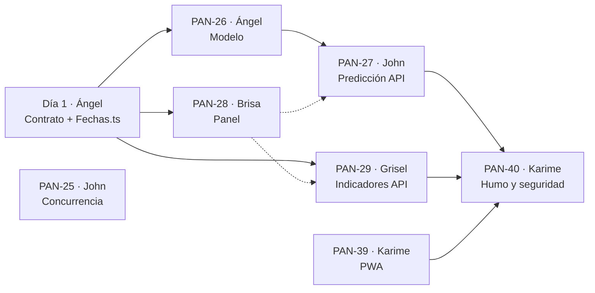

# Replicación del incremento 4 (cierre del MVP) — guía de gestión para Ángel

> **Fecha:** 24/09/2026 · **Para:** Ángel (Scrum Master) · **Documento interno:** no se copia al repositorio del equipo.
> **Referencia:** rama `sprint04` de `panamericana-base`, commit `9661664` (incremento 4 completo y validado).
> **Requisito previo:** el Sprint 3 fusionado en el repositorio del equipo (`REPLICACION_SPRINT_03.md` §11).
> **Cuándo:** si el docente confirma un Sprint 3 largo, al final de ese sprint; si no, en la **fase final**, junto con el despliegue (PAN-09 y PAN-24). Ver `docs/REVISION_FACTIBILIDAD.md`, ajuste A5.

---

## 0. Resumen

| | |
|---|---|
| **Incremento** | **Cierre del MVP:** predicción de demanda con *machine learning* (tecnología emergente), panel de indicadores, portal instalable (PWA), prueba automatizada de compras simultáneas, prueba de humo y revisión de seguridad |
| **Base de datos** | **Sin cambios.** Solo lecturas nuevas |
| **Tecnología emergente** | Regresión lineal múltiple (aprendizaje supervisado) entrenada en **TypeScript** con `npm run ml:entrenar` (ajuste A4: no hay Python). Datos **sintéticos declarados** (3 rutas, 24 meses, feriados bolivianos). Partición por tiempo 80/20. En los días de prueba: **MAE 4,27 · RMSE 5,43 pasajes/día · R² 0,947**. La API solo lee los coeficientes (JSON) |
| **Pruebas** | 114 unitarias (13 nuevas) · 3 de integración contra la base real (20 compras simultáneas del mismo asiento → gana 1) · **22 casos de aceptación** (indicadores cuadrados contra operaciones reales, alerta de refuerzo) · prueba de humo 17/17 · revisión de seguridad 12/12 · regresión de los sprints 2 y 3 (60/60 y 52/52) · navegador en computadora y 375 px · revisión de código: 4 hallazgos, 4 corregidos |
| **Pendiente de verificar fuera de aquí** | El registro del *service worker* (el navegador integrado de la computadora de trabajo no admite *service workers*). Hay que confirmarlo en Chrome o en un Android (criterio de PAN-39) |
| **Tu trabajo** | Día 1: contrato. PAN-26 (modelo). Revisar con la §7 y cerrar con la §9 |

---

## 1. Tarjetas del incremento 4 (para Trello)

### 1.1 Resumen y carga

| Tarjeta | Responsable | Trabajo | Pts | Depende de | Revisor |
|---|---|---|---|---|---|
| **PAN-26** | Ángel | Datos sintéticos y entrenamiento del modelo de demanda | 3 | Contrato | John |
| **PAN-27** | John | Caso de uso y endpoint de predicción de demanda | 3 | PAN-26 | Grisel |
| **PAN-29** | Grisel | Indicadores del panel (API) | 2 | Contrato | John |
| **PAN-28** | Brisa | Pantalla del panel con gráfico de demanda | 3 | Contrato (PAN-27 y PAN-29 para probar) | Karime |
| **PAN-25** | John | Prueba automatizada de compras simultáneas | 3 | — | Grisel |
| **PAN-39** | Karime | Portal instalable (PWA) | 2 | — | Brisa |
| **PAN-40** | Karime | Prueba de humo y revisión de seguridad | 3 | Todas (últimos días) | Brisa |

**Carga:** John 6 · Karime 5 · Ángel 3 · Brisa 3 · Grisel 2. Es liviano a propósito: deja espacio para el **despliegue** (PAN-09 John 3 pts, PAN-24 Ángel 1 pt) si entra en el mismo periodo.

### 1.2 Descripción y criterios

**PAN-26 · Modelo de demanda · Ángel · 3 pts**
Como administradora quiero una estimación de la demanda de pasajes para decidir a tiempo si programo refuerzos.
Archivos: `prediccion/dominio/FeriadosBolivia.ts` y `Caracteristicas.ts`, `prediccion/entrenamiento/` (`datosSinteticos.ts`, `regresion.ts`, `entrenar.ts`), `adaptadores/modelo-demanda.json`, script `ml:entrenar`.
- [ ] Feriados bolivianos fijos y móviles (Carnaval, Viernes Santo, Corpus Christi a partir de la Pascua)
- [ ] Características: día de la semana, feriado, víspera, temporada alta (julio, diciembre) y tendencia
- [ ] Datos sintéticos reproducibles (misma semilla) y **declarados como sintéticos**
- [ ] Partición por tiempo 80/20 y métricas MAE, RMSE y R² sobre los días de prueba
- [ ] `npm run ml:entrenar` escribe el JSON con coeficientes y métricas

**PAN-27 · Predicción de demanda (API) · John · 3 pts**
Archivos: `prediccion/dominio/ModeloDemanda.ts`, `PrediccionRepositorio.ts`, `errores.ts`; `casos-de-uso/PredecirDemanda.ts` + prueba; `adaptadores/ArchivoModeloDemanda.ts`, `PgPrediccionRepositorio.ts`, `prediccionRutas.ts`.
- [ ] `GET /v1/panel/prediccion?dias=7` (1 a 31 días; solo administradora)
- [ ] Pasajes estimados = demanda base de la ruta × índice del modelo
- [ ] Base: ventas reales de los últimos 90 días si hay 14 días con ventas; si no, la del modelo
- [ ] Capacidad del día: asientos de los viajes programados o en ruta
- [ ] Alerta `refuerzo_sugerido` sobre el 90 % y `sin_viajes` si no hay viajes
- [ ] La respuesta declara el modelo, sus datos y sus métricas

**PAN-29 · Indicadores (API) · Grisel · 2 pts**
Archivos: módulo `backend/src/modulos/panel/`.
- [ ] `GET /v1/panel/indicadores?desde&hasta&ruta_id` (por defecto los últimos 30 días; máximo 366; solo administradora)
- [ ] Pasajes vendidos y anulados, ingresos cobrados, reembolsados y netos, ventas por canal, ocupación por viaje y promedio ponderado, encomiendas por estado
- [ ] Fechas de La Paz; filtro de ruta en pasajes, canales y ocupación
- [ ] Fechas inválidas o al revés → 400

**PAN-28 · Pantalla del panel · Brisa · 3 pts**
Archivos: `web/src/modulos/panel/componentes/*`, `compartido/componentes/GraficoBarras.tsx`, página `/admin/panel`, menú y bienvenida.
- [ ] Demanda estimada por ruta (7 o 14 días) con barras de pasajes y asientos; días con refuerzo en rojo; feriados marcados
- [ ] Nota del modelo con sus datos y métricas
- [ ] Tarjetas, ventas por canal y ocupación por viaje con filtros de fecha y ruta
- [ ] Se ve bien en celular

**PAN-25 · Compras simultáneas · John · 3 pts**
Archivos: `ventas/adaptadores/ComprasSimultaneas.integracion.test.ts`, `backend/vitest.config.ts`, `backend/vitest.integracion.config.ts`, script `test:integracion`.
- [ ] 20 reservas simultáneas del mismo asiento y tramo → exactamente 1 gana y 19 reciben `AsientoNoDisponibleError`
- [ ] Tramos que no se cruzan del mismo asiento → los dos ganan
- [ ] La base rechaza sola un pasaje que se cruza (23P01)
- [ ] Borra solo lo que creó; `npm test` (y la CI) no la ejecuta

**PAN-39 · PWA · Karime · 2 pts**
Archivos: `web/src/app/manifest.ts`, `web/public/` (íconos y `sw.js`), `compartido/componentes/RegistroPwa.tsx`, página `/sin-conexion`, `app/layout.tsx`, `web/next.config.ts`.
- [ ] Manifiesto con nombre, íconos 192 y 512 (y *maskable*), `standalone` y color
- [ ] *Service worker*: páginas siempre desde la red (con página "sin conexión"), estáticos guardados, la API nunca se guarda
- [ ] Solo se registra en producción
- [ ] Se instala desde Chrome en Android (verificar en un celular)

**PAN-40 · Humo y seguridad · Karime · 3 pts**
Archivos: `backend/src/infraestructura/pruebaHumo.ts` y `revisionSeguridad.ts`, scripts `prueba:humo` y `prueba:seguridad`, encabezados en `infraestructura/servidor.ts`.
- [ ] `npm run prueba:humo` recorre la API sin escribir datos (sirve contra staging con `API_URL`)
- [ ] `npm run prueba:seguridad`: RLS en todas las tablas, sin políticas públicas, vistas protegidas, CORS, ningún secreto en los archivos, rutas cerradas, sin `x-powered-by`
- [ ] Los dos terminan en verde antes de la demo

---

## 2. Mapa de dependencias



---

## 3. Calendario sugerido (5 días hábiles)

| Día | Quién | PR |
|---|---|---|
| **1** | Ángel | Contrato (§4.0) |
| **1–2** | Ángel · Grisel · Karime | PAN-26 · PAN-29 · PAN-39 |
| **2–3** | John · Brisa | PAN-27 (sobre el JSON de PAN-26) · PAN-28 |
| **3–4** | John | PAN-25 |
| **4–5** | Karime | PAN-40 y corrida final de humo y seguridad |
| **5** | Todos | Aceptación (§9), demo completa, tarjetas a `Completao` |

---

## 4. Detalle por tarjeta (el flujo de archivos)

### 4.0 Contrato — Ángel, día 1

| Archivo | Qué contiene |
|---|---|
| `shared/src/tipos/panel.ts` · `endpoints.ts` · `index.ts` | `Indicadores`, `PrediccionDemanda`, `DemandaDelDia`; `RUTAS_API.panel` |
| `web/src/modulos/panel/servicios/panelServicio.ts` · `hooks/usePanel.ts` | Llamadas y hooks del panel |
| `backend/src/compartido/dominio/Fechas.ts` | `sumarDias`, `diasEntre` (los usan panel y predicción) |

### 4.1 PAN-26 y PAN-27 · Predicción — Ángel y John

```
npm run ml:entrenar (PAN-26, fuera de la API)
   datosSinteticos ─► caracteristicasDelDia (dominio) ─► ajustar (regresion) ─► metricas ─► modelo-demanda.json

GET /v1/panel/prediccion (PAN-27)
   PredecirDemanda ─► ArchivoModeloDemanda (lee y valida el JSON) ─► exigirModeloCompatible
                   ─► PgPrediccionRepositorio: rutas activas, capacidad por dia, historial de ventas
                   ─► baseDeRuta · pasajesEstimados · evaluarCapacidad (dominio)
```

**Detalle a revisar:** `Caracteristicas.ts` está en el **dominio** porque entrenar y predecir deben describir un día **igual**. Si cambia, hay que reentrenar; `exigirModeloCompatible` lo detecta.

### 4.2 PAN-29 · Indicadores — Grisel

`panel/dominio/Periodo.ts` (`resolverPeriodo`, `porcentaje`), `PanelRepositorio.ts`, `errores.ts`; `casos-de-uso/ObtenerIndicadores.ts` + prueba (2); `adaptadores/PgPanelRepositorio.ts` (5 consultas, todas con parámetros) y `panelRutas.ts`. Las 5 consultas se piden **a la vez** (`Promise.all`).

**Detalle a revisar:** el dinero sale de `pagos` (cobrado − reembolsado), no de `ventas_totales`: una venta anulada cobró y devolvió.

### 4.3 PAN-28 · Pantalla del panel — Brisa

`PanelIndicadores.tsx` (filtros), `ResumenIndicadores.tsx` (tarjetas, canales, ocupación), `PrediccionDemanda.tsx` (gráfico por ruta y nota del modelo), `compartido/componentes/GraficoBarras.tsx` (SVG sin librerías), página `/admin/panel`, opción "Panel" del menú (solo administradora).

### 4.4 PAN-25 · Compras simultáneas — John

`ComprasSimultaneas.integracion.test.ts` usa el caso de uso y el repositorio **reales**. `vitest.config.ts` excluye `*.integracion.test.ts` de `npm test` (la CI no tiene base); `vitest.integracion.config.ts` los corre con `npm run test:integracion`.

### 4.5 PAN-39 · PWA — Karime

`app/manifest.ts` (Next.js lo publica en `/manifest.webmanifest`), íconos en `web/public/`, `public/sw.js`, `RegistroPwa.tsx` (en `layout.tsx`), página `/sin-conexion`, `next.config.ts` (encabezados de seguridad y los del *service worker*, según la guía de PWA de Next.js 16).

### 4.6 PAN-40 · Humo y seguridad — Karime

`infraestructura/pruebaHumo.ts` (solo lee; `CLAVE_DEMO` agrega las pruebas con sesión) y `infraestructura/revisionSeguridad.ts`; `servidor.ts` quita `x-powered-by` y agrega `nosniff`.

---

## 5. Configuración

Sin variables nuevas. Para la prueba de humo contra staging: `API_URL=https://…`. Los scripts nuevos de la raíz: `ml:entrenar`, `test:integracion`, `prueba:humo`, `prueba:seguridad`.

---

## 6. Modo rescate

Misma función `Copiar-Archivos` (`REPLICACION_SPRINT_01.md` §7.1), con `panamericana-base` en la rama `sprint04`. Los `package.json` no se copian: se agregan a mano los scripts de la §5 (raíz y `backend`).

```powershell
# Contrato (Angel, dia 1)
Copiar-Archivos @("shared\src\tipos\panel.ts","shared\src\endpoints.ts","shared\src\index.ts","web\src\modulos\panel\servicios\panelServicio.ts","web\src\modulos\panel\hooks\usePanel.ts","backend\src\compartido\dominio\Fechas.ts")
```

```powershell
# PAN-26 (Angel)
Copiar-Archivos @("backend\src\modulos\prediccion\dominio\FeriadosBolivia.ts","backend\src\modulos\prediccion\dominio\Caracteristicas.ts","backend\src\modulos\prediccion\entrenamiento\datosSinteticos.ts","backend\src\modulos\prediccion\entrenamiento\regresion.ts","backend\src\modulos\prediccion\entrenamiento\entrenar.ts","backend\src\modulos\prediccion\adaptadores\modelo-demanda.json")
```

```powershell
# PAN-27 (John) · luego su bloque en contenedor.ts y rutas.ts
Copiar-Archivos @("backend\src\modulos\prediccion\dominio\ModeloDemanda.ts","backend\src\modulos\prediccion\dominio\PrediccionRepositorio.ts","backend\src\modulos\prediccion\dominio\errores.ts","backend\src\modulos\prediccion\casos-de-uso\PredecirDemanda.ts","backend\src\modulos\prediccion\casos-de-uso\PredecirDemanda.test.ts","backend\src\modulos\prediccion\adaptadores\ArchivoModeloDemanda.ts","backend\src\modulos\prediccion\adaptadores\PgPrediccionRepositorio.ts","backend\src\modulos\prediccion\adaptadores\prediccionRutas.ts")
```

```powershell
# PAN-29 (Grisel) · luego su bloque en contenedor.ts y rutas.ts
Copiar-Archivos @("backend\src\modulos\panel\dominio\Periodo.ts","backend\src\modulos\panel\dominio\PanelRepositorio.ts","backend\src\modulos\panel\dominio\errores.ts","backend\src\modulos\panel\casos-de-uso\ObtenerIndicadores.ts","backend\src\modulos\panel\casos-de-uso\ObtenerIndicadores.test.ts","backend\src\modulos\panel\adaptadores\PgPanelRepositorio.ts","backend\src\modulos\panel\adaptadores\panelRutas.ts")
```

```powershell
# PAN-28 (Brisa)
Copiar-Archivos @("web\src\modulos\panel\componentes\PanelIndicadores.tsx","web\src\modulos\panel\componentes\ResumenIndicadores.tsx","web\src\modulos\panel\componentes\PrediccionDemanda.tsx","web\src\compartido\componentes\GraficoBarras.tsx","web\src\app\(backoffice)\admin\panel\page.tsx","web\src\compartido\componentes\MenuLateral.tsx","web\src\modulos\sesion\componentes\Bienvenida.tsx")
```

```powershell
# PAN-25 (John)
Copiar-Archivos @("backend\src\modulos\ventas\adaptadores\ComprasSimultaneas.integracion.test.ts","backend\vitest.config.ts","backend\vitest.integracion.config.ts")
```

```powershell
# PAN-39 (Karime)
Copiar-Archivos @("web\src\app\manifest.ts","web\public\icono-192.png","web\public\icono-512.png","web\public\icono-mascara-512.png","web\public\apple-touch-icon.png","web\public\sw.js","web\src\compartido\componentes\RegistroPwa.tsx","web\src\app\(publico)\sin-conexion\page.tsx","web\src\app\layout.tsx","web\next.config.ts")
```

```powershell
# PAN-40 (Karime)
Copiar-Archivos @("backend\src\infraestructura\pruebaHumo.ts","backend\src\infraestructura\revisionSeguridad.ts","backend\src\infraestructura\servidor.ts")
```

Y aplicar `CORRECCIONES_03.md` (un comentario de `backend/eslint.config.mjs`).

---

## 7. Lista para revisar cada PR (además de las anteriores)

- [ ] El modelo se **entrena fuera de la API**; la API solo lee el JSON y lo valida.
- [ ] Toda cifra del panel sale de la base con parámetros (`$1`, `$2`, `$3`), nunca armada con texto.
- [ ] Los datos sintéticos se **declaran** como tales en la respuesta y en la pantalla.
- [ ] Las pruebas que tocan la base borran **solo** lo que crearon (nada de `like '9%'`).
- [ ] El *service worker* no guarda respuestas de la API.

---

## 8. Demo del MVP completo (guion de presentación, 10 minutos)

1. **Portal (celular):** buscar *Oruro → Cochabamba*, elegir asiento del tramo, pagar, ver el boleto con QR. Mostrar que se instala como app.
2. **Concurrencia:** `npm run test:integracion` en vivo (20 compras a la vez, gana una) y dos navegadores por el mismo asiento.
3. **Taquilla (Luis):** vender en efectivo sobre el mismo inventario, anular y ver el asiento libre en la web.
4. **Encomiendas (Ana):** registrar, despachar en un viaje, seguimiento público.
5. **Panel (Ana):** indicadores del día y **demanda estimada** con la alerta de refuerzo; explicar el modelo y sus métricas.
6. **Calidad:** `npm run prueba:humo` y `npm run prueba:seguridad` en verde.

Antes: `npm run db:demo` para renovar los viajes de la semana.

---

## 9. Prueba de aceptación

```bash
PROYECTO="F:/Universidad/6to/Proyecto III/panamericana" CLAVE_DEMO=<contraseña> node docs/pruebas/aceptacion_sprint04.mjs
```

Debe terminar con **`fallos: 0 de 22`** y `(igual que antes)`. En la carpeta del equipo, además:

```bash
npm run test:integracion
```

```bash
CLAVE_DEMO=<contraseña> npm run prueba:humo
```

```bash
npm run prueba:seguridad
```

---

## 10. Mensaje para el equipo (se puede copiar tal cual)

> **Cierre del MVP**
>
> 1. **Hoy** subo el contrato del panel y `Fechas.ts`. Yo entreno el modelo de demanda (PAN-26) y John arma la predicción sobre ese JSON (PAN-27).
> 2. Grisel los indicadores (PAN-29), Brisa la pantalla del panel (PAN-28), John la prueba de compras simultáneas (PAN-25) y Karime la PWA, la prueba de humo y la revisión de seguridad (PAN-39, PAN-40).
> 3. Antes de la demo, todos corremos `npm run prueba:humo` y `npm run prueba:seguridad`.
>
> Reglas: el modelo se entrena con `npm run ml:entrenar`, nunca dentro de la API; los datos de entrenamiento son sintéticos y **se dice así** en la presentación; las pruebas que usan la base borran solo lo suyo.

---

## 11. Estado

| Paso | Estado |
|---|---|
| Incremento 4 construido y validado en `panamericana-base` (rama `sprint04`) | ✅ 24/09 (`9661664`) |
| Registro del *service worker* confirmado en Chrome o Android | ⏳ |
| Tarjetas PAN-25 a PAN-29, PAN-39 y PAN-40 en Trello | ⏳ cuando lo decidas |
| `CORRECCIONES_03.md` aplicada | ⏳ |
| Contrato · PAN-26 · PAN-29 · PAN-39 | ⏳ |
| PAN-27 · PAN-28 · PAN-25 · PAN-40 | ⏳ |
| Aceptación (§9) y demo (§8) | ⏳ |
| Despliegue (PAN-09, PAN-24) | ⏳ fase final |
